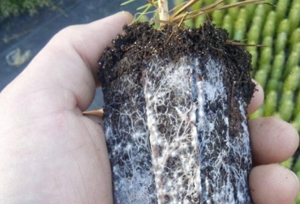
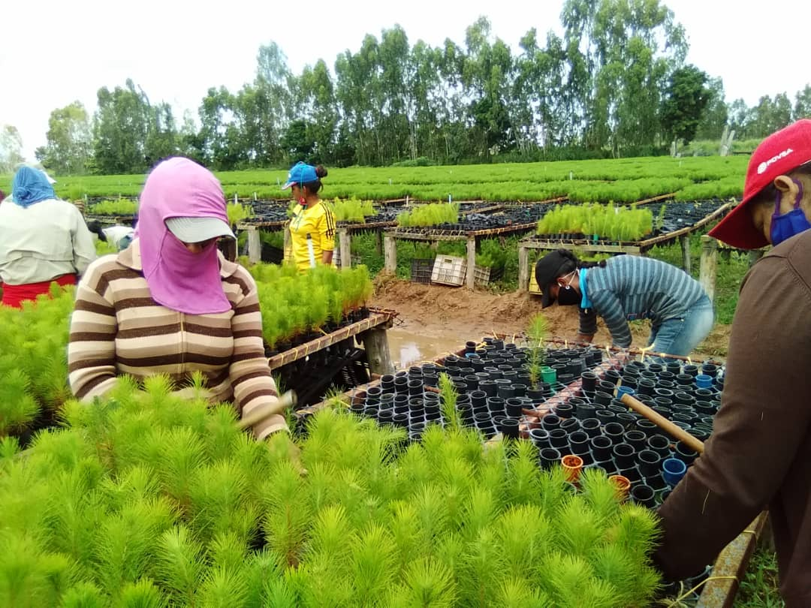
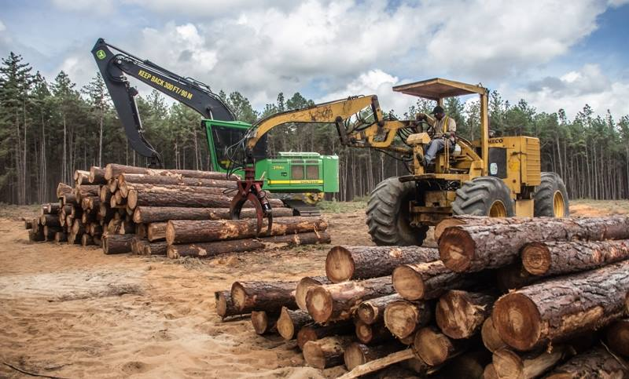
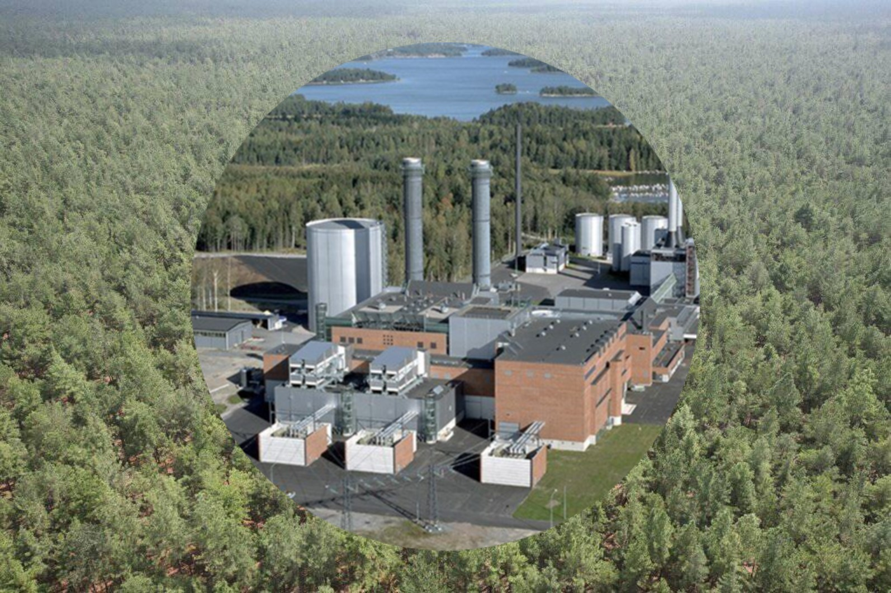

*Entre el mar Caribe y el inmenso río Orinoco se encuentra el bosque plantado más grande de Suramérica*

En la década de los 60´s, un grupo de visionarios venezolanos, sintieron la necesidad de aprovechar las extensas sabanas de Anzoátegui y Monagas  para el establecimiento y siembra de especies nativas o exóticas, como alternativa en favor de la conservación de los bosques. Entre las especies evaluadas, el pino caribe *(Pinus caribaea var.hondurensis)*, afloró como la más apropiada. En 1966, cerca de la población de Uracoa (Estado Monagas), los Ingenieros Agrónomos *José Joaquín Cabrera-Malo* (1921-2016),  “J.J. como era conocido por sus amistades” y *Darío Boscán Odor* (1936-2010), quien estaba al frente de una pequeña estación del Ministerio de Agricultura y Cría (MAC), inician un ensayo  en una superficie de 500 hectáreas. 

**Un matrimonio perfecto: hongo más micorriza...**
Las semillas de pino caribe traídas de Honduras, fueron plantadas e inoculadas con esporas de hongos formadores de micorriza. Esta asociación hongo-raíz, resultó muy positiva, pues el hongo suministra los nutrimentos que la raíz no puede formar, proporcionándole la energía en forma de dióxido de carbono (CO2), que ha tomado del sol. Con estas semillas Cabrera-Malo y Boscán, plantaron unas 500 hectáreas en los suelos arenosos cercanos a un morichal, y otras en los suelos arcillosos de la sabana.
 Al cabo de 4 años pudieron constatar que las plantas se adaptaban muy bien a suelos de textura suelta que permitían un rápido crecimiento de las raíces.

**La primera plantación...** 
Animado con estos resultados J.J Cabrera-Malo, para ese entonces Gerente del Departamento Agroforestal de la Corporación Venezolana de Guayana (CVG), comienza la búsqueda de tierras donde materializar su sueño de establecer plantaciones de pinos. En las llanuras del sur de Monagas y Anzoátegui, encontró los suelos ideales: planos, de textura suelta, poco profundos y baja fertilidad natural, sub utilizados, sin problemas de tenencia y con baja vegetación natural. Investiga durante 10 años, y observa el buen crecimiento del pino caribe, promoviendo entonces la plantación a gran escala, en la cercanía del pequeño poblado conocido como Uverito, en el estado Monagas.
Para la plantación comercial, se fijó inicialmente una meta de 40.000 hectáreas, de acuerdo con los requerimientos del proyecto de una planta de pulpa para papel. El desarrollo de los pinos en esta primera etapa fue satisfactorio y por ello se obtuvo la aprobación para continuar el programa. Este extenso territorio, sub utilizado  por sus características de baja precipitación y suelos pobres, fue ocupado exitosamente con un bosque de 500.000 has de pinos, ordenado, eficientemente manejado y estratégicamente ubicado en las cercanías del río Orinoco, lo que garantizaba  suficiente agua para la industria de pulpa y papel, y facilidades para el transporte fluvial y conexiones con el comercio nacional e internacional.

**Servicios ecosistémicos que presta el bosque**

**Servicios Sociales.**
El desarrollo de Uverito permitió la organización y participación de comunidades criollas e indígenas, en especial de la etnia Kariña, provenientes del sur de Monagas y Anzoátegui, en las distintas fases y operaciones de manejo, como por ejemplo en la producción de plantas, plantación, labores de protección, etc.
>Desde sus inicios, la visión de género estuvo presente; en 1968 cuando se realizó la primera plantación, los envases donde se sembraba la semilla fueron elaborados por unas 500 jóvenes trabajadoras provenientes de Temblador, San Félix, Barrancas y algunos caseríos cercanos. Los ingresos percibidos representaban un aporte considerable para la economía doméstica, en una región económicamente deprimida.

En 1990 se creó la Escuela para formación de Bachilleres Técnicos Forestales, con el objetivo de incorporarlos a la cadena laboral de la Empresa. También se promovieron ocho carpinterías comunitarias, conformadas por hombres y mujeres de la zona, y siete Cooperativas de servicios para la las distintas fases de manejo del bosque: viveros, plantación, cosecha de semillas, mantenimiento, labores de corta y de aclareo, etc., desarrollándose además en la zona, cerca de 52 pequeños aserraderos para el procesamiento local.

**Servicios ambientales.**
El bosque de Uverito ha sido responsable de un evidente y favorable cambio climático.
>Una hectárea de pinos captura un promedio de 10 ton/año de CO2, y cada árbol genera anualmente 1Kg de oxígeno. Con una población de 600 árboles/ha, este bosque representa un inmenso potencial de oxigenación y descarbonización atmosférica. 

Por otra parte, el bosque ha propiciado la llegada de una fauna que no existía; diversas aves, venados, lapas, tigres y otras especies. Se ha generado un ciclo vital completo, con cambios en el microclima y clima local, disminución de procesos erosivos y preservación de morichales, entre otros.

**Servicios económicos.**
El aprovechamiento de los árboles depende de su edad y del diámetro de los tallos. Árboles con diámetros menores de 15 cm pueden aprovecharse en la fabricación de pulpa para papel y astillas para diferentes tipos de tableros aglomerados, para los hornos metalúrgicos, como materia prima para el proceso Kraft o pasta de celulosa, como cercas y puntales para la industria de construcción. Aquellos con diámetros superiores a  20 cm, luego de aserrados, son excelente materia prima para carpinterías, en la elaboración de paletas para carga, machihembrados, puertas, ventanas, muebles y elementos estructurales para la construcción de viviendas. Las astillas resultantes del aserrío de las rolas, pueden dedicarse a la industria de pulpa y papel. Las rolas por su altura y resistencia se utilizan como postes para tendidos de electricidad. De la resina del pino es posible obtener colofonia, trementina, cola, elastómeros, barnices, disolventes industriales, jabones, aceites esenciales y lignosulfonatos para uso de la industria petrolera.

**Semillas genéticamente mejoradas.**
En los  huertos de Santa Cruz de Bucaral (estado Falcón) y San Antonio de Maturín (estado Monagas), se obtiene una cepa criolla adaptada a nuestras condiciones, que garantiza el autoabastecimiento de este insumo y ofrece oportunidades de exportación.

**Situación actual y perspectiva futura.**
Las metas anuales de plantación han variado, en razón de aprovechamientos, incendios de magnitud, mortalidad por sequía y plagas, y por carencia de recursos. Un inventario realizado por la empresa *Maderas del Orinoco* (hoy **MAVETUR**), desde 1979 hasta el 2014, reflejó la superficie en pié, clasificada por año de plantación en 310.859,73 ha en Monagas y Anzoátegui. Durante el lapso 2015- 2020, se plantaron 30.664 ha. Para 2021 la meta en proceso, es 2.500 ha, de pino caribe. 
A partir del año 2022 la meta de plantación propuesta es de 10.000 ha/año.

Por su valor estratégico los pinos de Uverito están llamados a convertirse en uno de los rubros más importantes para fortalecer el desarrollo del sur del país. Existen oportunidades para expandir y diversificar la producción a partir de las plantaciones de pino caribe.

Considerando los aspectos económicos, ambientales y sociales de la cadena forestal madera-celulosa de Uverito, es posible identificar opciones para el uso integral de la biomasa del bosque, mediante una alternativa circular y sostenible: la **bioeconomía forestal**, a través del establecimiento de una **biorrefinería forestal integral**. Esta estrategia, junto con la incorporación de nuevas tecnologías, mejoras en la gestión y desarrollo de nuevos productos, sin duda resultaría en un óptimo aprovechamiento del bosque.

