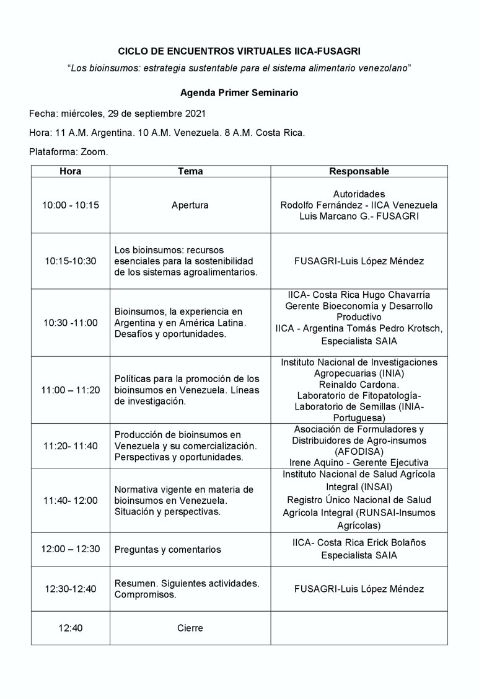

El *Instituto Interamericano de Cooperación para la Agricultura* (IICA) y la *Fundación Servicio para el Agricultor* (FUSAGRI), coinciden en la visión de que la reconstrucción pos-pandemia debe centrarse en la sostenibilidad y en una economía circular, baja en carbono y socialmente inclusiva. Para ello, la transformación de nuestros sistemas alimentarios es una de las herramientas más poderosas para cambiar el rumbo y avanzar hacia la consecución de los 17 *Objetivos de Desarrollo Sostenible*(ODS), aprovechando las innovaciones en ciencia y tecnología, digitalización y la **Bioeconomía**, en donde la sustentabilidad ambiental es uno de sus ejes centrales, y dentro de ella, a los bioinsumos que son elementos de importancia en esta visión estratégica. 

Teniendo como premisa que el éxito futuro de los bioinsumos agropecuarios en Venezuela dependerá del progreso de la investigación, la gestión de empresas innovadoras, la eficiente comercialización de los mismos, así como también la educación y transferencia a los productores, y con el propósito de contribuir con el crecimiento y desarrollo de esta bioindustria, hemos creído conveniente propiciar un ciclo de encuentros con investigadores, académicos, y profesionales del sector público y privado, para explorar vías y acciones de fomento, promoción y difusión del uso los bioinsumos, comenzando con una serie de seminarios denominados, “Los bioinsumos: estrategia sustentable para el sistema alimentario venezolano”.

Durante este primer encuentro se abordará en primera instancia la necesidad de aproximar a la agricultura venezolana desde la perspectiva bioeconómica, y del papel que desempeñan los bioinsumos en ese contexto. Se aspira que como resultado de este primer seminario, al menos se constituyan dos grupos de trabajo: 

- Marco regulatorio y fomento a la producción

- I+D+I, educación y difusión 

