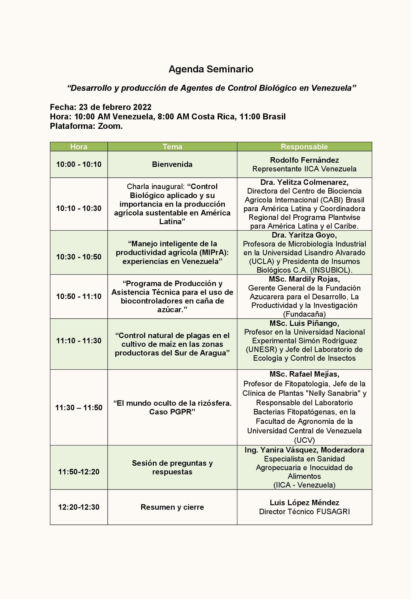

Con este tercer seminario de la serie de encuentros diseñados y organizados por FUSAGRI con el apoyo logístico del IICA, para impulsar la Bioeconomía en Venezuela, se dió continuidad al proceso de continuar visualizando el esfuerzo conjunto de varios actores involucrados en el crecimiento y desarrollo de los bioinsumos agropecuarios, especialmente las universidades y las empresas privadas.

Iniciamos con la presentación de nuestra invitada especial, la **Dra Yelitza Colmenares, Directora de CABI Brasil**, quien destacó la importancia del uso del Control Biológico aplicado en la producción agrícola sustentable en América Latina, mostrando casos específicos y exitosos de introducción y multiplicación de biocontroladores en pequeña escala en varios países. También nos comentó de la importancia de la Bioprospección y el uso del potencial de la biodiversidad de la región neotropical. Otro de los aspectos abordados fue el de la comercialización y transferencia de las tecnologías de CB, y la imprescindible necesidad del intercambio de conocimientos y experiencias con los productores. 

La **Dra. Yaritza Goyo, Presidenta de INSUBIOL,** disertó acerca del Manejo Inteligente de la Producción Agrícola (MIPrA), como nuevo paradigma en la necesaria transformación del sistema alimentario venezolano, discutiendo el amplio basamento teórico que lo sustenta, así como la implementación practica del mismo con el uso de bioestimuladores y biocontroladores para manejar el estrés de los cultivos.

**Mardilis Rojas, Gerente General de FUNDACAŇA**, hizo la presentación de esta iniciativa privada para la implementación del CB con *Cotesia flavipes* en el cultivo de caña de azúcar, mostrando todo el proceso desde mantenimiento de pie de cría hasta liberación en campo, seguimiento y control. Todo ello cumpliendo con estrictos protocolos de producción y control de calidad, desarrollados en el país. Resaltó también el caso particular de control de candelilla *(Aneolamia spp.)* mediante el uso de nematodos *(Heterorhabditis bacteriophora)*

El entomólogo **Luis Piñango** expuso acerca de las experiencias en CB de plagas en maíz en el sur del estado Aragua con la empresa **Agroinsumos Capital C.A,** y la difícil tarea de implementar de manera práctica dicho control. También mostró abundante evidencia de su labor en Bioprospección de los controladores locales.

Por último, y no menos destacado, el profesor **Rafael Mejías**, como representante de las nuevas generaciones vinculados a la investigaciones y desarrollo de los agentes de CB en Venezuela, nos mostró los avances realizados por la **Facultad de Agronomía de la UCV**, lo cual es particularmente destacable dadas las limitaciones presupuestarias y de equipos.

**Click** [Here](https://youtu.be/j6yEQcTBKlI)  **to watch seminar video** 

