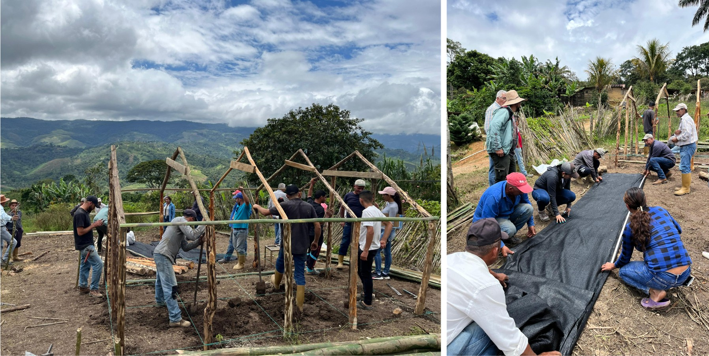
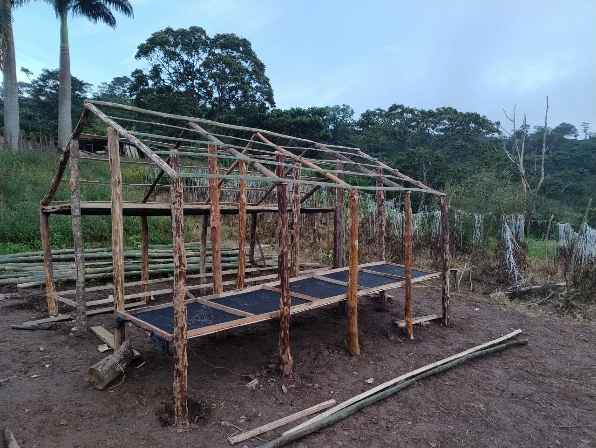
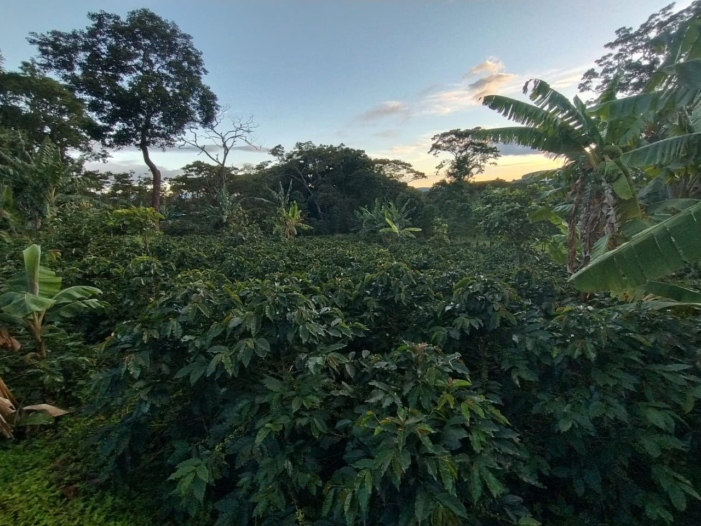

Con una visión hacia la sostenibilidad y la mejora continua, caficultores de la parroquia Hilario Luna y Luna, municipio Morán (Lara), dieron un paso significativo en la modernización de sus prácticas con el "Taller teórico-práctico de fortalecimiento de capacidades en secado solar de café", dictado por el Ing. Luis Arrieta. Esta iniciativa, que se llevó a cabo los dias 22 y 23 de julio de 2025, marca el lanzamiento oficial del **Proyecto Café Sostenible: Secadores solares y abonos orgánicos como herramientas de cambio.**

La jornada, realizada en la parcela del caficultor Ramón Conde en el sector Palo Grande (Villanueva), no solo proveyó conocimientos esenciales sobre el secado solar, sino que culminó con un hito tangible: la construcción, por parte de los propios participantes, del **primer secador solar de café en esta importante comunidad cafetalera.** 

La construcción de este secador representa un paso significativo para la comunidad cafetalera de esta Parroquia, marcando el inicio de un proceso de innovación que aspira transformar la forma en que producen su café, haciéndolo más competitivo, saludable y amigable con el entorno. 

La implementación de secadores solares es un claro ejemplo de cómo la capacitación y la tecnología pueden converger para generar un cambio positivo y duradero en el sector agrícola, consolidando el compromiso de esta región montañosa con un futuro cafetalero más próspero y ecológico.

Esta actividad se enmarca en los objetivos más amplios del **Proyecto Sistemas Agroforestales Cafetaleros Sostenibles con Enfoque de Género**, impulsado por la *Fundación Servicio para el Agricultor (FUSAGRI)* en alianza con el *Instituto Internacional de Cooperación para la Agricultura (IICA).* Dicho proyecto busca fortalecer la producción de café de alta calidad a través de la implementación de Sistemas Agroforestales que combinan el cultivo con la siembra de árboles, diversificando la producción, mejorando la salud del suelo, conservando la biodiversidad y aumentando la resiliencia ante el cambio climático. Además, el proyecto tiene un fuerte enfoque de género, garantizando la participación equitativa de las mujeres en toda la cadena de valor del café.

