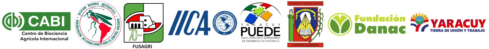
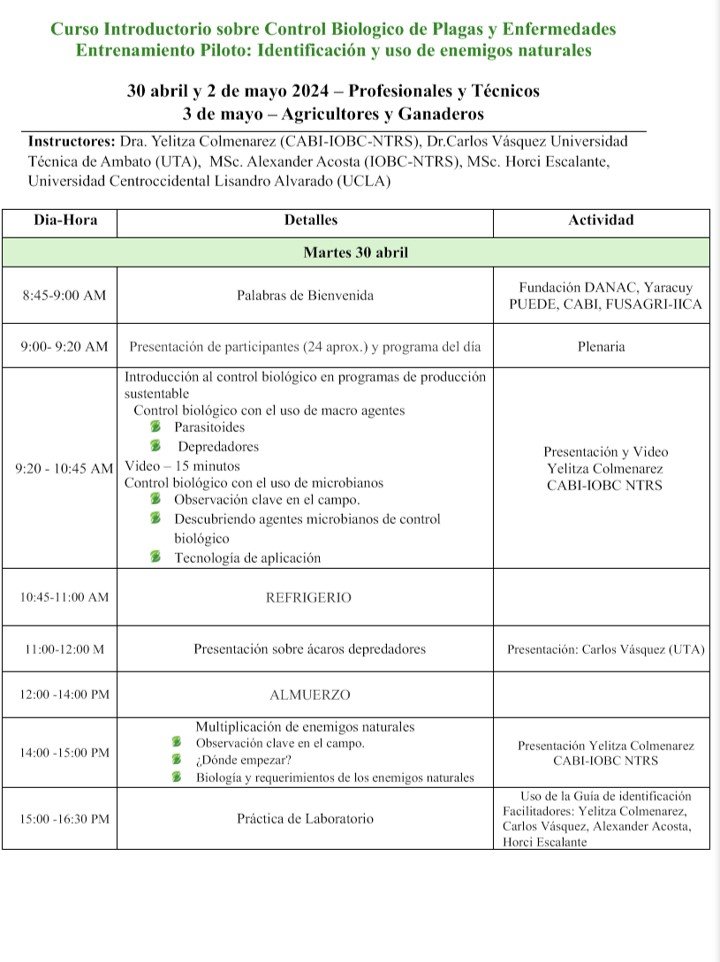
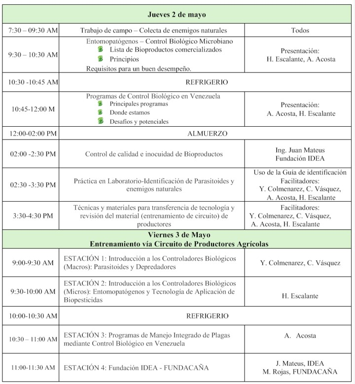

**VISION DE CONJUNTO**

El nuevo modelo agrícola para Venezuela requiere impulsar el desarrollo sostenible de la pequeña y mediana agricultura para promover  la seguridad alimentaria y nutricional de los territorios rurales, bajo un escenario de cambio climático.
Yaracuy, es un estado donde la actividad agrícola tienen un papel preponderante en la economía y sustento de su población, basada en cultivos como caña de azúcar, maíz, aguacate, naranjas, café, otros frutales y pastos, que enfrentan desafíos considerables en cuanto al manejo de las plagas y enfermedades que los afectan, debido a que el uso exclusivo de plaguicidas sintéticos, que ha sido una práctica común, no siempre ha resultado efectivo y presenta, adicionalmente, riesgos para la salud humana e impactos ambientales indeseados. Es ese sentido, es necesario  conjugar esfuerzos entre actores claves de la producción agrícola, para lograr el reconocimiento y concientización de los problemas fitosanitarios y económicos ocasionados por plagas y enfermedades de importancia económica, así como la implementación de Buenas Prácticas Agrícolas,  con el objetivo de sentar las bases de una nueva agricultura, que logre integrar  productividad, seguridad alimentaria y mejoramiento de la calidad de los alimentos, en un marco ambientalmente sostenible y de desarrollo económico territorial. 

El *Control Biológico (Bioprotección)* surge entonces como una alternativa sostenible y efectiva a ser integrada en programas de manejo de plagas y enfermedades, por lo que la capacitación de agentes de extensión y asistencia técnica agrícola sobre este tema, reviste gran importancia por las siguientes razones:

**1. Protección del medio ambiente:** reduce la dependencia de plaguicidas, sintéticos, preservando la biodiversidad, la calidad del agua y del suelo, minimizando la contaminación ambiental.

**2. Seguridad alimentaria:** disminución de  los residuos químicos en los cultivos, mejorando la calidad e inocuidad de los alimentos para el consumo humano y animal.

**3. Rentabilidad económica:** a largo plazo puede ser una alternativa más económica que el uso exclusivo de plaguicidas sintéticos a largo, representando beneficios para agricultores y ganaderos.

**4. Sostenibilidad:** contribuye a la salud de los agroecosistemas, promoviendo prácticas agrícolas amigables con el ambiente y resilientes al cambio climático.

Además de ello, el accionamiento del *Control Biológico* puede generar nuevas oportunidades de empleo en la producción y comercialización de agentes de control biológico y la asistencia técnica, así como también impulsar la innovación, basada en la investigación y desarrollo de nuevas tecnologías para el manejo de plagas y enfermedades.

**PERFIL DEL CURSO**

**I.	Objetivos** 

Promover el uso de soluciones de bajo riesgo para reducir la dependencia de insumos agrícolas de origen sintético que afectan negativamente a la salud humana y la biodiversidad, facilitando la adopción por parte de los agricultores de productos fitosanitarios de menor riesgo.

**II.	Participantes** 

>Profesionales y Técnicos del sector público y privado, vinculados a la asistencia técnica y extensión agrícola.

>Productores agrícolas (agricultores y ganaderos)

**III.	Instructores**

* Dra. Yelitza Colmenarez, Directora de CAB International-CABI
* Dr. Carlos Vásquez, Programa Plantwise-CABI
* MSc. Horci Escalante (Universidad Centroccidental Lisandro Alvarado)
* MSc. Alexander Acosta (IOBC-NTRS)Horci Escalante (UCLA) 

**IV.	Organizadores** 
- Yaracuy PUEDE
- Fundación DANAC
- CAB International-CABI (Centro de Biociencia Agrícola Internacional) para América Latina.
- Organización Internacional para el Control Biológico de Plantas y Animales Nocivos (IOBC-NTRS)
- Fundación Servicio para el Agricultor (FUSAGRI)
- Instituto Internacional de Cooperación para la Agricultura (IICA)

**LUGAR Y FECHAS** 

**Fundación DANAC, San Javier vía Guarataro, San Felipe, Estado Yaracuy**
  
  >Profesionales y Técnicos: 30 abril y 2 de mayo 2024
  >Productores Agrícolas y Ganaderos: 3 de mayo 2024

**PROGRAMA** 

