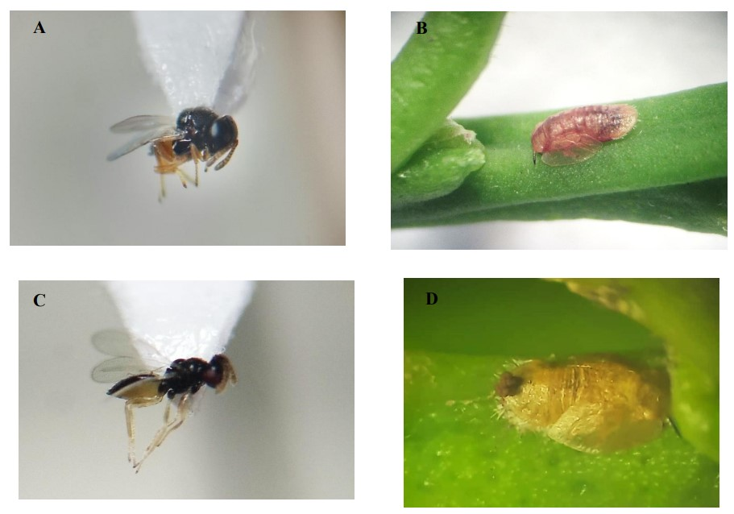

**Vea la presentación de este estudio pulsando** [aquí](https://youtu.be/NRopa68uMwQ)

Los citricultores venezolanos cuentan con un nuevo aliado en la lucha contra el destructivo Psílido Asiático de los Cítricos (*Diaphorina citri*), comúnmente llamado **Dragón Amarillo**. Este minúsculo insecto ha causado cuantiosos daños a las plantaciones de naranjas, limones, mandarinas y toronjas en el país, ya que transmite la enfermedad **Huanglongbing (HLB)**, considerada el principal problema fitosanitario en Venezuela debido a que ha causado la muerte de miles de árboles.

**Descubrimiento:**

En un reciente estudio realizado en fincas citrícolas del estado Yaracuy, con el apoyo del Instituto Interamericano de Cooperación para la Agricultura **(IICA)** y la Fundación Servicio para el Agricultor **(FUSAGRI)**,  los científicos han encontrado dos especies de avispas parásitas, *Diaphorencyrtus aligarhensis* y *Tamarixia radiata*, las cuales se alimentan del **Dragón Amarillo**, ofreciendo una esperanza para la protección de las plantas  y la recuperación de la producción de cítricas. El descubrimiento de ambas especies en Yaracuy representa un hallazgo significativo. Además, este es el primer registro de *Diaphorencyrtus aligarhensis* en Venezuela, una avispita que viene de India.

**Fotografías:** © Evelin Arcaya 2024            
**A.** Adulto de *Diaphorencyrtus aligarhensis* ♀    
**B.** Ninfa parasitada por *D. aligarhensis*    
**C.** Adulto de *Tamarixia radiata* ♀        
**D.** Ninfa con meconio parasitada por *T. radiata*  

**Importancia:**

La presencia de estas avispas parásitas ofrece opciones para el manejo integral de esta plaga mediante instalaciones de biofábricas para su multiplicación en las fincas de los citricultores, y así poder realizar una gestión más sostenible y respetuosa con el medio ambiente con menor uso de plaguicidas. Al controlar de forma natural al **Dragón Amarillo**, estas avispas pueden ayudar a reducir la propagación del HLB y proteger los cultivos de cítricos.

Al hacer el anuncio del estudio, la **Dra. Rosa Briceño**, del Departamento de Ciencias Biológicas - Decanato de Agronomía de la **UCLA**, destacó que *"este descubrimiento podría tener implicaciones de gran alcance para los citricultores de Venezuela y de otros países que luchan contra esta devastadora plaga. Se necesitan más investigaciones para explorar el potencial de estas avispas parásitas como agentes de control biológico del Dragón Amarillo”*

Esta investigación pionera pone de relieve la importancia de estudiar a los enemigos naturales de las plagas agrícolas para desarrollar estrategias de control más eficaces y sostenibles. 

**Vea el video (6 minutos) de la presentación de este estudio pulsando** [aquí](https://youtu.be/NRopa68uMwQ)

