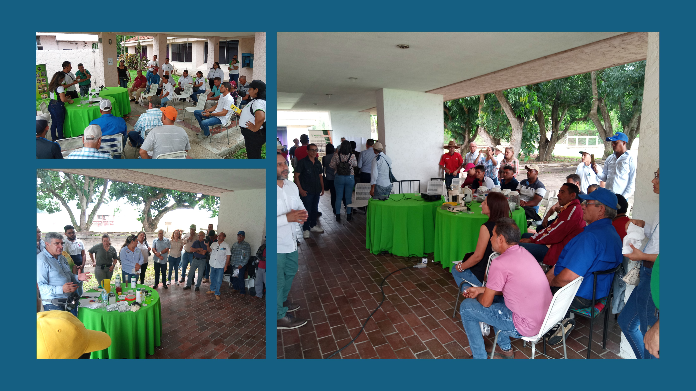

En el marco de las actividades que vienen realizando: el Instituto Interamericano de Cooperación para la Agricultura (IICA), CAB Internacional-CABI y la Fundación Servicio para el Agricultor (FUSAGRI), para promover la agricultura sostenible, en el estado Yaracuy se llevó a cabo con éxito un curso sobre control biológico de plagas, dirigido a profesionales y técnicos del sector público y privado, vinculados a la asistencia técnica y extensión agrícola. El curso, completamente gratuito y que tuvo una duración de 3 días (30 de abril y 2-3 de mayo, 2024) fue impartido por especialistas en el área y contó con la participación de 34 personas, provenientes de 27 organizaciones, 14 de ellas representadas por mujeres, resaltando la presencia de 7 asociaciones yaracuyanas de productores (agricultores y ganaderos).

> **INSTRUCTORES**
>- Dra. Yelitza Colmenarez, Directora de CAB International-CABI
>- Dr. Carlos Vásquez, Programa Plantwise-CABI
>- MSc. Alexander Acosta (IOBC-NTRS),
>- MSc. Horci Escalante (UCLA), 

Durante el curso, realizado en la sede de la Fundación DANAC en San Javier (Yaracuy), los participantes aprendieron sobre los principios del control biológico de plagas, los diferentes métodos y técnicas disponibles, así como las ventajas y desventajas de cada uno. Ello mediante lecciones teóricas, prácticas de campo y laboratorio. 

También tuvieron la oportunidad de realizar sesiones de instrucción con productores, donde pudieron aplicar los conocimientos adquiridos, los cuales serán acreditados por la Universidad Centroccidental Lisandro Alvarado (UCLA).

Al finalizar el curso, los participantes se mostraron satisfechos con la capacitación adquirida y expresaron su compromiso con la difusión del conocimiento sobre control biológico de plagas en sus organizaciones.

**Participación activa de organizaciones locales, patrocinantes y autoridades gubernamentales**

El éxito del curso fue posible gracias a la activa participación de YARACUY P.U.E.D.E (Plan Unificado Empresarial de Desarrollo Económico), una Asociación Civil, impulsada por el gremio empresarial Cámara de Comercio e Industrias y FEDECAMARAS-Yaracuy. 
Esta organización cuenta con el apoyo de la Gobernación del Estado Yaracuy, y fue factor relevante para la realización de la Misión Técnica de CAB-International (CABI) en Venezuela a finales de 2023, coordinada por IICA y FUSAGRI, con el propósito de considerar la implementación de proyectos de cooperación internacional y nacional para el Manejo Integrado de Plagas y Producción Sustentable en Venezuela, con particular énfasis en HLB. 

De igual manera se destaca la colaboración de Fundación DANAC, quien además de poner a  disposición sus instalaciones (auditorio y laboratorios), también aporto la comida y refrigerio para los participantes y facilitadores del curso, así como también  el patrocinio de FUNDACAÑA, los productores de plantas sanas de cítricos en viveros protegidos: SUPERPLÁNTULAS C.A. y AGROVIVAR C.A., y las empresas procesadoras de frutas:  MULTI FRUIT C.A. y FRUTÍCOLA EL VALLE C.A.

**Compromiso con la agricultura sostenible**

Todas las instutuciones participantes están comprometidas con la promoción de prácticas agrícolas sostenibles en el país, pues consideran que el control biológico es una herramienta fundamental para lograr una agricultura más respetuosa con el medio ambiente y más beneficiosa para los agricultores y consumidores.

