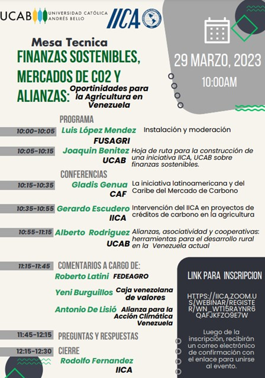

**Ud. puede ver la grabación completa pulsando** [Aqui](https://youtu.be/26jkN-U4his)

**INTRODUCCIÓN**

Luego de ocho años de contracción, la producción del agro venezolano comenzó a crecer en 2021. Tanto las instancias oficiales como los gremios agrícolas reportan un crecimiento importante en 2022, en comparación con 2021, en los principales rubros alimenticios: maíz blanco y amarillo, arroz, caña de azúcar, frijol, hortalizas y frutales. Ello ha ocurrido en medio de grandes dificultades en cuanto a acceso a financiamiento, disponibilidad de insumos, obsolescencia de maquinarias y equipos, y la no menos grave falta de combustible.

En este crecimiento se destaca la incorporación de la producción y utilización de los bioinsumos agrícolas, sobre todo biofertilizantes e inoculantes, disminuyendo el empleo de fertilizantes sintéticos y desarrollando acciones para fomentar el adecuado uso de estos productos. que requieren, al ser un nuevo paradigma, del acompañamiento técnico en su proceso de mercadeo y adopción.
Sin embargo, el incremento de la utilización de bioinsumos obedece especialmente a sus ventajas económicas, debido a que el sector agrícola (oficial y privado) aun no internaliza los beneficios adicionales del uso de esta herramienta y de la bioeconomía en general,  en la conservación de los recursos naturales, la salud de los suelos, la sanidad de los alimentos, y mucho menos en cuanto a su contribución para atenuar los efectos del cambio climático, y de su importancia para la inversión agrícola climáticamente inteligente, en concordancia con los Objetivos de Desarrollo Sostenible 2030.

Esta coincidencia representa una magnífica oportunidad para reafirmar el preponderante papel de la agricultura en la seguridad alimentaria nacional, y también para difundir las ventajas que tiene el sector para mitigar y adaptarse al cambio climático, y en consecuencia, la urgente necesidad de promover  la utilización de las finanzas sostenibles para capitalizar esas ventajas y fortalecer el Sistema Alimentario Nacional, cumpliendo al mismo tiempo los compromisos con el desarrollo resiliente al clima y con bajas emisiones de carbono.

En tal sentido, y con el objetivo de visibilizar y analizar  la posibilidad que representa el financiamiento sostenible (valores negociables verdes, sociales y sustentables), en la inversión agrícola climáticamente inteligente y el empoderamiento climático, la *Dirección de Sustentabilidad Ambiental de la Universidad Católica Andrés Bello (UCAB)*, con el apoyo del *Instituto Interamericano de Cooperación para la Agricultura (IICA)*, se han propuesto llevar a cabo un ciclo de encuentros virtuales para explorar las oportunidades que para la agricultura en Venezuela representan las finanzas sostenibles y los mercados de carbono, así como las alianzas necesarias, las necesidades y los retos que pudieran surgir. El primero de estos encuentros fue la **Mesa Técnica: Finanzas Sostenibles, Mercados de Carbono y Alianzas: Oportunidades para la Agricultura en Venezuela**, la cual se  realizó el 29/03/2023.

**DESARROLLO**

Como lo indica el programa, la sesión de ponencias se inició con  una introducción a cargo de **Joaquín Benítez, Director de Sustentabilidad Ambiental de la UCAB**, explicando cómo se ha venido construyendo la iniciativa IICA-UCAB sobre finanzas sostenibles y la vinculación con los sectores productivos, así como las alianzas que están comenzando a gestarse y las que se estiman se construirán a futuro. Igualmente, mencionó el contenido y propósito de las siguientes mesas técnicas:
-	Financiamiento sostenible al sector agrícola. Experiencias internacionales y nacionales. Prospectos
-	Financiamiento sostenible. Instrumentos y Certificación

La primera ponencia estuvo a cargo de **Gladis Genua, Asesora de la Vicepresidencia de Sector Privado del Banco de Desarrollo de América Latina (CAF):** *La Iniciativa Latinoamericana y del Caribe del Mercado de Carbono (ILACC)*, promovida por esta institución y cuyo objetivo es generar capacidades para construir una cadena de valor regional en el mercado de carbono que permitan desarrollar mejores proyectos, más integrales y sostenibles, y que contribuyan a una mejor participación a nivel global de créditos de carbono generados en América Latina y El Caribe. Antes, sin embargo, disertó detalladamente sobre el concepto de los mercados de carbono, como se generan y los tipos que coexisten, además de los riesgos y desafíos que representan.
    
Por su parte, **Alberto Rodríguez, Coordinador de Sociología de la UCAB**, expuso sobre las posibilidades de integración para pequeños proyectos mediante *Alianzas, Asociaciones y Cooperativas, como herramientas para el desarrollo rural de la Venezuela Actual*, señalando dos experiencias innovadoras y exitosas, que son ejemplo de asociatividad en el país: 
-	Las Centrales Cooperativas
-	Los Consorcios Sociales de Vivienda y Hábitat.

A continuación, **Gerardo Escudero, Representante del IICA en Panamá**,  realizó una presentación sobre la concertación de esfuerzos institucionales (18 actores), para el impulso a la cadena de valor del arroz en Panamá, y de su transformación mediante la  implementación de prácticas de agricultura sostenible adaptadas al clima, con reducción de costos, incremento de rendimientos, menor uso de insumos y mayor eficiencia al utilizar recursos naturales, logrando disminuir la huella de carbono y la emisión de gases de efecto invernadero (GEI) en 30% e incrementos en productividad del 36%.
>Estos resultados positivos han permitido la inscripción de la NAMA Arroz (Acción de Mitigación Nacionalmente Apropiada) en el informe bianual de Actualización de las Contribuciones Nacionales Determinadas (NDC) del sector agropecuario de Panamá ante la Convención Marco de las Naciones Unidas sobre el Cambio Climático (CMNUCC).

La siguiente fase consiste en su medición, registro y verificación (MRV), para lo cual se requiere obtener la trazabilidad necesaria a través de la utilización de una plataforma digital (Blockchain), como alternativa a la verificación internacional, para poder hacer la gobernanza de la transformación de los créditos de carbono y su colocación en el mercado. Mas adelante se aspira expandir esta área inicial de 5.000 a  70 - 80.000 hectáreas, con el apoyo financiero del Fondo Verde.

Acto seguido intervinieron los comentaristas invitados: 
- **Yeni Burguillos Tovar**, *Caja Venezolana de Valores S.A. (CVV)*
- **Antonio De Lisio**, *Alianza para la Acción Climática Venezuela*
- **Roberto Lantini**, *Confederación de Asociaciones de Productores Agropecuarios (FEDEAGRO).*

Finalmente, se abrió un espacio para preguntas y respuestas.

**COMENTARIOS** 

Este primer encuentro, además de poner de relieve la importancia, sus avances y dificultades, de las finanzas sostenibles a nivel regional, y de modo especial el financiamiento climático relacionado con el mercado de carbono, también deja al descubierto las debilidades del país para aprovechar estas oportunidades, principalmente en cuanto al marco institucional y de garantías para inversiones, poniendo en contraste los casos exitosos de Colombia, Panamá y Perú.
>De manera general, se evidencia la desinformación que tiene el sector agrícola acerca de la posibilidad y conveniencia del financiamiento climático, aunque este tema está despertando cierto interés para los productores de café y cacao. Mientras que en el sector financiero se estarían trabajando algunas propuestas en finanzas sostenibles (bonos sociales, verdes, sostenibles), según lo informado por la CVV y confirmada por CAF.

Estas consideraciones muestran claramente los beneficios obtenidos con la realización de esta primera mesa técnica, y el compromiso de la institucion anfitriona: la *Dirección de Sustentabilidad Ambiental de la UCAB)* en el establecimiento de una hoja de ruta para continuar fomentando las finanzas sostenibles en Venezuela, mediante actividades de formación y capacitación, y la promoción de las alianzas necesarias, propuesta que se alinea con las recomendaciones de los expertos internacionales invitados, en cuanto a que no es necesario esperar por la legislación nacional y el marco institucional para que el sector privado desarrolle políticas de sostenibilidad para captación de finanzas sostenibles, como los casos exitosos de los países mencionados, teniendo en cuenta que Latinoamérica cuenta con el capital natural más importante del mundo.

Al mismo tiempo se requiere formular proyectos con bases sólidas, científicas y tecnológicas con el apoyo de plataformas digitales para garantizar transparencia y trazabilidad, generando reputación y confianza para las inversiones. Esto podría materializarse localmente impulsando la cadena de valor del arroz la cual viene avanzando, a pesar de las dificultades, hacia una producción mas rentable y sostenible, y que cuenta con fortaleza gremial y organizativa.

**Ud. puede ver la grabación completa de esta Mesa Técnica pulsando** [Aqui](https://youtu.be/26jkN-U4his)

