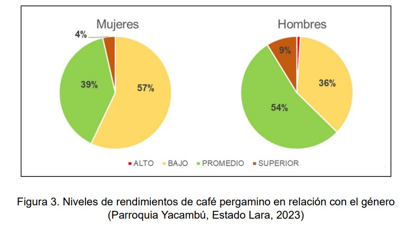
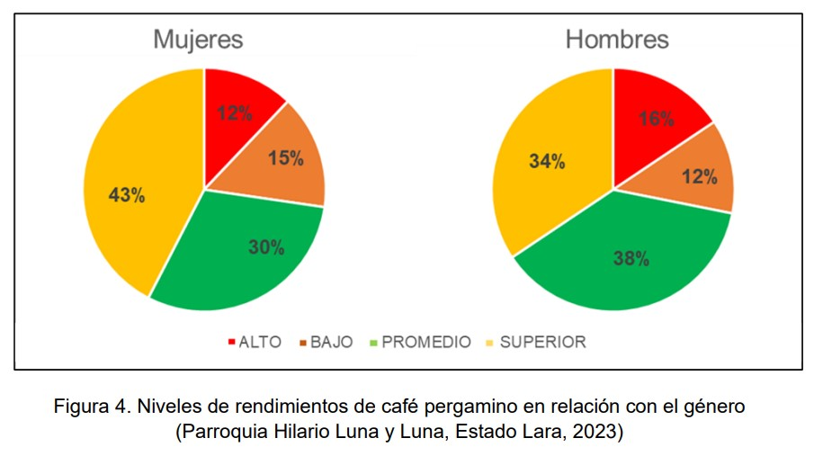

La contribución de las mujeres en la producción de café es de vital importancia para esta industria. Se estima que son responsables del 20 al 30% de las unidades económicas productoras de café en el mundo, y que su participación en la fuerza laboral agrícola del sector puede llegar a ser del 70% (Organización Internacional del Café, 2018). 
En los últimos años, se han realizado esfuerzos para promover sus aportes en la producción de este rubro. Organizaciones como el Fondo Internacional de Desarrollo Agrícola (FIDA) y la Organización Internacional del Café (OIC), han desarrollado programas para apoyar a las caficultoras, brindándoles acceso a capacitación, financiamiento y otros recursos.

Un estudio del FIDA realizado en seis países productores de café (Colombia, Costa Rica, El Salvador, Guatemala, Honduras y México), encontró que las fincas cafetaleras dirigidas por mujeres tienen un rendimiento promedio 20% superior al de las fincas dirigidas por hombres. Este rendimiento superior se debe a una serie de factores, entre los que se incluyen:
- Generalmente son más cuidadosas y dedicadas a la producción de café.
- Son más receptivas a las nuevas tecnologías y prácticas agrícolas.
- Suelen tener una mayor capacidad de organización y colaboración.

El estudio también encontró que las fincas cafetaleras dirigidas por mujeres son más propensas a adoptar prácticas agrícolas sostenibles. Esto obedece a que, de manera general, son más conscientes de los impactos ambientales que genera la producción de café, lo cual demuestra que la participación de las mujeres representa  una oportunidad importante para mejorar la sostenibilidad y la productividad de la cadena cafetalera.

**Productividad del café  (Lara – Venezuela)**

En un caso en Venezuela, los resultados iniciales de una investigación reciente realizada por FUSAGRI y profesores de la Facultad de Agronomía (UCV), con el patrocinio del Instituto Interamericano de Cooperación para la Agricultura (IICA),  destinada a identificar y caracterizar los sistemas y unidades de producción de café a partir de la información recabada en dos territorios del eje cafetalero sureste del estado Lara: (Parroquia Yacambú - Municipio Andrés Eloy Blanco y Parroquia Hilario Luna y Luna - Municipio Moran), indican que existen marcadas diferencias en los niveles de rendimientos del café pergamino seco en los dos agroecosistemas evaluados.

Estas diferencias se pueden apreciar en la Figura 1, al comparar la cantidad de unidades de producción cafetaleras (UPC),  agrupadas por nivel de rendimiento en cada parroquia.
Se puede observar claramente que en la Parroquia Yacambú (PY), 119 de las 130 UPC encuestadas reportan niveles de rendimiento de café de Bajo a Promedio. En otras palabras, el 91% de las UPC logran obtener hasta 12 quintales (qq) de café por hectárea (quintal = 46 kg). En contraste, en la Parroquia Hilario Luna y Luna (PHLL) solamente 63 UPC (49%) obtienen esos niveles de rendimiento de café, mientras que 66 UPC (51%) logran niveles de rendimiento Alto y Superior.

**Rendimiento del café y genero (Lara – Venezuela)**

En ambas localidades la gran mayoría de las personas entrevistadas, quienes se identificaron como productores/propietarios de las UPC, son hombres (Figura 2). Sin embargo, el  23,2 % del total son mujeres, lo cual concuerda con lo reportado por la OIC.
Destaca igualmente que  en PHLL, uno de cada cuatro productores es mujer (25,6%).

Cuando se examina el nivel de rendimiento en relación con el género se destacan diferencias entre las localidades estudiadas, pero también dentro de la misma (Figura 3).
Por ejemplo, en PY, la mayoría de las “productoras” (57%) logran rendimientos de café en el nivel Bajo (0-7 qq/ha), mientras que el 54% de los “productores” se colocan en el nivel de rendimiento Promedio (7-12 qq/ha)

En el caso de PHLL no hay diferencias destacadas en los niveles de rendimiento entre “productores” y “productoras”, lo cual los distingue de PY (Figura 4).
Pero además, sobresale el hecho de que el porcentaje de “productoras” en el nivel de rendimiento Superior (43%) es mayor que el de los productores con ese mismo nivel de rendimiento (34%).

En consideración con esta información preliminar  y teniendo en cuenta que la importancia de la participación de la mujer en la producción de café es cada vez más reconocida en la cadena mundial de suministro, no solamente en el aspecto económico sino también en cuanto a calidad y sostenibilidad, así como también la urgencia de emprender acciones dirigidas a reducir las brechas y las desigualdades de género, de manera que conduzcan al empoderamiento y la inclusión igualitaria de las mujeres rurales en el desarrollo de los sistemas agroalimentarios, FUSAGRI y el IICA realizarán un estudio sobre el perfil de la mujer productora de café en la Parroquia Hilario Luna y Luna (Municipio Moran, Estado Lara) que se aspira permita identificar casos de éxito (eficientes, sostenibles y replicables) en el proceso productivo del café.
