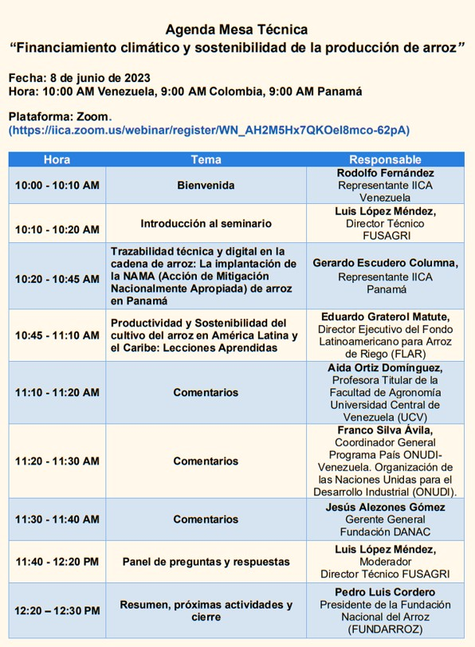

**Si Ud. desea participar en esta Mesa Técnica** [Pulse aquí](https://iica.zoom.us/webinar/register/WN_AH2M5Hx7QKOeI8mco-62pA)

Encuentro virtual, organizado por FUSAGRI, el IICA y FUNDARROZ, con actores destacados de la cadena de valor del arroz, en el formato de Mesa Técnica, para compartir conjuntamente con Eduardo Graterol (FLAR) y Gerardo Escudero (IICA), las experiencias en el caso del mejoramiento de la productividad del cultivo de arroz en Panamá, y en  America Latina, de manera que través del análisis y discusión, podamos recoger las recomendaciones pertinentes para la elaboración de una hoja de ruta que permita obtener financiamiento, a fin de desarrollar un plan de acciones de adaptación y mitigación del cultivo del arroz al cambio climático y lograr la sostenibilidad del sector arrocero venezolano.
A la disertación de estos expertos internacionales se agregarían los breves comentarios de representantes de FAGRO-UCV, ONUDI y Fundación DANAC. 

