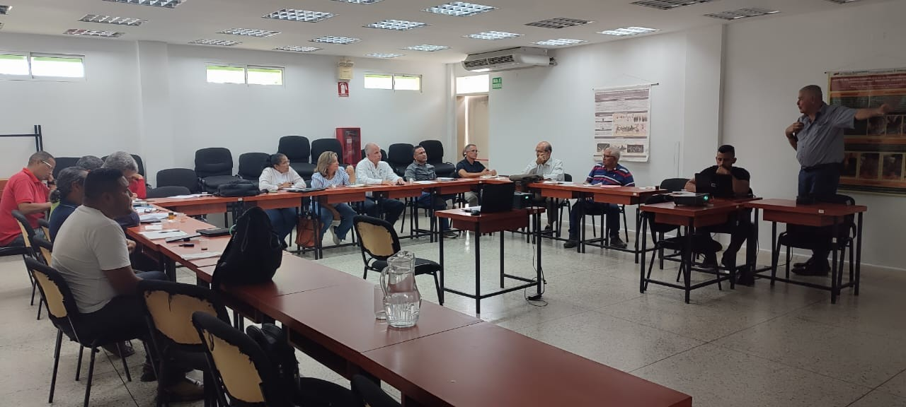
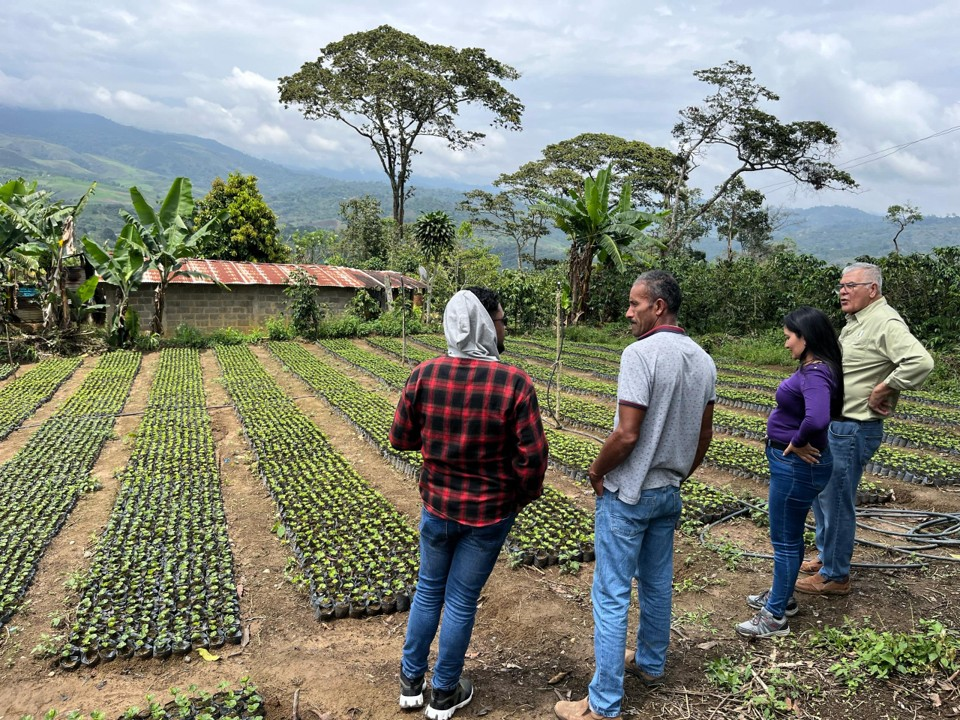
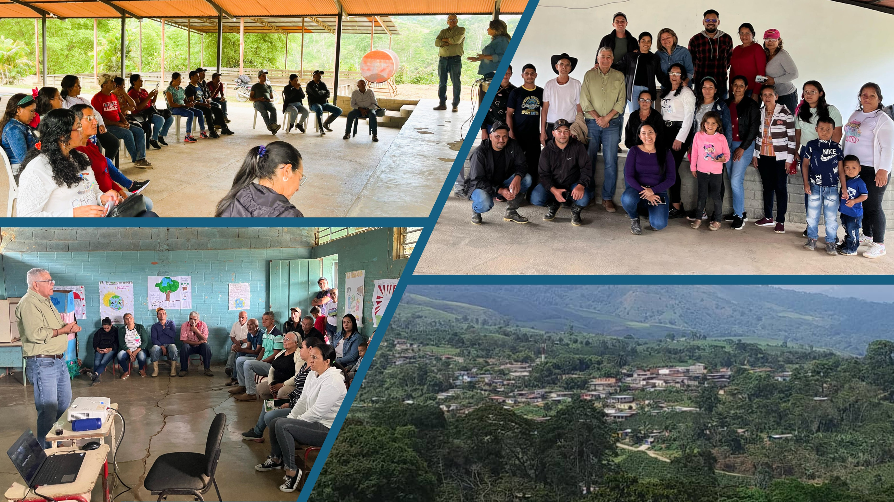

En la primera semana de mayo, se llevaron a cabo una serie de actividades en el estado Lara, para presentar el proyecto **"Sistemas Agroforestales Cafetaleros Sostenibles con Enfoque de Género"**, a organizaciones públicas y privadas, y a productores de café de la Parroquia Hilario Luna y Luna, específicamente en la comunidad cafetalera de Villanueva y sus alrededores. 
Las actividades incluyeron talleres, charlas informativas y visitas a fincas cafetaleras, donde se presentaron los beneficios de los sistemas agroforestales (SAF), se compartieron experiencias exitosas y se promovió el intercambio de conocimientos entre los participantes.

El proyecto es impulsado por la Fundación Servicio para el Agricultor (FUSAGRI) en alianza con el Instituto Internacional de Cooperación para la Agricultura (IICA), y cuenta con el apoyo local de la Fundación Don Diego (El Tocuyo) y del Circuito Económico Cafetalero “Vida y Café”. Se espera que esta iniciativa contribuya significativamente al desarrollo de la caficultura sostenible de la Parroquia Hilario Luna y Luna, mejorando la calidad de vida de las familias cafetaleras y fortaleciendo su capacidad de adaptación al cambio climático.

En una reunión celebrada en las instalaciones del Instituto Nacional de Investigaciones Agrícolas (INIA-Lara), representantes de diversas instituciones se dieron cita para discutir esta iniciativa, presentada por Luis López Méndez y Carmen Torrealba de FUSAGRI, y por Rodolfo Fernández del IICA.  Este encuentro contó con la participación de Luis Dickson, coordinador estadal del INIA, junto a Yasmil Granda, José Antonio Salas, Hector García y Lisbeth Ure; Diego Lozada, y Crisbely Pérez de la Fundación Don Diego; Horci Escalante y Alexander Acosta por la Universidad Centroccidental Lisandro Alvarado (UCLA); Carlos Reyes y Edgar Torres de CORPOLARA y Meiber Graterol del Ministerio del Poder Popular para la Agricultura Productiva y Tierras (MPPAT - Lara).

El proyecto, que se enmarca en un modelo de acción para la construcción de **Comunidades Rurales Resilientes y Sostenibles (CRRS)**, busca fortalecer la producción de café de alta calidad a través de la implementación de sistemas agroforestales, que combinan este cultivo con la siembra de árboles. Esta estrategia permite diversificar la producción, mejorar la salud del suelo, conservar la biodiversidad y aumentar la resiliencia de las plantaciones cafetaleras frente al Cambio Climático.

Durante las jornadas de promoción llevadas a cabo en Villanueva y la Vigía Nueva,  se destacó el enfoque de género del proyecto, que busca garantizar la participación equitativa de las mujeres en todas las etapas de la cadena de valor del café, desde la producción hasta la comercialización. Se resaltó el papel fundamental de las mujeres en la transmisión de conocimientos tradicionales, la gestión de los recursos naturales y el desarrollo de emprendimientos rurales.

