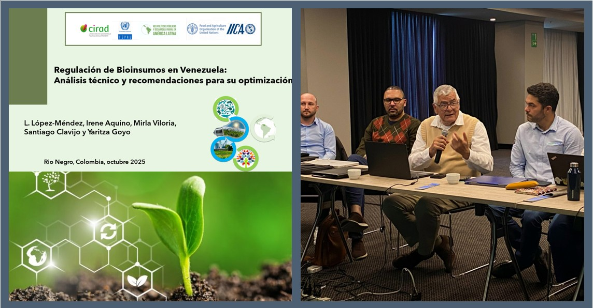
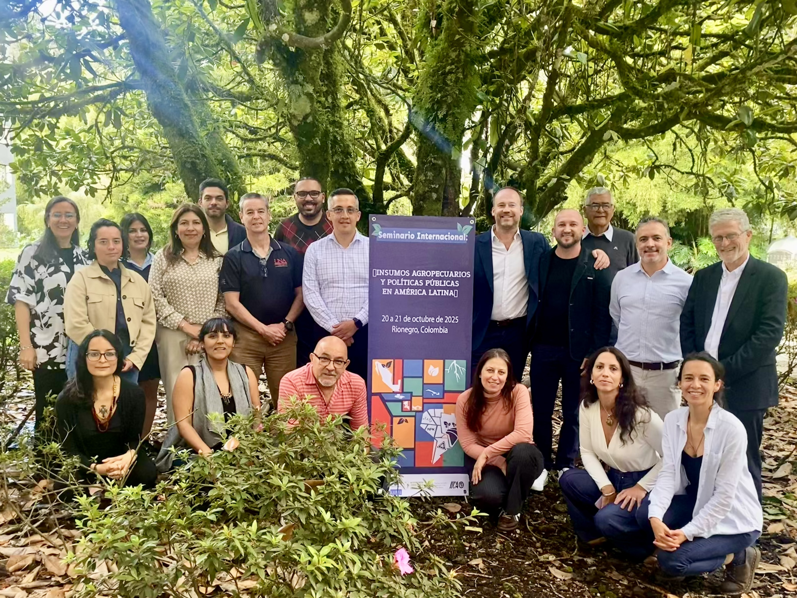

Organizado por la **Red de Políticas Públicas y Desarrollo Rural en América Latina** [(Red PP-AL)](https://www.pp-al.org/), junto con **CEPAL, FAO e IICA** , el seminario abordó la encrucijada de debates productivos, ambientales, industriales, comerciales y sociales que rodean a los insumos agropecuarios.

A lo largo de dos intensas jornadas, las presentaciones y discusiones se estructuraron en ocho secciones temáticas, con los bioinsumos como eje central. Las contribuciones de los autores del libro en preparación, titulado **"Insumos agropecuarios y políticas públicas en América Latina"**, cubrieron temas vitales como:

•	*(Des)regulación y Normativas en países como Venezuela, Chile y Argentina.*

•	*Políticas Nacionales para Bioinsumos y su fomento, con análisis de casos en Argentina, Brasil y Uruguay.*

•	*Procesos de Transición Tecnológica y la coexistencia de políticas de agricultura sustentable y de fertilizantes en Brasil, Colombia y México.*

•	*Gobernanza Multisectorial e influencias de la industria en el uso de bioinsumos.*

•	*Retos y Oportunidades en países específicos, incluyendo Costa Rica y Cuba.*

•	*Controversias sobre Agroquímicos y sus alternativas, como el debate sobre el glifosato en México y el contrabando de agrotóxicos en la frontera Brasil-Paraguay.*

El evento permitió un extenso intercambio entre los participantes, generando debates sobre los desafíos y perspectivas de las políticas públicas, vinculadas especialmente a los bioinsumos agropecuarios, destacando que la falta de marcos regulatorios específicos y la inexistencia de armonización regional dificultan el registro y comercialización en múltiples países, así como también la importancia de una definición clara y consensuada del término bioinsumos para facilitar su regulación y adopción. Igualmente se abordó la experiencia pionera de Brasil, que regula la producción "on farm" y establece controles y buenas prácticas para la producción artesanal. 

De la misa manera se resaltó la existencia de  suficiente evidencia científica que demuestra beneficios ambientales, económicos y sociales de los bioinsumos, pero esta información no siempre está accesible ni sistematizada, lo que retarda su adopción y el desarrollo de políticas públicas.

**Próximos Pasos**

El seminario concluyó con una sesión de *"Cierre - Próximos pasos"*, reafirmando el compromiso de los participantes y las instituciones organizadoras de avanzar en la publicación del libro en 2026, con un equipo editorial conformado por: 
- *Frédéric Goulet (CIRAD/CIMMYT, Red PPAL), 
- Mônica Rodrigues (CEPAL),
- Catia Grisa (UFRGS, Red PPAL),
- Ana Posas Guevara (FAO) y 
- Harold Gamboa (IICA).

La obra busca contrastar experiencias nacionales y regionales para contribuir a la formulación de políticas en bioinsumos más sostenibles, inclusivas y efectivas en América Latina.

>La **Red de Políticas Públicas y Desarrollo Rural en América Latina** (Red PP-AL) estudia las políticas públicas con el objetivo de examinar sus mecanismos y sus efectos en las transformaciones del mundo rural y en la lucha contra la desigualdad *(https://www.pp-al.org/)*

