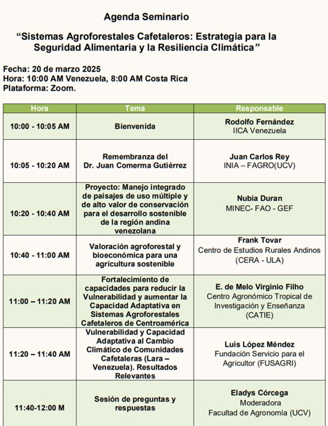

**Vea la presentación de este seminario pulsando** [aquí](https://youtu.be/aWfDQkGHZbY)

Organizado por la *Fundación Servicio para el Agricultor (FUSAGRI)* con el soporte del *Instituto Internacional de Cooperación para la Agricultura (IICA)*, el seminario virtual **"Sistemas Agroforestales Cafetaleros: Estrategia para la Seguridad Alimentaria y Resiliencia Climática"**, celebrado el 20 de marzo de 2025, fue un espacio clave para el intercambio de conocimientos y la generación de propuestas innovadoras para el futuro del cultivo del café en el sureste del estado Lara, de donde proviene aproximadamente la cuarta parte de la producción nacional de este rubro.

Más allá de la presentación de hallazgos y experiencias, el seminario se destacó por su enfoque en la formulación de propuestas concretas para impulsar la gestión sostenible de los sistemas agroforestales cafetaleros como estrategia de adaptación al cambio climático. De igual manera, se buscó promover un diálogo multidisciplinario e interinstitucional que permita desarrollar soluciones efectivas y equitativas, incorporando el enfoque de género y reconociendo el papel fundamental de la mujer caficultora.

El seminario también rindió un emotivo homenaje póstumo al **Dr. Juan Comerma Gutiérrez**, cuyo invaluable legado en la Ciencia del Suelo sigue inspirando la búsqueda de soluciones innovadoras para la agricultura sostenible.

Este evento representa un paso fundamental en la construcción de un futuro más sostenible y resiliente para el sector cafetalero, a través de la generación de propuestas que promuevan la adopción de sistemas agroforestales y el desarrollo de comunidades prósperas y sostenibles.

¡Gracias a todos los participantes por compartir experiencias y construir juntos soluciones sostenibles para el futuro del café! ☕

**Vea el video de la presentación de este seminario pulsando** [aquí](https://youtu.be/aWfDQkGHZbY)

