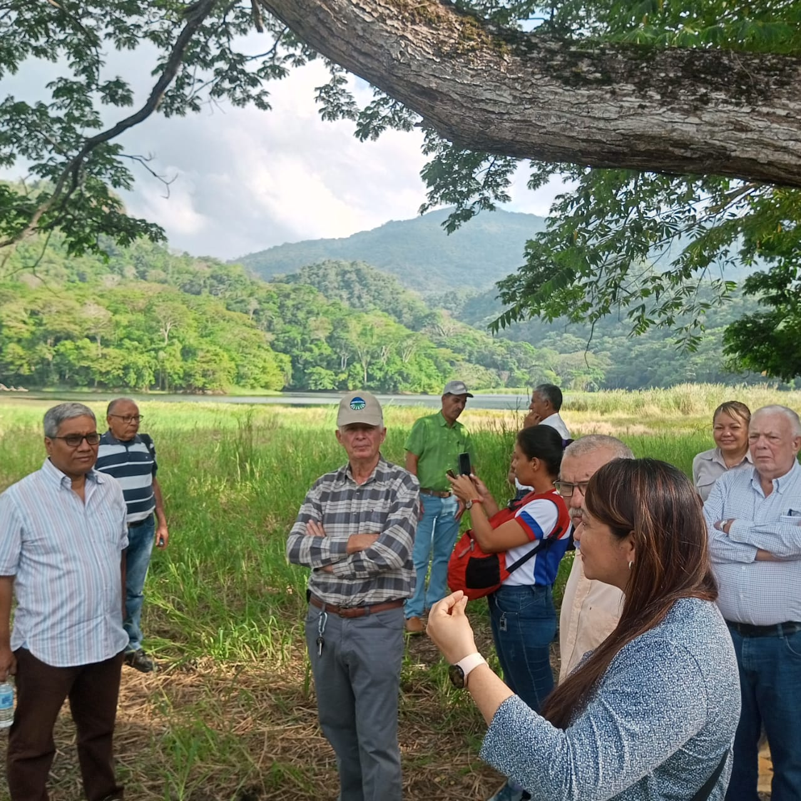

Continuando las acciones coordinadas para apoyar los esfuerzos que vienen realizando los sectores productivos (procesadores de frutas, productores de plantas sanas y citricultores) para el rescate y relanzamiento de la citricultura nacional, la Fundación Servicio para el Agricultor (FUSAGRI) y la Oficina en Venezuela del Instituto Internacional de Cooperación para la Agricultura (IICA), con el acompañamiento de la Dirección de Salud Vegetal Integral del Instituto Nacional de Salud Agrícola Integral (DSVI-INSAI), lograron implementar exitosamente la Visita Técnica de la Dra.  Yelitza Colmenarez, especialista en control biologico y Directora de CAB International-CABI (Centro de Biociencia Agrícola Internacional) para América Latina, con sede en Sao Paulo (Brasil), junto al  Dr. Carlos Vásquez, Profesor de Entomología en la Facultad de Ciencias Agropecuarias de la Universidad Técnica de Ambato (UTA) y apoyo del Programa Plantwise dentro del marco de colaboración de CABI-Plantwise-UTA, con el propósito de considerar la implementación de proyectos de cooperación internacional y nacional para el Manejo Integrado de Plagas y Producción Sustentable en Venezuela, con particular énfasis en la enfermedad de los cítricos “Huanglongbing” (HLB), también conocida como enverdecimiento (greening) y considerada como el problema fitosanitario más grave en el país, la cual  ha causado considerables pérdidas económicas en las zonas citricultoras más importantes, ubicadas en los estados Yaracuy y Carabobo.

Además de recorrer los terrenos para constatar los daños y las pérdidas de plantaciones de naranjas, los delegados de la visita técnica también se reunieron con el Decanato de Agronomía de la Universidad Centroccidental “Lisandro Alvarado” (UCLA) y la Facultad de Agronomía de la Universidad Central de Venezuela (FAGRO-UCV) para planificar proyectos de investigación relacionados con el HLB y el insecto vector. De igual manera con instituciones del sector público: INSAI, INIA, Fundación CIEPE, y del sector privado como FUNDACAÑA, Fundación DANAC.  Cabe destacar que  los delegados fueron atendidos por el Gobernador del estado Yaracuy y su equipo ejecutivo, quien se mostró partidario de crear una Comisión Regional del HLB para garantizar la continuidad del proceso recuperación de la citricultura local. 

Especial consideración fue dedicada a las empresas productoras de plantas de cítricos en viveros protegidos: AGROVIVAR (Chivacoa-Yaracuy) y SUPERPLANTULAS C.A. (Turmero-Aragua) pudiendo evidenciar los avances logrados para la obtención de plantas sanas libres de HLB, cumpliendo los estándares exigidos por el INSAI. 
La siembras de estas plantas está pautada para comenzar el primer semestre del 2024.

La realización de esta fructífera visita para determinar las demandas de los sectores productivos, en cuanto a ciencia y tecnología para el manejo integral del HLB y el desarrollo de la nueva citricultura, así como de las capacidades actuales y necesarias para afrontar ese retos, se hizo posible gracias al soporte y apoyo logístico brindado por las organizaciones gremiales Yaracuy PUEDE, FEDECAMARAS Yaracuy, la Federación Nacional de Fruticultores (FEDENAFRUT) y la Asociación de Fruticultores del Occidente de Carabobo (AFOCAR), así como de las procesadoras de frutas Multi Fruit C.A., Frutícola El Valle C.A. y la Corporación Tropical Cotoperí C.A.

