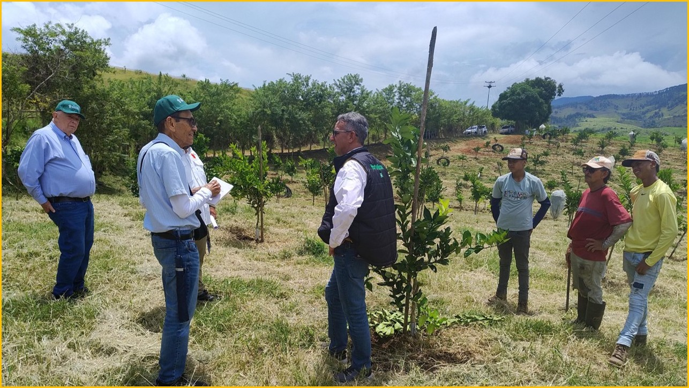
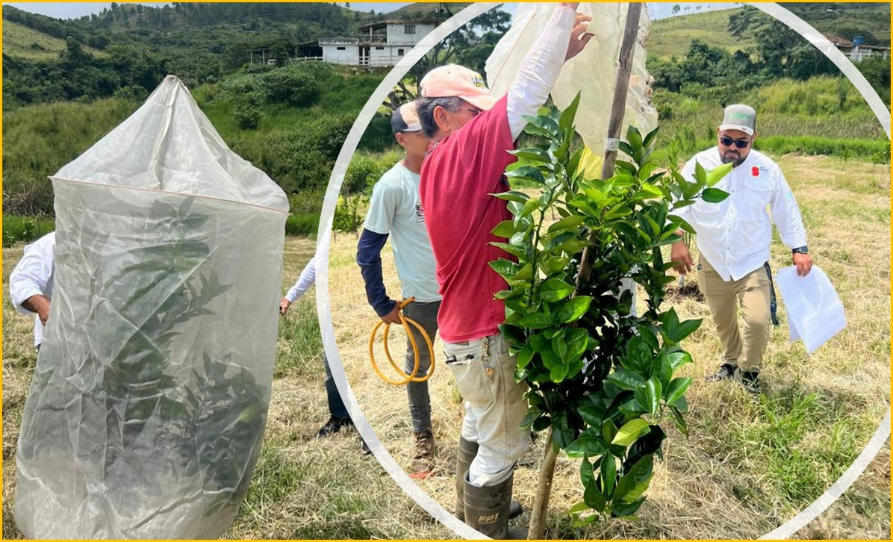
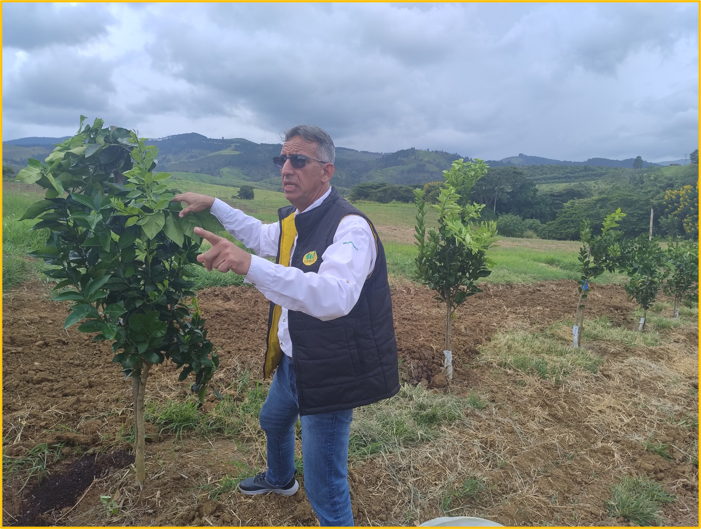

La citricultura venezolana se ha enfrentado a un desafío considerable desde la aparición de la enfermedad del **Huanglongbing (HLB)** en 2016, lo cuál coincidió con plantaciones envejecidas de baja productividad y una deficiente fiscalización de viveros, resultando en la inexistencia de plantas sanas certificadas. Esto, junto con la escasez de insumos y el colapso de la cadena de valor, provocó la pérdida de árboles y una disminución drástica en la oferta y calidad de frutas, al extremo que las principales industrias procesadoras de naranjas están prácticamente paralizadas. Cabe destacar que la citricultura generaba 4,5% y 1% del PIB de Yaracuy y Carabobo, respectivamente, lo cual dimensiona económicamente el daño que ha causado el HLB.

Un avance importante hacia la reactivación de la producción citrícola se pudo comprobar mediante una visita técnica a las **Parcelas Piloto de Plantas Sanas de Cítricos (PPC)** ubicadas en:  **Nirgua - Yaracuy (Sr Martin Rodríguez, Finca Cantarrana) y Montalbán - Carabobo (Sra. Maigualida Cabrera, Sector Agua de Obispo).**
El objetivo de esta inspección fue evaluar el progreso de estas pruebas, conducidas por **Agropecuaria Superplántulas C.A. – la primera empresa nacional en obtener la certificación  de PSC –** implementando una estrategia bioeconómica, con el objetivo de construir un nuevo modelo de negocios para el sector. Estas parcelas experimentales comparan cuatro patrones importados, injertados sobre naranja Valencia, sembrados en varias densidades de plantación, desde Tradicional (400 plantas/ha), hasta Alta (600 plantas/ha). Los patrones fueron seleccionados por su tolerancia a HLB y a CTV (virus de la tristeza de los cítricos), así como también por su alta productividad y tamaño del árbol.

La comitiva técnica estuvo integrada por destacados especialistas como el Dr. Santiago Clavijo (Consultor del IICA), el Dr. Edmundo Monteverde (Especialista en Citricultura Tropical), el Ing. Luis López-Méndez (Director Técnico de FUSAGRI), y en representacion de Agropecuaria Superplántulas C.A., el Ing. Aurelio Sánchez (Vicepresidente) y el Ing. Néstor Klemm (Gerente de I&D de Distribuidora Magna).

Durante la visita, se observó un excelente desarrollo de las plantas de naranja, con un año de trasplantadas, libres de plagas y enfermedades. Los especialistas destacaron la implementación de buenas prácticas de manejo y conservación de suelos mediante cobertura vegetal, sin uso de herbicidas, y el empleo de bioinsumos (biocontroladores y biofertilizantes). La aplicación de nutrientes se realiza con base en análisis de suelo y evaluación con drones, y se monitorean insectos con trampas de colores.

Un hallazgo prometedor es el magnífico comportamiento de los portainjertos **US-897 y US-942, provenientes del Centro de Investigación y Educación sobre Cítricos de la Universidad de Florida (UF/CREC),** los cuales han demostrado inducir plantas semi-enanas de excelentes rendimientos  y buena calidad de fruta. Además, se resaltó el vigor y la altura de las plantas protegidas con la tecnología **“Tree Defender”.**

Ing. Aurelio Sánchez, Vicepresidente de Superplántulas C.A., comentó: *"Si bien el control total del HLB aún no es posible, hoy día sí es posible convivir con el problema adaptándonos con nuevas tecnologías. Nuestro desafío es cambiar el modelo de producción para una citricultura venezolana competitiva".* Sánchez expresó su optimismo, afirmando que *"el primer paso ya lo dimos para tener plantas sanas en viveros protegidos, con la estricta supervisión  de la Dirección de Salud Vegetal Integral del Instituto Nacional de Salud Agrícola Integral (DSVI-INSAI) y de la Comisión Nacional de Semillas (CONASEM), que incluyó el análisis de riesgos para la importación de semillas de patrones y yemas de copas de cítricos. Creemos que vamos a lograr grandes cambios".*

Por su parte, los especialistas señalaron que *“estas parcelas piloto son fundamentales para la capacitación de talentos en nuevas tecnología: altas densidades, podas, manejo agroclimático y manejo agrícola inteligente,  así como para  demostrar la importancia del suministro confiable de plantas a los citricultores”.* También coinciden en que  la recuperación de la citricultura venezolana es una oportunidad para establecer un nuevo modelo de producción basado en una estrategia que integre la seguridad alimentaria, la mejora de la calidad de las frutas y la exploración de mercados de exportación, todo dentro de un marco de sostenibilidad ambiental.

>Los resultados de estos ensayos piloto serán clave tanto para el diseño y gestión de políticas públicas, como para la toma de decisiones sobre el manejo agronómico de futuras plantaciones y el escalamiento de proyectos de investigación, con la meta de crear un modelo de **citricultura rentable y sostenible.**

