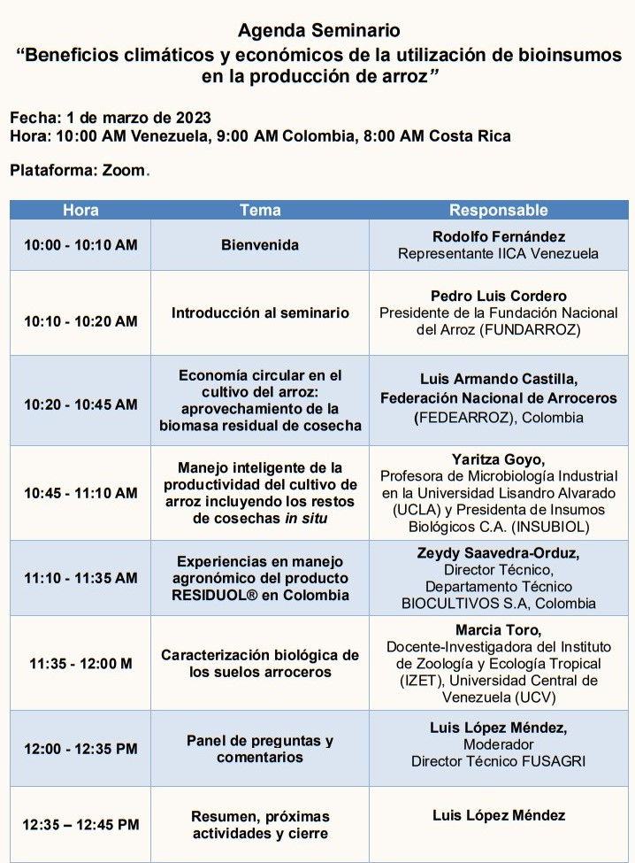

**DESARROLLO**

Se presentaron resultados de las experiencias en el manejo de los residuos de cosecha de arroz en Colombia, a través del Programa AMTEC (Adopción Masiva de Tecnología), impulsado desde el año 2012 por [FEDEARROZ](https://www.fedearroz.com.co/es/) - Fondo Nacional del Arroz, el cual busca que el agricultor arrocero sea competitivo frente a mercados internacionales, mediante la adopción de prácticas y tecnologías que permitan aumentar la productividad, haciendo un uso racional de los recursos naturales, en sintonía con los principios y fundamentos de la economía circular. Esta información fue complementada con las experiencias en el manejo agronómico de RESIDUOL®, bioinsumo desarrollado para acelerar la descomposición y degradación de los residuos de cultivo en campo (in-situ), a cargo de la empresa [BIOCULTIVOS S.A.](https://www.biocultivos.com.co/)

>Los resultados obtenidos indican que con la práctica de manejo los residuos de cosecha del cultivo del arroz, estimados 5 a 7 t/ha, y el reciclaje de nutrientes, se logra incrementar el rendimiento del arroz entre 1.0 a 1.4 t/ha. Al mismo tiempo, se evita la emisión de aproximadamente 44 toneladas de CO2 atmosférico, que causan efecto invernadero favoreciendo el calentamiento global del planeta.

La bioindustria nacional estuvo representada por la empresa [INSUBIOL C.A.](https://www.insubiol.com.ve/), exponiendo sobre los principios, objetivos y ventajas del Manejo Inteligente y Productivo de Arroz, como también sobre el manejo y resultados del compostaje de residuos agrícolas, demostrando la capacidad nacional para el desarrollo y producción de bioinsumos. Finalmente, pero no menos importante, pudimos conocer de las competencias técnicas que dispone el [LABORATORIO DE ECOLOGÍA DE AGROECOSISTEMAS](https://leaizetucv.wordpress.com/#:~:text=El%20Laboratorio%20de%20Ecolog%C3%ADa%20de,de%20sustratos%20y%20enmiendas%20org%C3%A1nicas) de la Universidad Central de Venezuela para   medir el impacto/efecto del manejo de residuos en la salud el suelo y los indicadores físicos, químicos y biológicos que se utilizan para ello 

**CONCLUSIONES**

Si bien el propósito de este seminario fue generar un ambiente de discusión entre los distintos actores, públicos y privados, del sector primario arrocero, sobre estrategias para avanzar en el desarrollo de bioinsumos agrícolas como herramientas para una producción sustentable en un escenario de cambio climático que nos afecta a todos, con las excelentes exposiciones realizadas y la discusión generada, no queda duda que el sector arrocero está preparado y dispuesto para avanzar hacia  esquemas de producción que sean sustentables y amigables con el medio ambiente, trabajando bajo el concepto de una sola salud, con un enfoque integrador que procura equilibrar y optimizar de manera sostenible la salud de los ecosistemas, de los animales y de las personas.

Pudimos comprobar que existe tanto la tecnología disponible como las capacidades de investigación primarias y el escalamiento necesario para el manejo de residuos de cosecha. Igualmente, que existe información de los beneficios económicos y climáticos del empleo de los bioinsumos.

>Se requiere entonces que comencemos a transitar el camino de la implementación de esta tecnología mediante las actividades de transferencia y generación de información de línea base que demuestren efectivamente la contribución del arroz en la disminución de emisiones de GEI, reducción en la aplicación de fertilizantes químicos y mejora en la salud de los suelos.

En tal sentido surge la necesidad de crear un equipo técnico para la formulación de una propuesta para apalancar financieramente esta iniciativa en virtud de su aporte en la atenuación del cambio climático. La organización paraguas para este equipo no podría ser otra que FUNDARROZ, con la colaboración [FEDEARROZ Colombia](https://www.fedearroz.com.co/es/), [BIOCULTIVOS S.A.](https://www.biocultivos.com.co/), [INSUBIOL C.A.](https://www.insubiol.com.ve/), y el [LABORATORIO DE ECOLOGÍA DE AGROECOSISTEMAS](https://leaizetucv.wordpress.com/#:~:text=El%20Laboratorio%20de%20Ecolog%C3%ADa%20de,de%20sustratos%20y%20enmiendas%20org%C3%A1nicas) de la Facultad de Ciencias de la Universidad Central de Venezuela.

**Ud puede ver la grabación completa de este seminario pulsando** [Aqui](https://youtu.be/bYkXiiQmdU4) 

