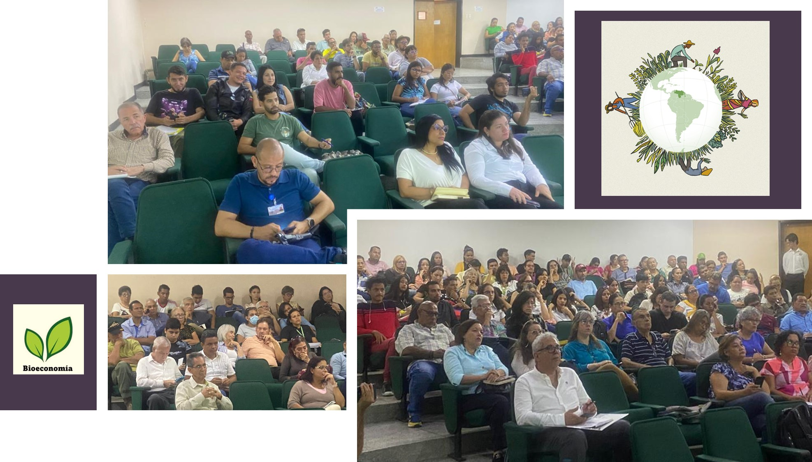

Con gran éxito se celebró el pasado 11 de octubre, el *Seminario “Bioeconomía, Innovación y sostenibilidad para el futuro del agro venezolano”*, en el Auditorio de Economía Agrícola y Ciencias Sociales de la Facultad de Agronomía de la UCV (FAGRO-UCV), en Maracay. Este evento se enmarca dentro del *Diplomado “Bioeconomía aplicada a las cadenas de valor agrícolas”* que fue diseñado conjuntamente por expertos de la FAGRO-UCV, el Instituto Interamericano de Cooperación para la Agricultura (IICA) y la Fundación Servicio para el Agricultor (FUSAGRI) y tomará lugar durante las próximas 6 semanas, incluyendo actividades de aula, talleres, días de campo y visitas a empresas, iniciándose así, de una manera formal, los programas de formación de talentos venezolanos en esta importante área. 

El Auditorio estuvo pleno de profesionales y técnicos provenientes de diversas universidades nacionales, empresas y ong´s quienes pudieron valorar el enorme potencial de la Bioeconomía para el logro de un modelo agrícola verdaderamente sustentable, adaptando los sistemas tradicionales y mitigando el cambio climático.  
Los diversos expositores destacaron la importancia de la biodiversidad y la generación de conocimientos como bases de la Bioeconomía, ilustraron con ejemplos concretos los grandes avances que esta disciplina ha tenido en  Argentina, Brasil, Colombia, México y Costa Rica, resaltando el gran potencial que tendría en un país megadiverso como Venezuela. 

