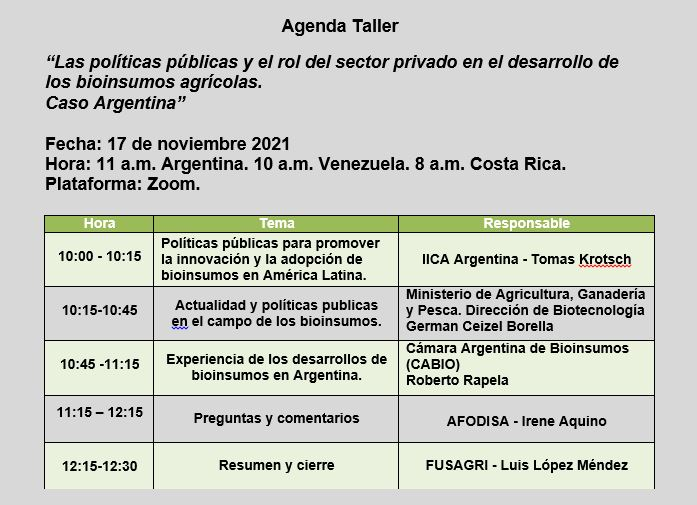

Mediante los **Ciclos Virtuales IICA-FUSAGRI** se aspira concientizar sobre la urgente necesidad de transformar el actual modelo agrícola venezolano por uno nuevo que potencie el desarrollo sostenible de la agricultura y los territorios rurales, con visión bioeconómica. El primero de estos Ciclos se inició el pasado 29 de septiembre con el webinar:  *“Los bioinsumos: estrategia sustentable para el sistema alimentario venezolano”.*

Con este primer encuentro hemos empezado la construcción de un espacio de diálogo y cooperación entre los sectores participantes para potenciar el avance de esta bioindustria en el país. En tal sentido se acordó la realización de varios talleres para conocer las dinámicas actuales en materia de bioinsumos de los países que más han avanzado en ese aspecto en la región, comenzando con las presentaciones de la **Cámara de Bioinsumos de Argentina (CABIO)** y el **Ministerio de Agricultura, Ganadería y Pesca (MAGyP)**

