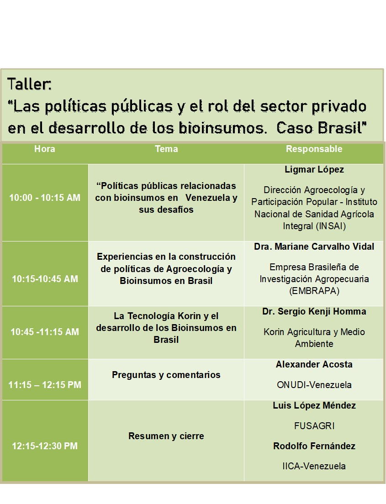

Para este segundo taller contamos con la participación de la Dra. Mariane Carvalho Vidal, investigadora de la Empresa Brasileña de Investigación Agropecuaria (EMBRAPA), quien fuera  coordinadora del Programa Nacional de Bioinsumos del Ministerio de Agricultura, Ganadería y Abastecimiento de Brasil, mientras que por el sector privado tuvimos la presencia del Dr. Sergio Hamma, CEO de Korin Agricultura y Medio Ambiente, empresa pionera en la producción de bioinsumos agrícolas en Brasil.

El sector oficial venezolano estuvo representado por la Ing. Ligmar López, Directora de Agroecología y Participación Popular del Instituto Nacional de Sanidad Integral (INSAI), para dar la bienvenida a los ponentes y participantes de este segundo taller, en el marco de las actividades dispuestas por el Ministerio del Poder Popular para la Agricultura y Tierras (MPPAT) para el fomento de la bioindustria nacional de bioinsumos.

**Para ver todas las presentaciones de este seminario pulse** [Aqui](https://youtu.be/5GRLPn7gcXo)

