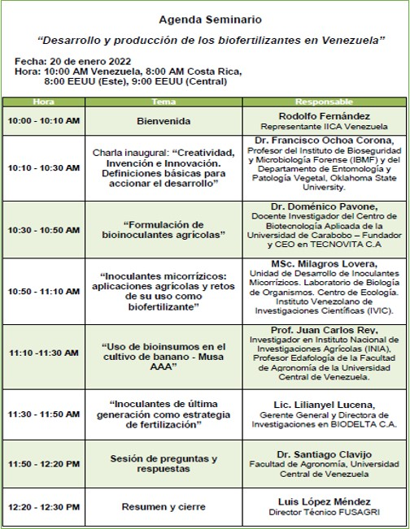

La producción y el uso de biofertilizantes agropecuarios ha venido incrementándose, especialmente por el empleo de inoculantes bacterianos, fertilizantes biológicos y mejoradores del suelo, con la particularidad que aproximadamente el 80% de ellos son productos nacionales.
Estos resultados solo son posibles gracias al esfuerzo conjunto realizado por los actores responsables del desarrollo de los bioinsumos agrícolas. Por un lado, el aporte fundamental de las distintas organizaciones de investigación, tanto públicas como privadas, y por el otro, el impulso decisivo del sector privado en su apuesta a las empresas de biotecnología. A esto se agrega el apoyo de las políticas públicas en materia de agroecología.

Con este marco de referencia realizamos el segundo de los Encuentros Virtuales IICA-FUSAGRI, iniciando con la presentación del **Dr. Francisco Ochoa (Oklahoma State University, OSU)** quien abordó un tema trascendental para el desarrollo de las bioindustrias y lo que tiene que ver con el apoyo a los bioemprendimientos locales. Tema por lo demás sensible de donde se derivan estímulos para la generación de conocimientos: la propiedad intelectual y las patentes, sobre lo cual tenemos que crear puentes y condiciones si queremos futuro en agroecología y Bioeconomía.

Las contribuciones de los centros de investigación públicos estuvieron cargo de la **Dra. Milagros Lovera del Instituto Venezolano de Investigaciones Científicas (IVIC)** en relación a las asociaciones de micorrizas y su aplicación en la agricultura: un universo poco conocido y el cual está llamado a ser eje central en la transformación de los sistemas alimentarios; y por el **Instituto Nacional de Investigaciones Agrícolas (INIA), el investigador Juan Carlos Rey** nos mostró los avances sostenidos, aunque aún modestos, en el uso de los bioinsumos agrícolas en musáceas, rubro estratégico de gran importancia en la alimentación y nutrición de los venezolanos, sobre el cual se cierne una gran amenaza, el Fusarium (R4T), y donde estos bioinsumos deben tener especial protagonismo para su manejo.

Dos empresas de biotecnología, con capital y tecnología venezolana, nos expusieron algunas de sus áreas de acción: la **Lic. Lilianyel Lucena, Gerente General y Directora de Investigación en BIODELTA**, explicó como materializar en el campo, la utilización de la más reciente generación de inoculantes microbianos, pues la transferencia a los productores agrícolas es muy distinta a la receta de los agroquímicos, y requiere de acompañamiento técnico especializado. Por su parte, el **Dr. Doménico Pavone, CEO y fundador de TECNOVITA**, presentó una serie de soluciones innovadoras en materia de formulación de bioinsumos, además de los esfuerzos que realizan en la capacitación técnica.

En este encuentro pudimos apreciar que la Bioeconomía va estrechamente vinculada con la generación de conocimientos y la puesta en marcha de innovaciones. Implica agregación de valor, creación de empleos calificados, inclusión territorial. Bioeconomía no es hacer compost, que por cierto, no es menos importante. Pero Bioeconomía va más allá.
Y requiere, un marco apropiado para su despegue y desarrollo. En ese camino andamos.

**Para ver todas las presentaciones de este seminario pulse** [Aqui](https://youtu.be/2aN3Z3sCtq8) 

