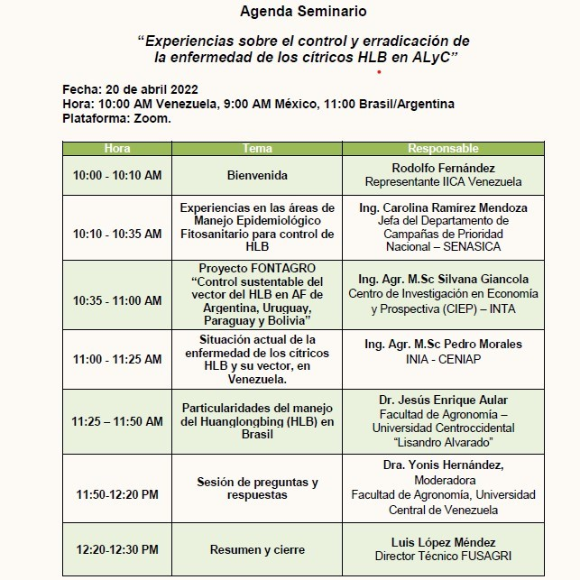

En este 4to seminario de los Encuentros Virtuales IICA-FUSAGRI, efectuamos un cambio sustancial, pero plenamente justificado, en la agenda de los encuentros virtuales IICA-FUSAGRI, dedicados a impulsar a la Bioeconomía en Venezuela como herramienta fundamental para el desarrollo sustentable de nuestra agricultura, así como también en la visibilización y apoyo a las actividades conexas relacionadas con la agroecología y la economía circular.
Ello en razón a las considerables pérdidas de árboles que ha causado esta enfermedad en las zonas de producción, de acuerdo con las informaciones suministradas por los representantes de los gremios citricultores y la muy disminuida oferta de estas frutas, tanto al mercado fresco como a la industria. Por estas razones, se considera urgente y necesario el rescate de la principal área citrícola – Valles Altos de Carabobo y Yaracuy- y en tal sentido creimos conveniente conocer y analizar experiencias regionales en el manejo del HLB, como insumo sustancial en la elaboración de un Proyecto Manejo Integral del HLB de los Cítricos para ese territorio.
Es así como pudimos conocer tres realidades muy distintas entre sí, e igualmente diferentes a la nuestra: México, Argentina y Brasil, pero que necesariamente tenemos que tomar en consideración para la refundación de la citricultura nacional.
Resalta en los tres casos citados el respaldo de los planteamientos, asi como de los resultados y logros, mediante gráficos y datos, metodológicamente recolectados, algo de lo cual carecemos y que son indispensables para proponer soluciones factibles al problema del HLB y su vector, como por ejemplo  las Áreas de Manejo Epidemiológico Fitosanitario (AMEFI’s), donde se coloca al agricultor en el centro del eje para el manejo integral, y exitoso, de la enfermedad, independientemente del tamaño de las fincas o predios. Esto debería ser una de las tareas prioritarias, y donde FUSAGRI está dedicando esfuerzos en la construcción de una propuesta, necesaria pero también factible de llevar a cabo.

**Ud puede ver la grabación completa de este seminario pulsando** [Aqui](https://youtu.be/47XSNvbaggo) 

