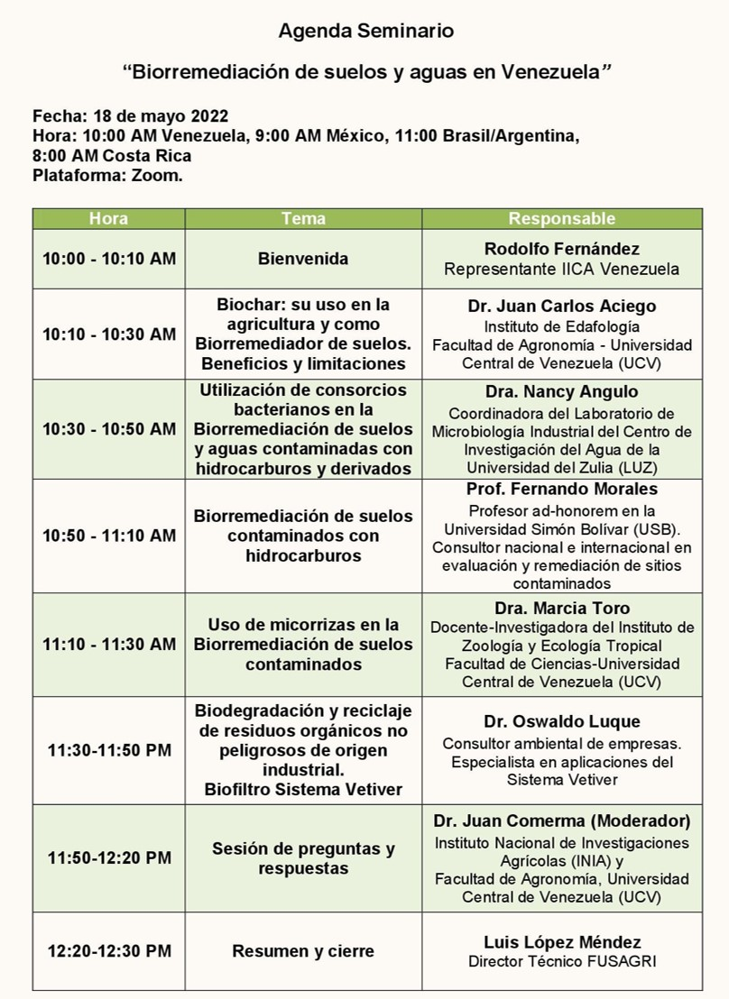

La Biorremediacion de suelos y aguas se alinea con 2 de los senderos para el aprovechamiento de la Bioeconomía en el país: la adecuada utilización de los recursos de nuestra inmensa biodiversidad, particularmente de los suelos, e igualmente las aplicaciones biotecnológicas. La combinación de ambas permitiría lograr soluciones tanto para la recuperación de suelos degradados por la actividad petrolera y minera, como también por acumulación de sales y pesticidas.

Es conveniente destacar que no es posible el desarrollo de la Bioeconomía sin investigación, pues se trata de eso, de la aplicación de la ciencia y la tecnología para producir más y mejor sin impactar el medio ambiente, y preferiblemente de manera inclusiva.  En este caso en particular hablamos de Biotecnología Gris o Biotecnología Ambiental (biorremediación, manejo de residuos, biolixiviación) es decir, las aplicaciones directas de la biotecnología sobre el medio ambiente para la recuperación y conservación de la biodiversidad y reducción de contaminantes. Y eso es definitivamente importante para un país petrolero, y minero como el nuestro, pero que también posee extensas áreas como las sabana orientales de Anzoátegui y Monagas, coincidentemente petroleras, con suelos marginales para la agricultura, llamada convencional, pero con abundante recursos hídricos y energía solar, y que gracias a aplicaciones biotecnológicas como el caso del Biochar pudieran ser incorporados a la producción agrícola, especialmente si nuestra visión de agricultura, mira más allá de alimentos y puede pensar que los bosques como Uverito  forman parte de ella, con la consiguiente utilización de los residuos de la producción forestal (cerca del 80%), Mediante la aplicación de esa tecnología podríamos aprovechar esas extensas áreas para producir biomasa y secuestrar carbono.

De la misma manera, se hace necesario pasar al proceso de escalamiento de los productos de las investigaciones que se vienen realizando, con grandes esfuerzos, en nuestras universidades, para el beneficio de la sociedad, pero también para el fortalecimiento del Sistema Tecnológico Nacional y de las condiciones de nuestros investigadores. Un ambiente propicio para estos encuentros lo debe proporcionar el estado venezolano generando políticas públicas que estimulen y haga realidad esa convergencia tecnológica, por lo demás mostrada con los trabajos que viene realizando con esa maravilla verde llamada Vetiver y con un importante apoyo de la empresa privada. Es tiempo de comenzar a establecer estándares en la huella hídrica gris de las actividades industriales ubicadas en las cuencas más importantes del país, como por ejemplo en la del Lago de Valencia, donde se ubica el problema ambiental más grave de Venezuela, y para lo cual ya hay opciones probadas y escaladas como las  mostradas en este seminario.
Finalmente, pero no menos importante fue la exposición de casos concretos de biorremediacion óptima en Venezuela mediante el enfoque de estimulación de comunidades de macroorganismos nativos, y de la capacidad instalada para biorremediar situaciones de contaminación por hidrocarburos y derivados  

**Ud puede ver la grabación completa de este seminario pulsando** [Aqui](https://youtu.be/5QULNRE_Feo) 

