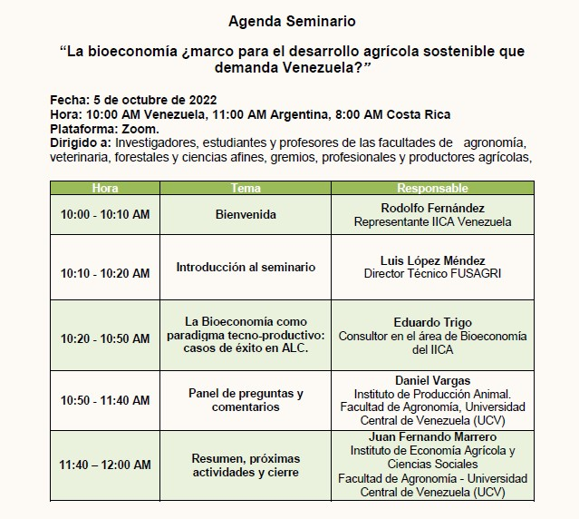

**La Bioeconomía como marco para el desarrollo de sistemas agrícolas sostenibles**

Pareciera que hemos superado la peor parte de la crisis sanitaria provocada por el COVID-19, con signos evidentes de recuperación de la actividad económica y el crecimiento del consumo de energías fósiles. En este punto de inflexión vale la pena preguntarnos si se reactivará el modelo global de desarrollo capitalista dependiente del petróleo o se comienza a transitar hacia nuevos paradigmas basados en el desarrollo sostenible, como la economía circular, la economía verde o su aproximación convergente: la Bioeconomía.

Los cambios acelerados que se están produciendo inclinan la respuesta a que si hay una transición en marcha, centrada en la sostenibilidad y en una economía baja en carbono, socialmente inclusiva, resiliente al cambio climático, y que a su vez, permite restaurar y conservar la biodiversidad. La hoja de ruta para esa senda son los Objetivos de Desarrollo Sostenible (ODS) de la Agenda 2030.

Esa transformación es más urgente en el Sistema Alimentario Venezolano (SAV), lo que obliga a la reformulación del papel de la agricultura en la economía y en la sociedad, donde los productos a obtener directamente de la actividad agrícola dejen de ser en si mismos el núcleo central, permitiendo incorporar nuevas opciones para la agregación de valor y nuevas formas de relación agricultura-industria, como por ejemplo los biocombustibles, la bioeconomía forestal, la utilización de los recursos de nuestra biodiversidad y los servicios ecosistémicos.

Se trata de un cambio de paradigma del desarrollo agrícola, vinculándolo a nuevos desafíos y oportunidades emergentes en sintonía con los avances de la ciencia y la tecnología, lo que supone la incorporación de nuevos bioprocesos a la producción de bienes y servicios para la obtención de un mayor valor agregado y la generación de numerosos empleos directos e indirectos.

Este cambio requiere de ajustes en los esquemas productivos actuales, que a su vez obligan a la adecuación de la formación de los profesionales destinados a trabajar en los mismos, representando el momento venezolano actual una excelente oportunidad para iniciar, con una visión compartida, la construcción de un nuevo modelo de desarrollo agrícola para Venezuela.

En este contexto, la Fundación Servicio para el Agricultor (FUSAGRI), el Instituto Interamericano de Cooperación para la Agricultura (IICA) y la Facultad de Agronomía de la Universidad Central de Venezuela (UCV) acordaron en emprender un conjunto de actividades tendentes al logro de lo señalado, la primera de las cuales fue el Seminario Virtual, la Bioeconomía ¿marco para el desarrollo agrícola sostenible que demanda Venezuela?, realizado el 5/10/2022, con la participación del Dr. Eduardo Trigo, una de las referencias globales en materia de Bioeconomía y asesor del Director General del IICA, mediante la ponencia: “Bioeconomía, una apuesta estratégica para América Latina y el Caribe”, destacando que no es un proceso nuevo, pues hay al menos once países que tienen estrategias para el aprovechamiento de estos senderos de desarrollo en AL y C, de manera que  no es hablar de potencialidades, sino de cosas que ya están ocurriendo en la región y que tienen una dimensión realista.
Por su parte,  Yinet Parrado Sanabria, del Ministerio de Ciencia, Tecnología e Innovación de Colombia, y Coordinadora Programa Colombia BIO, el cual tiene como finalidad fortalecer los conocimientos de la biodiversidad de Colombia y en consecuencia la comprensión de sus posibles usos y aplicaciones, presentó una disertación acerca de las “Experiencias de Ciencia Tecnología e Innovación para una Bioeconomía en Colombia”.

**Ud puede ver la grabación completa de este seminario pulsando** [Aqui](https://youtu.be/Hc9BYF04uDU) 

