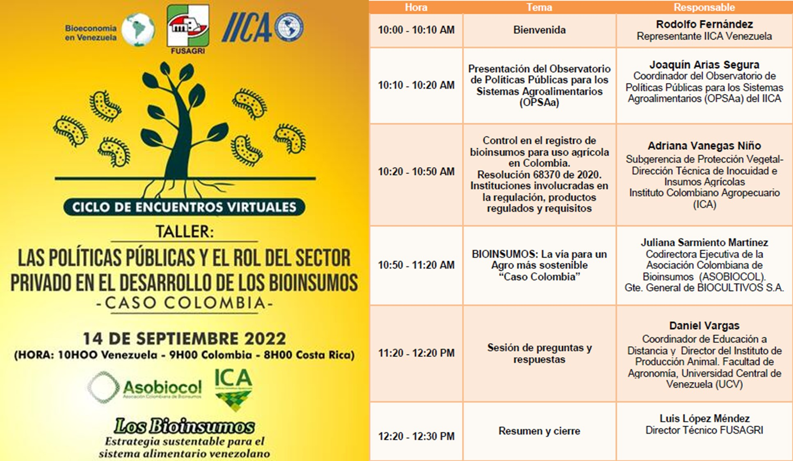

El negocio de los bioinsumos agrícolas en Colombia, ha tenido un significativo crecimiento en los últimos diez años. Para entonces contaba con 97 empresas registradas como productoras de bioinsumos, en la actualidad hay 333. Así mismo, en 2012 se generaban 123 kilos de producto, pero en 2019 se fabricaron 2,4 millones de kilos. Uno de los factores que más ha influido en este crecimiento son los requerimientos para la exportación de algunos rubros, como el aguacate, el banano, el café, las pasifloras, los arándanos y el cannabis. Se espera que las cifras vayan incrementando. Según el Plan de Bioeconomía al 2030 del MinCiencias, se tiene proyectado que la bioeconomía aporte 10% al PIB en el año 2030 y que, a ese mismo año, haya más de 500 bioproductos que incluyan nuevos principios activos, bioproductos en etapas pre-comerciales y comerciales y ampliaciones de registros a nuevos mercados nacionales e internacionales.

Para este Taller el sector público de bioinsumos estuvo representado por Adriana Vanegas Niño,  profesional de registro de empresas y productos tipo bioinsumos para uso agrícola de la Dirección Técnica de Inocuidad e Insumos Agrícolas, dependencia de la Subgerencia de Protección Vegetal del Instituto Colombiano Agropecuario (ICA).

La presentación del sector privado organizado en la Asociación Colombiana de Bioinsumos (ASOBIOCOL) fue realizada por su Codirectora Ejecutiva Juliana Sarmiento quien destacó que entre los objetivos de ASOBIOCOL está darle visibilidad y sostenibilidad a la bioindustria que busca un agro regenerativo y más sostenible. De ella hacen parte 12 empresas y varias exportan sus productos.

En esta ocasión también tuvimos la oportunidad de conocer sobre el nuevo Observatorio de Políticas Públicas para los Sistemas Agroalimentarios (OPSAa), 
por cuenta de Joaquín Arias, Especialista en Políticas y Análisis Sectorial Agrícola en IICA, quien detalló que será una herramienta para conectar personas e instituciones de los ámbitos público y privado, así como transformar el conocimiento en evidencia para una mejor gestión de las políticas públicas en las Américas. 

 **Ud puede ver la grabación de la primera parte de este seminario pulsando** [Sección 1](https://youtu.be/jukZkBEMLTg) y **la de la segunda parte** [Sección 2](https://youtu.be/JEA6Xg5Mir4)

