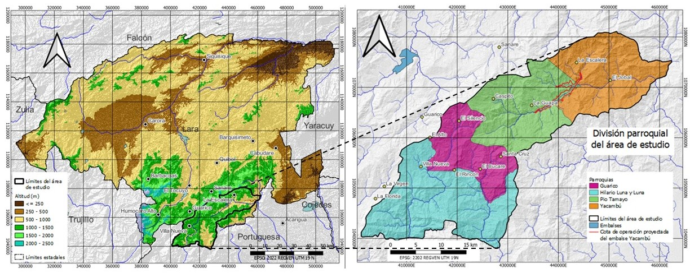
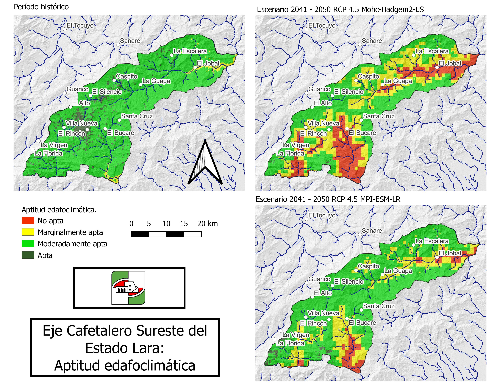
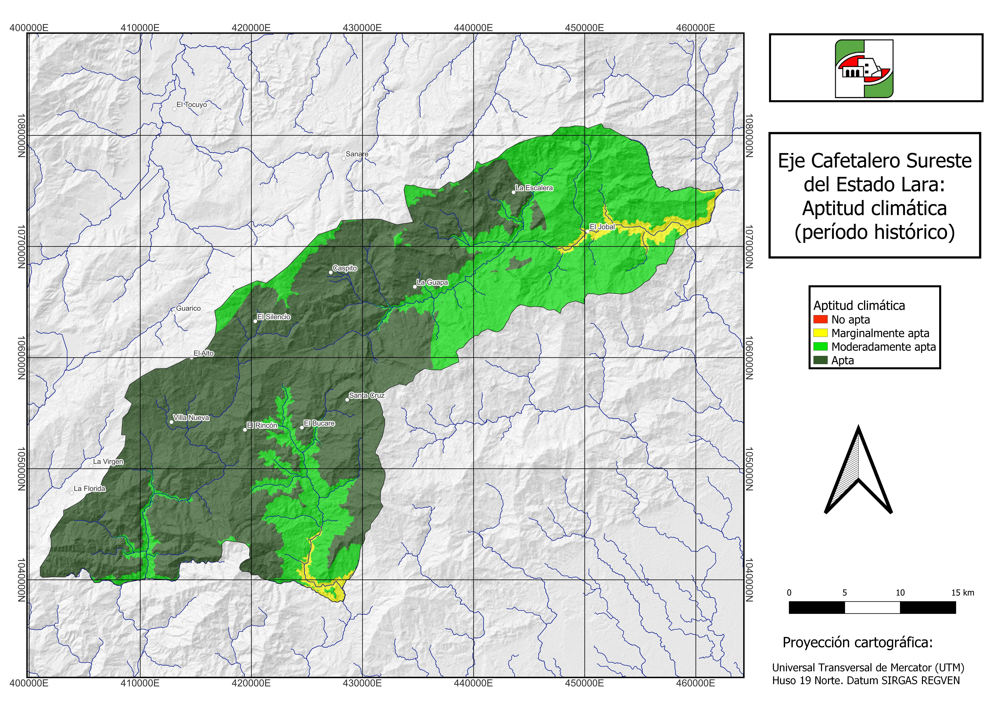
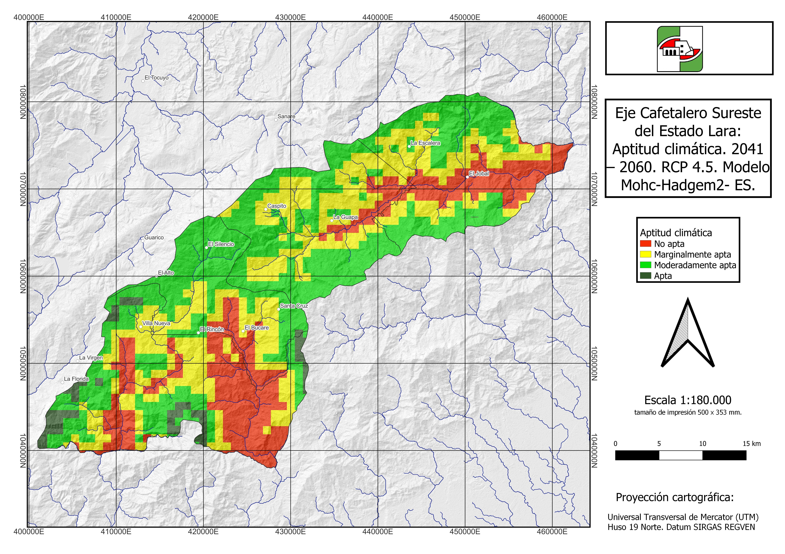
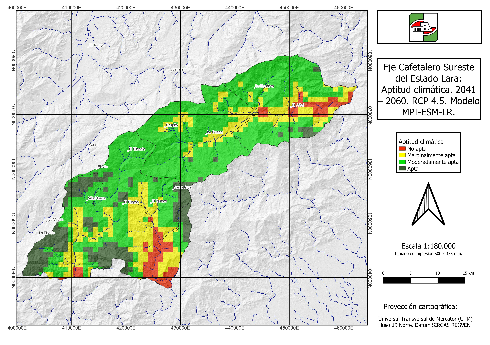

El cambio climático podrá perjudicar significativamente al cultivo del café arábica del eje montañoso del estado Lara. Esta fue la conclusión principal de un estudio desarrollado recientemente por la **Fundación Servicio para el Agricultor (FUSAGRI)**, con el patrocinio del **Instituto Interamericano de Cooperación para la Agricultura (IICA)**, y que contó con la participación de investigadores de la **Facultad de Agronomía de la Universidad Central de Venezuela**.

Para llegar a este resultado, se analizó la información climática histórica y futura del *Eje Cafetalero Sureste del Estado Lara* (conformado por las parroquias Hilario Luna y Luna, Guarico, Pío Tamayo y Yacambú) (**Figura 1**). Luego, este conjunto de información se comparó con los requerimientos del cultivo del café arábica.

 **Figura 1.** *Área de estudio: izquierda, localización en el estado Lara; derecha, división parroquial.*

A partir del análisis y procesamiento de los registros históricos de 17 estaciones climatológicas y de información climatológica regional disponible, se caracterizó el clima histórico en función a los requerimientos del café arábica. Para ello, se obtuvo el comportamiento y distribución espacial (en mapas) de la precipitación, temperatura (máxima, media y mínima del mes más frío), evapotranspiración y duración del período seco. 
>Para obtener valores para el clima futuro, estos mismos parámetros se estimaron empleando dos modelos climáticos globales para el período 2041–2060. Finalmente, comparando los valores de los parámetros climáticos mencionados con los requerimientos del café arábica, se obtuvieron los mapas de aptitud de las tierras para este cultivo en el escenario de clima histórico y en los dos escenarios de clima futuro (uno por cada modelo climático global empelado).

Los resultados mostraron que, en la mayor parte del área, generalmente sobre los 900 m de altitud, el clima es apto para la producción de café. Por debajo de esta cota, el régimen de temperatura limita, en cierta medida, el buen desarrollo del cultivo (como en el sur de la Parroquia Hilario y Luna), mientras que, por debajo de 600 m de altitud, la temperatura ofrece fuertes restricciones al cultivo. Adicionalmente, hacia el extremo nor-oriental del área de estudio (Parroquia Yacambú y sur de la Parroquia Pío Tamayo), la mayor precipitación ocasiona también moderadas limitaciones (**Figura 2**).

 **Figura 2.** *Aptitud climática de las tierras (período histórico).*

En contraste, al evaluar las condiciones futuras de clima (cambio climático), debido a la disminución de la precipitación, incremento de la temperatura y alargamiento del período seco, casi todas las tierras que históricamente han contado con una adecuada aptitud climática para el cultivo de café arábica, podrían degradar su aptitud debido a moderadas y fuertes limitaciones climáticas, e incluso, áreas considerables por debajo de 1000 m de altitud, podrían dejar de ser mínimamente adecuadas para este cultivo (**Figura 3** y **Figura 4**).

 **Figura 3.** *Aptitud climática de las tierras (2041 – 2060 RCP 4.5; Modelo Mohc-Hadgem2-ES).*

 **Figura 4.** *Aptitud climática de las tierras (2041 – 2060 RCP 4.5; Modelo MPI-ESM-LR).*

Al incorporar el efecto del suelo en la aptitud de las tierras, las restricciones pueden disminuir la aptitud de la tierra a grados inferiores de lo que permitirían las condiciones climáticas. Ello es el caso de gran parte de las Parroquias Hilario Luna y Luna, Guarico y Pío Tamayo, por lo que puede preverse que prácticas de mejoramiento de la fertilidad química y biológica del suelo podrán coadyuvar en el mantenimiento y mejoramiento de la aptitud de las tierras (**Figura 5**)

 **Figura 5.** *Aptitud edafoclimática de las tierras (escenario histórico y de cambio climático).*

También en este estudio, mediante encuestas diseñadas y dirigidas por la **Ing. Carmen Torrealba** *(Especialista en Desarrollo Sostenible – FUSAGRI)* en dos zonas productoras (una en la Parroquia Hilario Luna y Luna, y otra en la Parroquia Yacambú), se caracterizaron los sistemas de producción de café y, consecuentemente, la capacidad adaptativa de ellos. Sobre esta base, y considerando las mejores condiciones climáticas y mejor manejo de las plantaciones, los rendimientos de café tienden a ser más altos en la zona de Hilario Luna y Luna. Además, en esta zona, se reporta que recibe alguna asistencia técnica y los productores están mejor organizados que en la parroquia Yacambú. Por tales razones, se estima que la vulnerabilidad de los productores de la zona de Yacambú, ante el cambio climático, sería evidentemente mayor si se les compara con los productores de la Parroquia Hilario Luna y Luna.

El conocimiento adquirido en cuanto al impacto de posibles escenarios de cambio climático sobre la aptitud de las tierras para el cultivo del café arábica, en conjunto con lo relativo a vulnerabilidad de los caficultores, en especial, la de aquellos con desventajas para adoptar medidas de adaptación, puede servir de base para la delineación de políticas de gobernanza en cuanto a la adecuación de los sistemas de producción y de la asistencia técnica, social y económica a los productores.

Se estima que, entre las medidas de adaptación de los sistemas de café al cambio climático, deberá contarse, en plazos medios, con variedades tolerantes a temperaturas más altas y a condiciones restrictivas de humedad, y a corto plazo, enfrentar la renovación de las plantaciones y el mejoramiento de la sanidad del cultivo y del manejo del suelo (tanto en fertilidad como en retención y disponibilidad de humedad). También debe tenerse presente que, cuando se eleva el límite mínimo de altitud de las tierras aptas, gran parte del área de estudio podrá dejar de ser utilizable para el café. Por tanto, en la gestión agroambiental del área, y con especial énfasis en la conservación y degradación de los recursos naturales, se requerirán previsiones sobre la ocupación con cafetales de tierras más frágiles (boscosas y de muy fuerte pendiente), y sobre los posibles cultivos sustitutos en las tierras usadas con sistemas de café.
