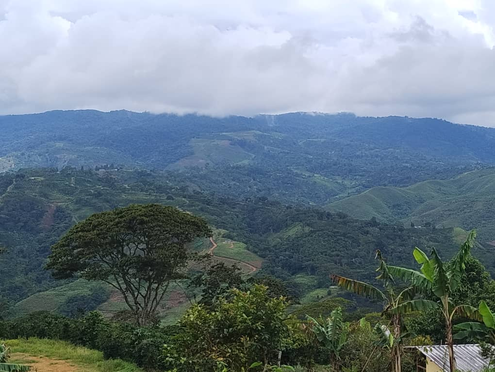
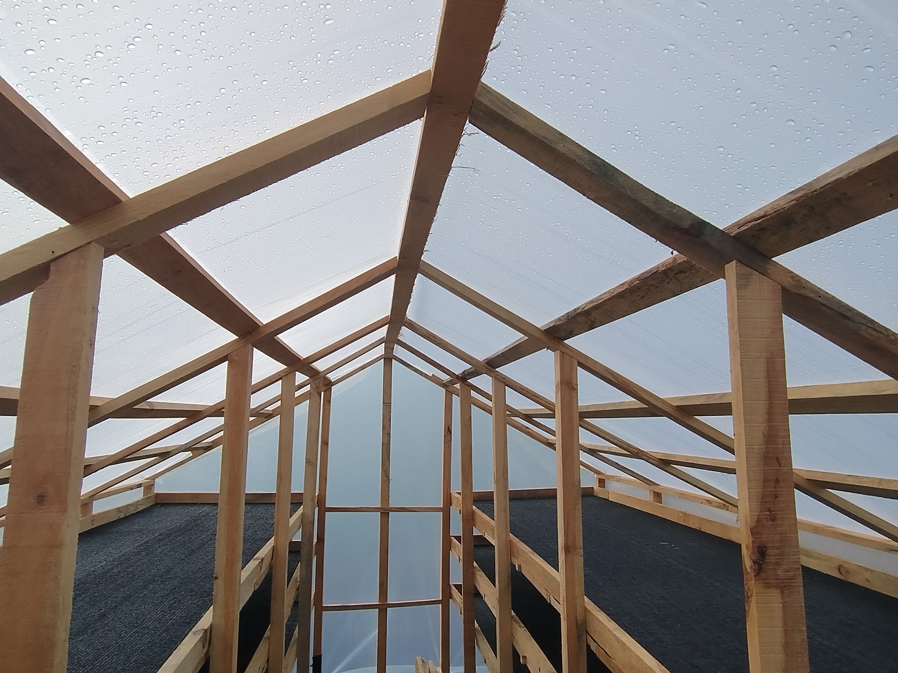
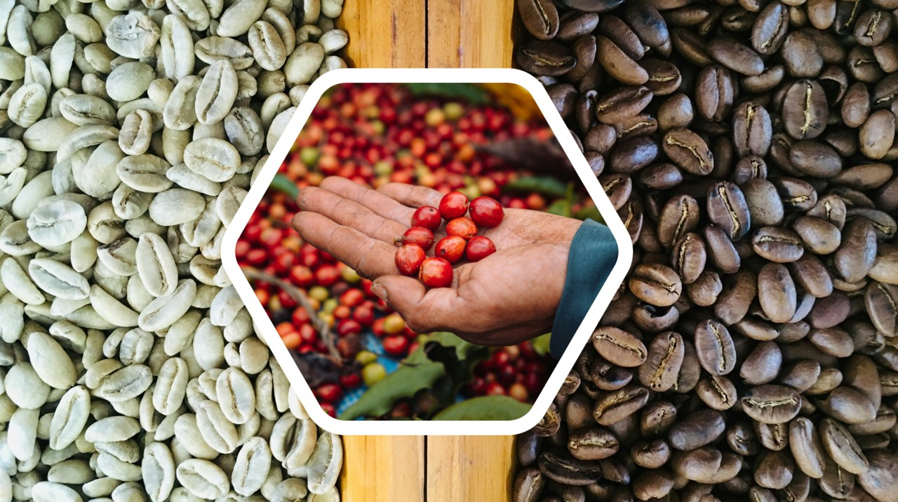
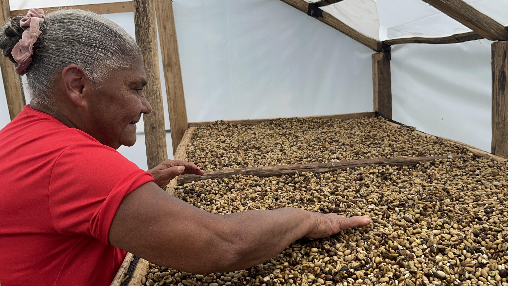
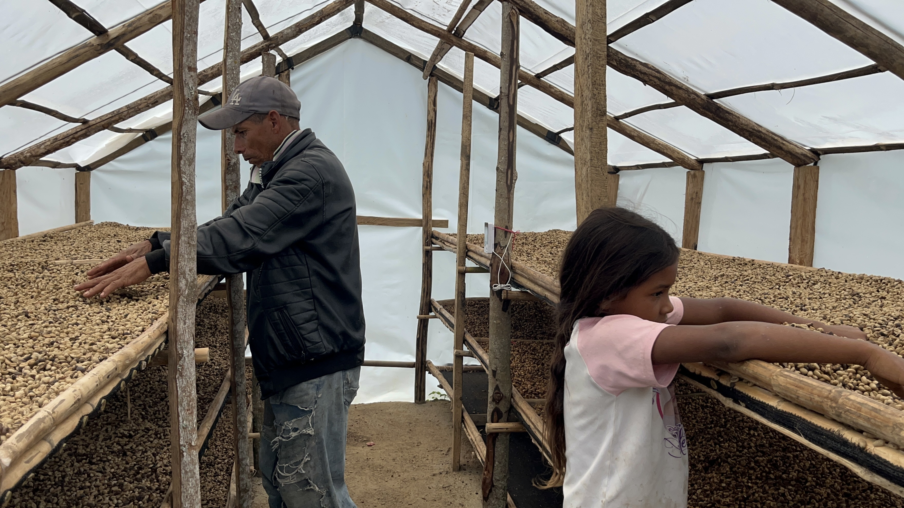
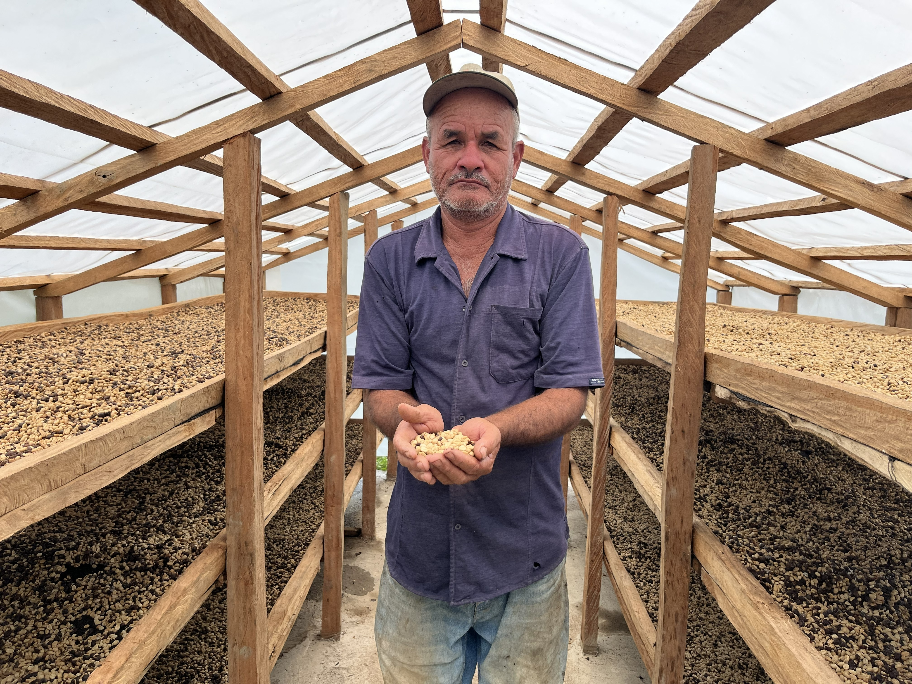
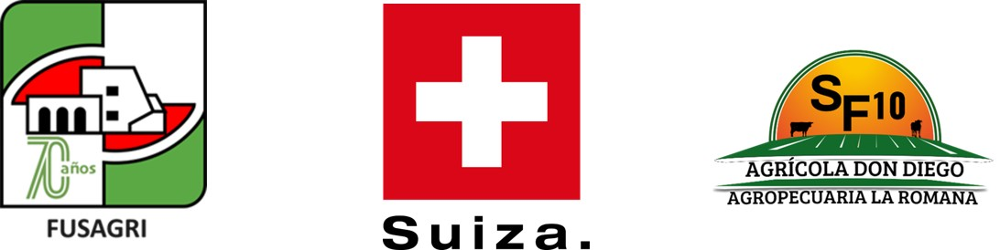

>Cuando un caficultor puede dormir tranquilo mientras afuera truena, sabemos que la innovación ha cumplido su propósito más noble.

### Alianza para el bienestar de los caficultores

 Históricamente, la vida del caficultor venezolano ha estado encadenada a la ansiedad del clima. 
 
Como dice la señora Zoraida Mendoza: *"uno está lo más tranquilo, y aunque truene, sabe que su cafecito está protegido bajo techo. Antes se vivía en carrera, teniendo que recoger el café a toda prisa ante la amenaza de un aguacero”*.

Hoy, esa angustia se ha convertido en tranquilidad. Esta transformación es el fruto de una alianza estratégica entre la  **Fundación Servicio para el Agricultor (FUSAGRI)** , la  **Embajada de Suiza en Venezuela**  y  **Agrícola Don Diego**. Juntos han demostrado que la tecnología limpia no es un lujo lejano, sino una herramienta más humana para devolverle tranquilidad al campo.

### Secar café no es simplemente "quitarle el agua"

La ciencia de este proyecto nos enseña que el objetivo real es  "dormir el grano" . El secado es un proceso de inducción a la latencia: buscamos que el embrión del café entre en un estado de reposo absoluto para que sus atributos vitales —aroma, sabor y cuerpo— queden sellados en su interior. La clave está en alcanzar el punto óptimo: **de 10 a 12% de humedad** . En este rango, el café queda estabilizado. Si el proceso es demasiado brusco, el grano se estresa; si es muy lento, se fermenta. El secador solar permite que, a través de mesas con mallas y una circulación de aire ascendente, el grano pierda humedad de forma uniforme hasta mostrar ese codiciado  color verde oliva homogéneo  que delata su altísima calidad. "El secado es la clave para resguardar la calidad de los granos”. 

### El caficultor como guardián de la calidad

Existe un mito en el campo: "mientras más sol, más rápido". Sin embargo, el calor excesivo es el enemigo silencioso de la calidad. Cuando la temperatura supera el límite de los  40-45°C  provoca un choque térmico que cristaliza los azúcares del mucílago y daña irreversiblemente el embrión. Aquí es donde el caficultor se convierte en un  **"guardián de la calidad"** . No es un proceso automatizado. Requiere manos humanas para abrir ventanillas y puertas entre las 11:00 AM y las 2:00 PM cuando el sol “calienta”. Esta gestión de la temperatura asegura que el grano no sufra, protegiendo esa estabilidad química que luego se traducirá en una taza excepcional.

### Haciendo justicia: eliminar la "cuota de dependencia"

La tecnología en Palo Grande ha tenido un impacto social que los manuales técnicos rara vez capturan. Antes de este proyecto, muchas mujeres caficultoras debían esperar su turno a que otro terminara de usar el patio de secado o, en casos más críticos,  pagar el servicio de secado entregando una parte de su propia cosecha. Hoy, de los 34 beneficiarios directos del proyecto,  **14 son mujeres**. El acceso a tecnología propia ha eliminado esa barrera, otorgándoles el 100% de los ingresos de su trabajo. La autonomía tecnológica es, en este contexto, la forma más real de empoderamiento: cuando la mujer controla el secado, controla el valor de su futuro.

### El "dinero encontrado" en la cosecha

A menudo pensamos que para ganar un 30% más, un caficultor debe ampliar un 30% más su plantación, o sembrar una variedad más “productiva”, lo que muchas veces implica más fertilizante y más sudor. Los datos recogidos por **Yfrain Fernández**  revelan una realidad distinta: en el método tradicional (secado en patio o con gasoil), se requieren entre  8 y 9 latas de café  para obtener un quintal trillado. Con el uso de los secadores solares, esa cifra se pudo bajar  a solo  6 latas por quintal, una ganancia de eficiencia de entre el 25% y 33%.. Es productividad pura que va directo al bolsillo de los caficultores.

### Calidad que mejora el ingreso. Tecnología covertida en dólares

La tecnología solo es valiosa si se traduce en bienestar económico. Los resultados de cata de los productores **Rufino Mendoza** y **Juan David Rodríguez**, alcanzaron puntajes entre  77 y 83 puntos. La calidad física y sensorial permitió romper la barrera de los precios comunes. Mientras el café en el mercado local fluctuaba entre 180 y 200 dólares por quintal, el café procesado bajo este modelo alcanzó hasta los 350 dólares  por quintal. El control técnico de la humedad y la higiene no es un lujo decorativo, es una herramienta que genera dólares adicionales.

>La hoja de ruta está a un clic: el **Manual práctico de construcción y uso de secadores solares para café**

Para que esta innovación se replique en el eje cafetalero, FUSAGRI ha sistematizado este conocimiento en un recurso práctico y gratuito, ofreciendo guías de construcción con materiales locales, protocolos de manejo de temperatura y estándares de calidad. Invitamos a técnicos, estudiantes y caficultores a descargar esta herramienta esencial para construir un modelo de alta eficiencia. El documento puede encontrarse en la **Biblioteca Virtual de FUSAGRI** , accesible gratuitamente en su sitio web oficial mediante este enlace: **https://www.fusagri.com/publication/** 

### Una pregunta para el futuro

El secado solar en Palo Grande es solo una pieza de un rompecabezas más grande: la  **Bioeconomía**. El paso del secado artesanal en patio, al secado solar controlado, es mucho más que una mejora técnica; es una evolución hacia la soberanía tecnológica y la resiliencia. Los datos demuestran que la sostenibilidad ambiental es el camino más corto hacia la viabilidad económica.
Al integrar resiliencia climática, soberanía tecnológica, equidad y viabilidad económica, estamos redefiniendo, con un enfoque bioeconómico,  qué significa ser un productor rural en el siglo XXI. Cuando un caficultor puede dormir tranquilo mientras afuera truena, sabemos que la innovación ha cumplido su propósito más noble.

**¿Podría esta combinación de tecnologías limpias y saberes locales ser el modelo para rescatar el resto de nuestra agricultura?**

