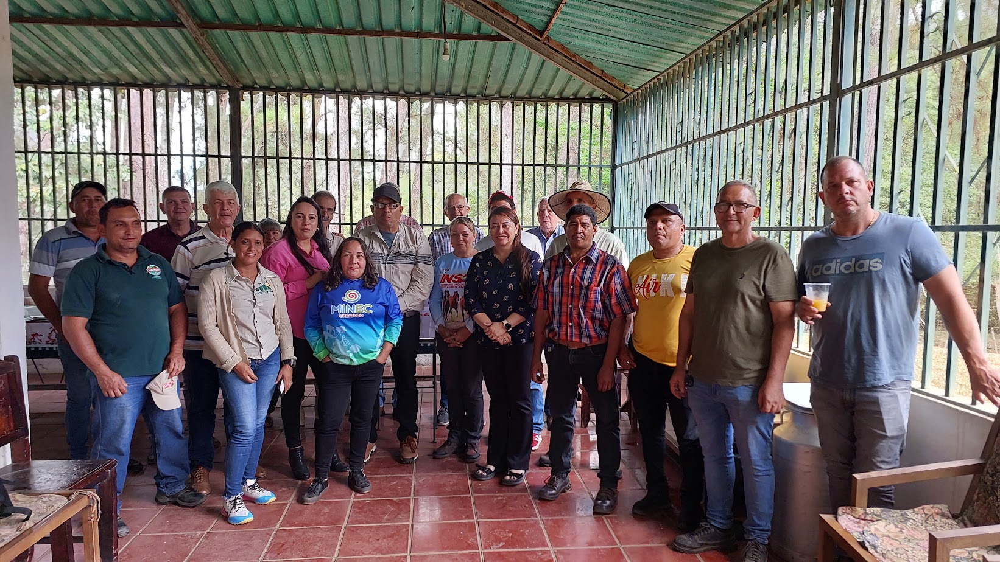
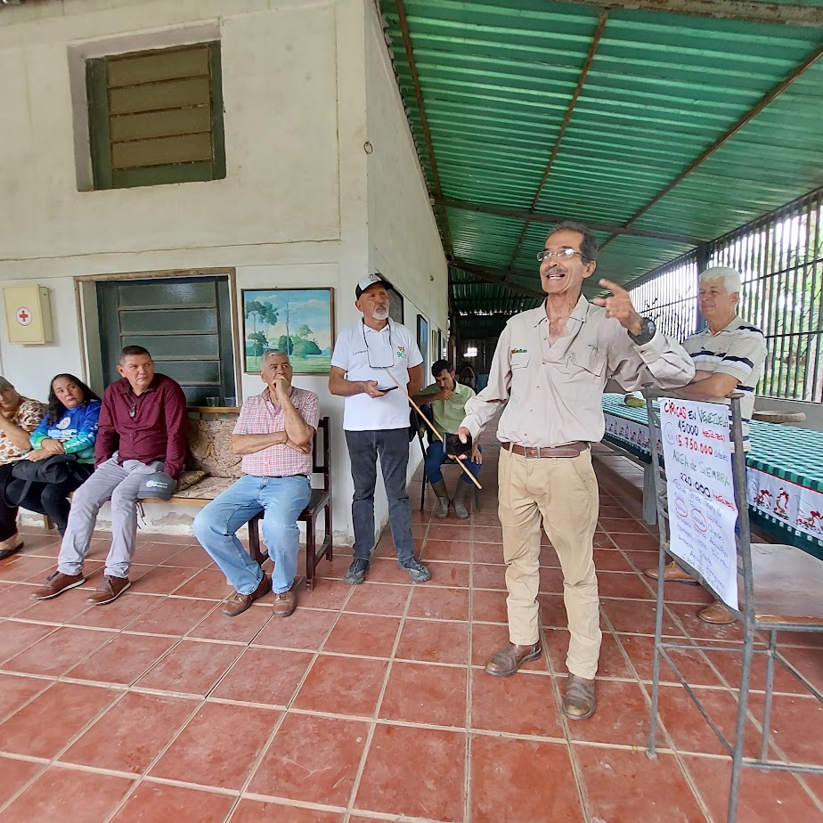

Dentro del plan *“Resiembra de Cítricos Carabobo 2024”* se concretó la visita técnica del **Centro de Biociencia Agrícola Internacional**, (CABI, por sus siglas en inglés), por parte de la directora de esta organización para América Latina, Doctora Yelitza Colmenarez.

Las gestiones ante el Ministerio del Poder Popular para la Agricultura Productiva y Tierras, para concretar esta la visita a Venezuela fue tramitada por la Fundación Servicio para el Agricultor, **FUSAGRI**, en la persona de su director, Ingeniero Luis López-Méndez, quien integró la comisión que tuvo varios encuentros en Lara, Yaracuy, Carabobo y Aragua.

>El martes 29 de noviembre arribaron a la Hacienda San Manuel, ubicada en el sector El Cedro, municipio Miranda del estado Carabobo; donde fueron recibidos por un grupo de citricultores e industriales; encabezados por los representantes gremiales, Juan González, presidente de la Federación Nacional de Fruticultores, FEDENAFRUT; y Jesús Castro, presidente de la Asociación de Fruticultores del Occidente de Carabobo, AFOCAR.

La Dra. Yelitza Colmenarez, adelantó que la misión vino con la intención de hacer un reconocimiento en sitio de la condición de las fincas citrícolas que fueron afectadas por el **Huanglongbing (HLB)**, conocido popularmente como *Dragón Amarillo*,  y evaluar la situación de los cultivadores del eje de los valles altos de Yaracuy y Carabobo, áreas productoras por excelencia de este rubro.

Detalló la experta venezolana, que venir a la región les permite conocer la situación, escuchar la experiencia en boca de los propios afectados, calibrar las investigaciones y el trabajo técnico que está adelantando la empresa privada en la producción de plántulas resistentes a la bacteria, con la finalidad que a futuro ayude en el proceso de replantar la áreas devastadas por la enfermedad.
Refirió Colmenarez, que a futuro se espera que con el trabajo conjunto entre sector público y privado se vean beneficiados los productores agrícolas con la reactivación del sector y “volvernos a tomar es juguito de naranja”. 

En ese orden de ideas, Colmenarez, quien es Ingeniera Agrónomo egresada de la Universidad Centroccidental Lisandro Alvarado, **UCLA**, reveló que hay un plan de trabajo a corto, mediano y largo plazo para implementar acciones puntuales. “Por ejemplo, a corto plazo, que los agricultores conozcan el correcto manejo del cultivo. En el mediano plazo, materializar la ayuda de los gobernantes tanto nacionales como estadales, a través de la recién creada **Comisión Nacional del HLB de los Cítricos**, conformada, según la Providencia Administrativa N” 4613, por el Ministerio del Poder Popular para la Agricultura Productiva y Tierras, (MPPAT), el Instituto de Salud Agrícola Integral (INSAI), la Comisión Nacional de Semillas (CONASEM), el Instituto Nacional de Investigaciones Agrícolas (INIA), el Instituto de Estudios Avanzados (IDEA), la Universidad Central de Venezuela (UCV), viveristas y empresas procesadoras.

Al finalizar el recorrido por la **Hacienda San Manuel**, su propietario, Pedro Tomás Pacheco, expuso a los asistentes un resumen pormenorizado de las implicaciones que el ataque del HLB ocasionó, afectando alrededor de 45 mil hectáreas y con ello a más de 15 millones de árboles de cítricos. Para luego proponer el plan de resiembra de 16.590 hectáreas en Carabobo que incluye 1.720 en el Municipio Montalbán, 1.240 en el Municipio Bejuma y 1.310 en el Municipio Miranda

**Fuente:** El Guardián Informa, 29 de noviembre 2023. Diciembre 2023, Año 1, N° 2. LECO Producciones. Miranda - Carabobo.
