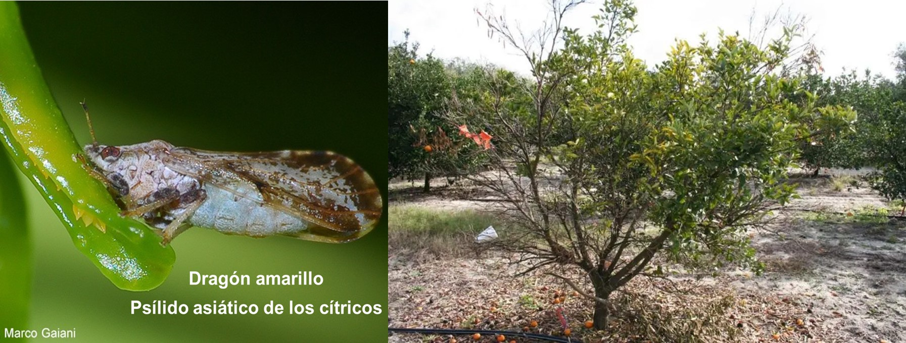

**Las pocas siembras de cítricas que se mantienen se localizan en las áreas de
mayor altitud, mientras que en los valles bajos está casi desaparecida.**

La agricultura y la agroindustria venezolana, componentes esenciales de
la producción de alimentos, han podido demostrar su resiliencia y
capacidad de reaccionar a los estímulos derivados de la dolarización de
la economía y la liberación de precios, sin embargo en ese "despegue
agrícola" no se ha podido incorporar el sector citrícola, debido a los
severos daños causados por la enfermedad HLB a las plantaciones ubicadas
principalmente en Yaracuy y Carabobo, donde también tienen asiento las
más importantes industrias procesadoras. Estos estados aportaban un poco
más de un tercio (37,2 %), de la producción nacional de naranjas,
limones y mandarinas, y ocupaban el 40,2 % de la superficie cosechada,
distribuidas en dos grandes zonas agroecológicas: Valles Bajos de
Aroa-Yaracuy y Valles Altos de Carabobo y Yaracuy. 

EL PROBLEMA

La enfermedad de los cítricos "Huanglongbing" (HLB), también conocida
como enverdecimiento (greening), causada por la bacteria *Candidatus*
Liberibacter asiaticus (CLas), y transmitida por el psílido asiático de
los cítricos o dragón amarillo (*Diaphorina citri*), es el problema
fitosanitario más grave en el país. Fue detectada en 2017, aunque los
síntomas tempranos característicos asociados a la enfermedad, tales como
brotes amarillos fueron notificados por productores en varias regiones
citrícolas desde el año 2016 (Marys et al. 2020, <https://doi.org/fn7j>).

La ausencia de estadísticas oficiales actualizadas impiden conocer la
realidad existente de la citricultura nacional, y del impacto que el HLB
ha causado, por ejemplo, en la contracción de las actividades
económicas regionales, sin embargo, son numerosas las denuncias
realizadas por las organizaciones de productores de pérdidas
considerables de árboles en las zonas de citrícolas, y en consecuencia,
la muy disminuida oferta, tanto en volumen como en calidad, de estas
frutas que están entre las preferidas para el consumo fresco y
elaboración de jugos , al mismo tiempo que son altamente recomendables
en el periodo post pandemia COVID-19. Ya es muy común observar limones y
naranjas importadas en los supermercados.

Por otro lado, se puede apreciar que en distintas zonas, algunos
productores tradicionales ya han sustituido sus plantaciones con cacao,
o lo que es más grave aún, por cultivos anuales o pastizales con la
consiguiente degradación de suelos y el impacto negativo en el balance
de los recursos hídricos, particularmente en Valles Altos de Carabobo y
Yaracuy, región que pertenece a la cuenca alta de los ríos Pao y
Cojedes. La citricultura que se mantiene se localiza en las áreas de
mayor altitud, mientras que en los valles bajos está casi desaparecida.

OPORTUNIDADES Y SOLUCIONES

Esta crisis puede ser aprovechada como una oportunidad para crear una
nueva citricultura, que logre integrar la seguridad alimentaria y el
mejoramiento de la calidad de las frutas, así como explorar
eventuales mercados de exportación, en un marco ambientalmente
sostenible y de desarrollo económico territorial. Con ese propósito se
hicieron contactos con actores activos y destacados de la cadena de
cítricos, y posteriormente se conformó un equipo de trabajo. Luego se
procedió a revisar y actualizar el "*Programa para establecer
referenciales tecnológicos para el manejo del complejo Huang Long Bing y
su vector Diaphorina citri en cultivos de cítricos de Venezuela (2019),*
teniendo como fundamento tanto las lecciones aprendidas como las
experiencias de México, Brasil y Argentina, en cuanto a control y
erradicación de HLB, recogidas con la realización del 4to Seminario de
los Encuentros Virtuales IICA-FUSAGRI en abril 2022
(<https://www.fusagri.com/bioeconomia-post/seminario-4/>).

Posteriormente, en agosto 2022, se llevó a cabo un taller con la
asistencia de destacados especialistas en el área de
investigación/transferencia del sector citrícola nacional, con el
objetivo identificar acciones para la construcción de una propuesta
consensuada teniendo en cuenta que en las circunstancias actuales,
plantear el rescate de la citricultura, a través de un esfuerzo
ambicioso en cuanto a cobertura geográfica pareciera no ser factible,
por lo que más bien deberíamos pensar en experiencias piloto,
adelantadas en localidades representativas donde existiesen condiciones
organizacionales favorables para desarrollar un proyecto de Manejo
Integral Regional (MIR) del HLB, lo que conduciría a establecer una
estrategia regional de manejo, tanto de la enfermedad como del vector,
que incluya el uso de plantas sanas, libres de la bacteria, y la
eliminación de plantas enfermas. Esta experiencia podría servir de
modelo para aplicarlo en otras regiones.

Como marco de acción se establecieron las siguientes premisas técnicas
para el MIR del HLB:

1.  El futuro de la citricultura nacional pasa por conocer, convivir y
    controlar al HLB y su vector.

2.  Para proponer soluciones factibles a este problema, como por ejemplo
    las Áreas de Manejo Epidemiológico Fitosanitario (AMEFI's)
    utilizadas en México, se requiere de información, metodológica y
    sistemáticamente recolectada y analizada, así como el
    posicionamiento del citricultor en el centro del eje para el manejo
    exitoso de la enfermedad HLB y su insecto vector, independientemente
    del tamaño de las fincas.

3.  Es absolutamente necesaria la "socialización" del conocimiento
    derivado de las investigaciones y experiencias obtenidas en el
    manejo integrado del HLB y su vector.

Considerando el bajo nivel de integración de los actores de la cadena de
cítricos, y por lo tanto la débil coordinación de acciones para
enfrentar este problema, se requiere el fortalecimiento de la gobernanza
de la misma, que pasa por la incorporación a cualquier plan de acción
que lograse implementarse, tanto a los productores como a la industria
procesadora, y que este involucramiento debe ser desde el inicio mismo
de la formulación de lo que se quiere hacer.

Es igualmente ineludible el establecimiento de una política oficial,
categórica y precisa, para la recuperación de la citricultura en el
país, en la que se establezcan las especies y variedades a fomentar,
tomando en cuenta la demanda nacional, la oferta internacional y las
capacidades locales para incidir en ellas con capacidad competitiva.
Además, la normativa establecida para contener el HLB se demuestra
desactualizada, no se corresponde con las necesidades de regulación
demandadas y es totalmente incumplida en cuanto a la movilización de
materiales a nivel nacional. El contrabando de plantas provenientes de
Colombia, supuestamente libres de la enfermedad, es un hecho
que lejos de aliviar el problema más bien lo está acentuando.

La reproducción de plantas sanas y condiciones para que permanezcan así
una vez llevadas a campo, seguirán siendo parte de cualquier iniciativa
futura, la cual deberá ser oficialmente supervisada técnicamente. En
este sentido es importante destacar que gracias a esfuerzos privados, a
partir de 2023 estarán disponibles plantas sanas y libres de la enfermedad,
como paso inicial para la recuperación de las siembras de cítricas, pero que
en ningún caso serán suficientes inmediatamente para cubrir las
necesidades y posibilidades de reemplazo de plantaciones o la fundación
de nuevas explotaciones. Sin embargo, aunque la importación de material
vegetal tolerante a la enfermedad ha estado asesorada por especialistas
nacionales, los patrones y copas no han sido sometidos a evaluaciones,
bajo condiciones locales, lo cual crea una incógnita sobre el
comportamiento productivo de estas plantas nuevas.

Finalmente los participantes acordaron que siendo HLB un problema
mundial que afecta a la citricultura en buena parte del planeta, hay que
estar pendiente de los desarrollos tecnológicos que se están gestando en
el ámbito internacional, de manera de poder incorporarlos a nuestras
realidades en la medida de lo posible y que esto también requerirá
fortalecimiento de capacidades locales, convenientemente vinculado intra
e interinstitucionalmente. En tal sentido, y como acciones previstas,
se realizaran encuentros con expertos en HLB de instituciones regionales
(México, Argentina y Colombia) en procura de cooperación
técnico-financiera para adaptación local de tecnologías de MIR,
particularmente en relación a sistemas de monitoreo del insecto vector.
