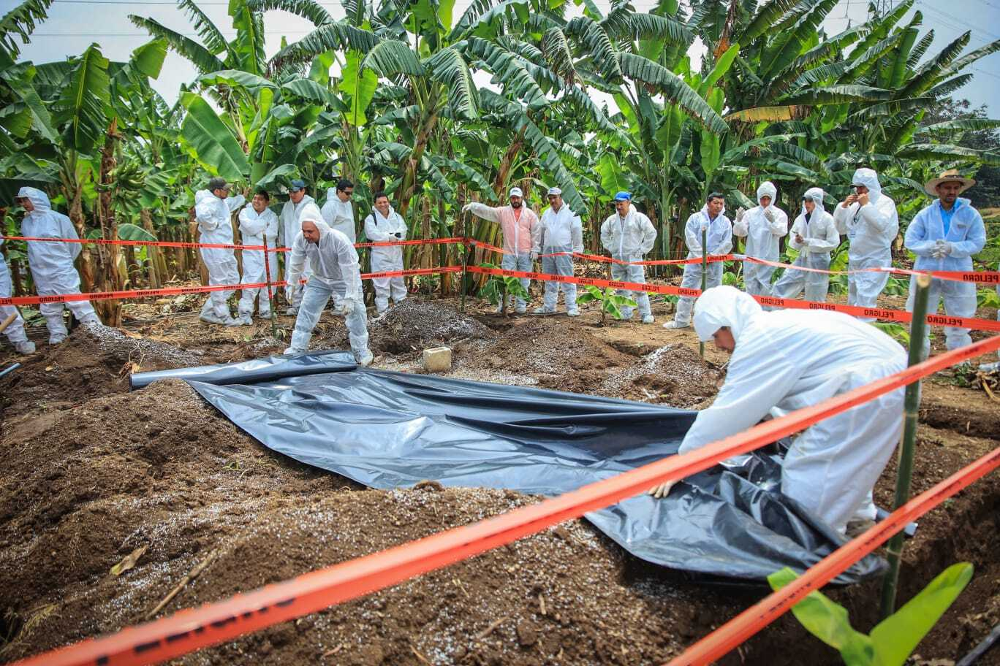

El banano y el plátano, alimentos esenciales para la seguridad alimentaria y la economía de América Latina y el Caribe (ALC), están enfrentando una seria amenaza. Se trata del **Fusarium Raza 4 Tropical (FOC R4T)**, un patógeno de suelo extremadamente perjudicial cuyos efectos son devastadores, pues NO pueden controlarse con productos químicos. Por tanto, cuando se propaga lo hace de manera acelerada a través del suelo, el agua, la maquinaria, etc., causando la muerte de la planta y permaneciendo en el suelo por décadas.

El *Banco Interamericano de Desarrollo* (BID) viene desarrollando una intensa labor para ayudar a los países de la región a prevenir la propagación de este patógeno y controlar su diseminación, con el fin de reducir los efectos que podría tener su expansión en un producto de extrema importancia para la región. El banano es el cuarto cultivo alimentario más importante del mundo, después del arroz, el trigo y el maíz, en términos de valor bruto de producción. ALC produce el 26% de banano y plátano en el mundo, y el 69% de la exportación mundial de este producto.

**Un alimento básico para la dieta y la economía**

No solo es un alimento esencial en la dieta base de muchas naciones, sino que tiene un impacto económico mayúsculo en la economía regional. Por poner dos ejemplos, la industria del banano emplea a un millón de familias en Ecuador y a unas 150.000 en Colombia. Fue este país, precisamente, el primero de América que detectó la presencia de *FOC R4T* en 2019, lo que obligó al Instituto Colombiano Agropecuario a declarar el estado de emergencia fitosanitaria.

El Fusarium es un género de hongos que afecta a multitud de plantas. En los años 50 del siglo pasado, el FOC R1 provocó una de las peores epidemias vegetales de la historia y tuvo efectos catastróficos en la producción bananera, basada en ese momento en la variedad Gros Michel. La solución aplicada entonces fue sustituir esa variedad por Cavendish, una variedad más resistente, que representa actualmente casi la totalidad del banano de exportación plantado en el continente.

Sin embargo, la aparición en los años 90 del patógeno *FOC R4T*, está suponiendo una seria amenaza también para la variedad Cavendish. Se estima que el 80% de la producción mundial de bananos y plátanos es vulnerable al *FOC R4T*, que ha destruido ya 200.000 hectáreas de cultivos en el sur de Asia. En ALC no se tuvo evidencia de la llegada de este patógeno hasta 2019, cuando Colombia confirmó su presencia, seguido por Perú en 2021 y Venezuela en 2023

**Estrategia del BID: prevenir y controlar con acciones regionales**

La presencia de esta enfermedad y su rápida expansión, obliga a la región a redoblar esfuerzos. Por eso,  el BID está apoyando a los gobiernos de la región a través de acciones de prevención y control, con financiamiento de cooperaciones técnicas de enfoque regional. Esas acciones se llevan a cabo en estrecha colaboración con las organizaciones nacionales de protección fitosanitaria, la Alianza Bioversity International-CIAT (Centro Internacional de Agricultura Tropical) y el Organismo Internacional Regional de Sanidad Agropecuaria (OIRSA). Esta colaboración con centros internacionales nos ha permitido implementar acciones en seis países de Centroamérica (Honduras, El Salvador, Guatemala, Costa Rica, Panamá, Belice), la República Dominicana, y tres países de la Región Andina (Colombia, Ecuador y Perú).

 La estrategia contra el Fusarium R4T abarca, entre otros, estos aspectos:

- La mejora de la capacidad de diagnóstico y vigilancia con la implementación de plataformas de monitoreo, el uso de drones y la capacitación de personal, entre otras acciones. Asimismo, el establecimiento de métodos homogéneos de detección del patógeno a nivel regional.
- El análisis de riesgos para identificar las vías de ingreso y dispersión del *FOC R4T*.
- La implementación de actividades de prevención y control para la identificación temprana y la contención de brotes. Identificar medidas eficaces para prevenir la propagación de la enfermedad es fundamental, por lo que adquieren especial importancia acciones como simulacros para poner en práctica las medidas que se deberían aplicar ante un brote de *FOC R4T* y talleres de campo para inspectores en campo, puertos y aeropuertos.
- Capacitaciones a productores con la entrega de kits de muestreo para que tengan los conocimientos suficientes para detectar el *FOC R4T* y prevenir su expansión hacia otros territorios.

Las características del *FOC R4T* representan un peligro grave para la seguridad alimentaria y la economía de la región. El principal reto de la región es contener el patógeno en los lugares en los que se ha detectado su presencia e impedir su entrada en otras zonas libres de esta enfermedad. Eso no se conseguirá sin el esfuerzo colectivo de gobiernos, instituciones, investigadores, organizaciones nacionales de protección fitosanitaria, organismos multilaterales y el sector privado. Entre todos debemos articular estrategias alineadas a nivel regional que, al mismo tiempo, sean lo suficientemente flexibles para adaptarse a las peculiaridades de cada país.

**Fuente:** [Blog del BID "Hablemos de Sostenibilidad y Cambio Climático"](https://blogs.iadb.org/sostenibilidad/es/)
