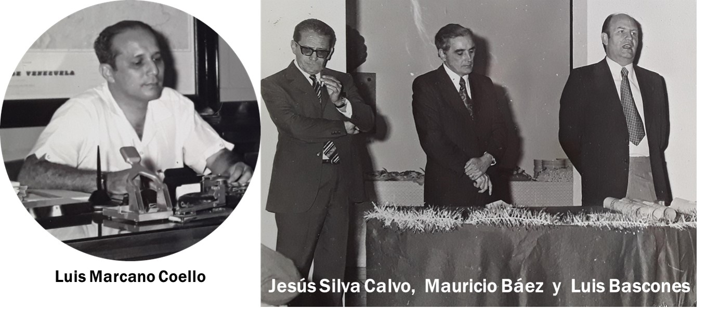
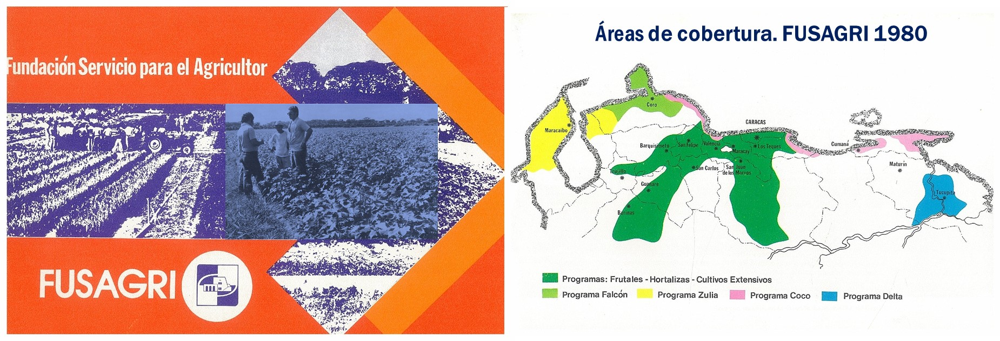
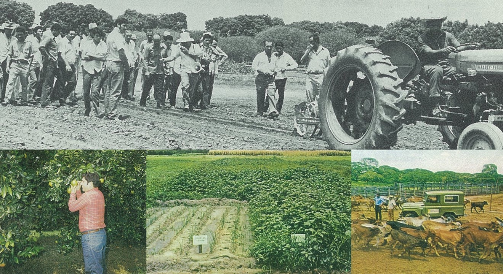
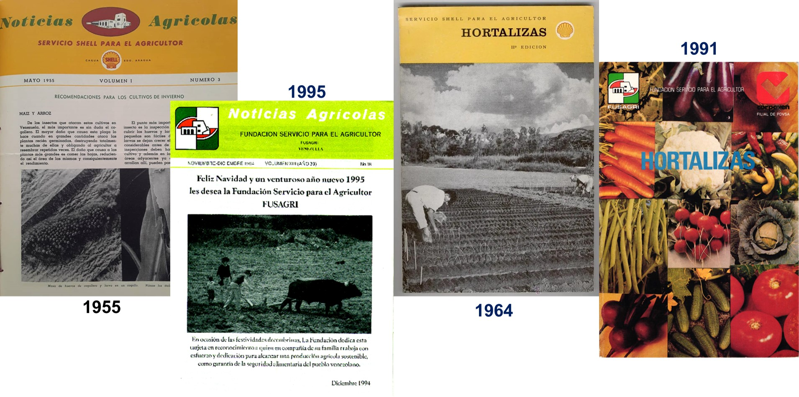

La rudimentaria agricultura venezolana a fines de la década de los años 40 del siglo pasado, representada por el sistema de conuco y básicamente destinada a surtir la despensa familiar, motivó la preocupación de quienes querían hacerla rentable y acorde con los adelantos tecnológicos que se desarrollaban en otras latitudes. Esta inquietud también estaba presente en los directivos de las empresas petroleras, a las que se señalaban de ser las causantes del éxodo campesino hacia las ciudades, particularmente a las atractivas zonas petroleras, además de causar distorsiones en la economía por la sobrevaluación de nuestra moneda debida a los grandes ingresos por las exportaciones petroleras.  

Es así como en 1952, la **Compañía Shell de Venezuela**, luego de analizar varias alternativas, creó el **Servicio Shell para el Agricultor (SSPA)**, conviniéndose en que sería un departamento no comercial de la empresa, destinado a brindar asistencia técnica gratuita a los agricultores. Rápidamente el proyecto se hizo realidad y se instaló una oficina provisional en la calle Froilán Correa de [**Cagua**](https://es.wikipedia.org/wiki/Cagua), Estado Aragua. 

La sede definitiva se estableció en un potrero abandonado de la hacienda Paraima, distante unos de tres kilómetros de Cagua. Ese mismo año, la maleza comenzó a dar paso a esa estructura con aire de pirámide trunca inaugurada en 1954 bajo la denominación de Estación Experimental de Cagua. En 1962, se inició el Programa Zulia en Mene Grande y en 1965 el Programa Falcón en Coro, expandiéndose las actividades hacia zonas de interés petrolero.

**La Gente de FUSAGRI**

Cuando se inició el SSPA había en Venezuela pocos especialistas del agro, todos laborando en incipientes instituciones nacionales. Por esta razón, los primeros expertos del Servicio fueron contratados en el exterior. A ellos se les asignaron dos o tres asistentes venezolanos recién graduados, con excelentes credenciales académicas, quienes a la vuelta de unos dos o tres años eran becados para cursos de posgrado en prestigiosas universidades de Estados Unidos y de Europa. Poco después de su reincorporación al Servicio, estos profesionales estaban suficientemente capacitados para dirigir sus respectivos departamentos o unidades. De esta forma se formó un excelente plantel de especialistas venezolanos, sin afectar los recursos humanos de universidades e instituciones públicas. Por el contrario, muchos de estos profesionales posteriormente ejercieron la docencia en las facultades de agronomía, principalmente de la Universidad Central de Venezuela (UCV) y la Universidad del Zulia (LUZ). 

El pionero de esta institución fue el ingeniero agrónomo venezolano **MAURICIO BÁEZ MENESES**, quien entonces con diez años de experiencia profesional, definió la filosofía de la organización y estableció las sólidas bases que han guiado y aún guían las actividades. Otros dos ingenieros agrónomos venezolanos con papeles protagónicos estelares en la historia de la institución fueron: **LUIS MARCANO COELLO**, quien le dio, entre otras cosas, dinamismo gerencial, continuidad administrativa, proyección internacional, una nueva visión organizacional basada en la diversificación y capacidad de emprender nuevas acciones en función de la demanda de servicios, aglutinando nuevos aliados y voluntades. Por su parte, **JESÚS SANTIAGO SILVA CALVO** contribuyó enormemente a la consolidación metodológica para la planificación, ejecución y seguimiento de los programas; fue guía permanente para definir y conciliar entre lo deseable y lo posible y elemento clave para el fortalecimiento de la disciplina y la ética institucional.

Los cargos de mayor responsabilidad siempre han sido ocupados por profesionales venezolanos quienes, además de los tres ya mencionados, han sido Directores Nacionales, Regionales o pioneros en alguna especialidad relevante. Se destacan entre ellos:  HÉCTOR AYALA CLEMENTE, LUIS BASCONES, RODOLFO BASTIDAS, DARÍO BOSCÁN ODOR, ALEXANDER BERMÚDEZ BARBOZA, EURO BRACHO MÉNDEZ, JOSÉ LORENZO CARVALLO, PEDRO CORZO, MAURICIO DELGADO, BALDOMERO GONZÁLEZ, LUIS LOPEZ MENDEZ, LUIS MARCANO GONZÁLEZ, RAMÓN MEDINA CERTAD, JOSÉ MARTÍNEZ GUARDA, ROLAND MENDT PETERS, JOHAN NEUMAÑ, JHANDER ORIHUELA, LIDIO PARRA, TIBERIO PEROZO, EDDIE RAMÍREZ SERFATY, PEDRO JUAN RODRÍGUEZ y DOUGLAS VASQUEZ GALEA,  ingenieros agrónomos, zootecnistas o médicos veterinarios, todos ellos excelentes técnicos formados en la institución, y con una larga y destacada trayectoria. Un sin número de otros profesionales han participado en la coordinación y ejecución de las actividades a nivel nacional, con apoyo de otros expertos del agro y personal administrativo y obrero.

**FUSAGRI. Fundación autónoma**

En 1972, previendo los efectos de la nacionalización de la Industria Petrolera y luego de un extraordinario esfuerzo de promoción y negociación, liderizado por el *Dr. Luis Marcano Coello*, se constituyó la **Fundación Servicio para el Agricultor (FUSAGRI)**, como fundación autónoma, con los aportes de 37 instituciones venezolanas, públicas y privadas, incluida la **Fundación Shell**

Esta nueva base jurídica permitió la realización de convenios con empresas petroleras, asociaciones de productores y de industriales, Ministerio de Agricultura, Corporaciones Regionales de Desarrollo, con Fondos mixtos para promover rubros específicos, con otras fundaciones, gobernaciones y alcaldías. Estos convenios contemplaban que FUSAGRI, como organización sin fines de lucro, prestaría al costo apoyo al sector agrícola para mejorar la producción y productividad de los agricultores y ganaderos y elevar la calidad de vida de los pequeños agricultores y de su familia, bajo la estrategia de sustentabilidad. 

La figura de Fundación también permitió que los aportes y excedentes generados se invirtieran exclusivamente en el cumplimiento del objeto fundacional y de esta forma el fortalecimiento, crecimiento y diversificación institucional.  Así, facilitó la promoción y soporte del **Centro de Desarrollo Vitícola** en el Zulia, la **Fundación para la Conservación de los Árboles (FUNDÁRBOL)** y la creación de  la **Fundación Colegio Experimental de Agricultura del Mundo Unido Simón Bolívar (FUNDACEA)**, dedicada a la educación agrícola formal y promoción del desarrollo rural. 

También se crearon algunas empresas rentales para la producción agropecuaria o prestación de algunos servicios relacionados. Esta apertura permitió que FUSAGRI llegara a tener presencia permanente en 14 entidades federales de la república y se  vinculara con otros rubros, además de los tradicionales de hortalizas, cítricos y durazno,   como coco, fresas, moras, guayaba, soya, trigo, maní, caraota y otras leguminosas comestibles, café, arroz de mesa, arroz de semilla, maíz, ganadería, pastos, economía del hogar, viveros, viticultura y enología, plantas ornamentales, huertos escolares y familiares, pesca artesanal, manejo y conservación de cuencas medias,  microcrédito rural, desarrollo forestal, riego y drenaje y administración de fincas entre otros.

**Metodología FUSAGRI**

El Servicio desarrolló una modalidad novedosa de investigación aplicada, realizada principalmente en las fincas de los agricultores y la prestación de asistencia técnica directamente relacionada con esas investigaciones.  Las visitas a las fincas y el contacto con los agricultores permitían detectar los problemas limitantes de la producción y de la productividad, los cuales se investigaban en las fincas o en la Estación Experimental de Cagua, y encontrada alguna solución, esta era inmediatamente divulgada a través de las mismas visitas técnicas, parcelas demostrativas, días de campo, informaciones de prensa, videos, radio, cursos para agricultores o para agrotécnicos multiplicadores, etc.

Inicialmente, el Servicio se orientó fuertemente hacia el mejoramiento de la producción de hortalizas. Para ello, la línea fuerte de trabajo fue la evaluación agronómica de Cultivares, de diferentes características y orígenes y así determinar su comportamiento en nuestro medio. 

Además, realizó valiosos aportes al país en la producción de cítricos, duraznos, control de malezas, plagas y enfermedades, maquinaria agrícola, riego y drenaje. Contó con un plantel de ingenieros agrónomos, peritos agropecuarios y demostradoras del hogar muy bien seleccionados y entrenados.   La mayor parte de los especialistas de las décadas de los años sesenta y setenta que eran profesores en las áreas de hortalizas, control de malezas y de enfermedades fueron formados en el Servicio. Se dictaron los primeros cursos de capacitación para agricultores venezolanos y cursos internacionales sobre Producción de Hortalizas y Control de Malezas, para técnicos agrícolas dedicados a la investigación y extensión

El efectivo método de contacto directo con el agricultor aumentó las demandas de atención. Cubrir un mayor universo requirió en breve tiempo que el Servicio apelara a formas adicionales para dar al agricultor la información necesaria para mejorar sus cultivos. Así, en enero de 1955 salió el primer número de la revista “Noticias Agrícolas”, la cual se publicó ininterrumpidamente hasta 1998. En 1963, se amplió la difusión de información mediante programas en la emisora Radio Aragua, de Cagua. Posteriormente se trabajó en la producción de películas sobre temas agrícolas y en la producción de folletos y boletines sobre diferentes tópicos, los cuales fueron, y siguen siendo, referencia para agricultores, técnicos, profesores y estudiantes de agronomía

