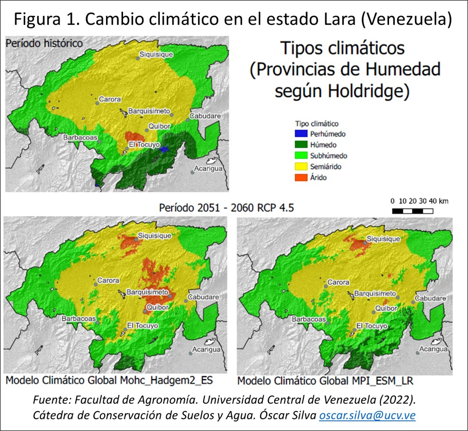

Además de contribuir en la construcción del nuevo modelo de desarrollo de la agricultura venezolana desde la perspectiva de la **Bioeconomía**, la Fundación Servicio para el Agricultor (FUSAGRI) también tiene interés en generar análisis y propuestas para identificar modelos inclusivos de adaptación y de eco-intensificación, que permitan incrementar la productividad sostenible de los productores de café y cacao.

Cacao y café son cultivos con arraigo y de importancia socioeconómica, cultural y ambiental en Venezuela.  Ambos se distinguen por ser plantaciones de pequeños productores, con tamaños promedios de parcelas entre 2 a 5 hectáreas, atendidos por el núcleo familiar, quienes cultivan, cosechan y muchas veces también benefician el grano.  Aunque las siembras se ubican en diferentes pisos climáticos, las áreas de producción se destacan por un alto grado de pobreza y niveles de desarrollo inferiores a las de otras zonas agrícolas, donde muchas veces la oferta de servicios básicos como electricidad, agua potable, educación y salud resulta limitada.

La región cafetalera más importante se encuentra en los estados Lara, Portuguesa, Trujillo, Mérida y Táchira, donde se produce aproximadamente las ¾ partes del total nacional. Se trata de regiones montañosas (zonas húmedas de trópico pre montano), en las que las siembras se ubican mayormente entre los 600 y 1600 msnm. 
Venezuela se encuentra entre los principales productores mundiales de cacao fino de aroma, ya que dispone de una importante diversidad genética que prospera en las condiciones ecológicas y de microclima requeridas por este cultivo. Sucre, Miranda y Mérida son los estados con las mayores áreas de siembra.

De acuerdo con la **Segunda Comunicación Nacional ante la Convención Marco de las Naciones Unidas sobre Cambio Climático para Venezuela (2017)**, el análisis de tendencia de aumento de temperatura evidencia un incremento de la temperatura media con el paso del tiempo, por años y trimestres, entre 1,5  y 2 °C, pudiendo alcanzar para finales de siglo un aumento en el orden de 5 °C. Igualmente se proyecta una disminución generalizada de la lluvia, de 15% a 20%, a lo largo del siglo XXI. Sin embargo, los aumentos de temperatura y el comportamiento de la precipitación no será el mismo en todas las regiones.

Los estudios realizados  para estimar el impacto del cambio climático en el sector agrícola del país indican que en la mayoría de los casos afectará los ciclos de producción y la dinámica de las principales plagas y enfermedades, lo que ocasionará una reducción en el rendimiento de los cultivos, como consecuencia del aumento de las temperaturas y la disminución o alteración del régimen pluviométrico.

Los aumentos de las temperaturas ocasionarán cambios considerables en calidad muchas regiones donde se cultiva café de forma tradicional, que perderán aptitud y surgirán nuevas zonas con desplazamiento hacia zona de mayor con serias consecuencias socioambiéntales.
Una investigación reciente simulando el clima futuro para el estado Lara (± 20% de la producción nacional de café), con el  Escenario de Cambio Climático RCP 4.5, estima  una alarmante conversión del Tipo Climático Húmedo a Subhúmedo, lo cual implica que aun en un escenario climático “intermedio”, el área cafetalera sufrirá una disminución de su aptitud para la producción de café (Figura 1). 

De la misma manera, esta alteración del clima en las zonas cacaoteras podría significar la disminución de la calidad de los cacaos Criollos, poniendo en grave riesgo la sostenibilidad de la cadena de suministro de este emblemático y tradicional cultivo.

Ante esta situación es necesario desarrollar herramientas de apoyo en la toma de decisiones para la adaptación climática en las comunidades cafeteras y cacaoteras, para lo cual es preciso:

1. Determinar cómo en las principales regiones estará cambiando su aptitud actual en el marco de los  escenarios proyectados, y
2. Las consecuencias que se derivan y las medidas, tanto de  adaptación como de mitigación, que pueden y convienen ser abordadas, con la finalidad de contrarrestar esos impactos.

Para iniciar estos procesos se requiere propiciar encuentros con actores relevantes de la producción primaria, con disposición a participar en construir y analizar estos escenarios futuros, así como también para generar interés y posibilidades de formular proyectos de investigación-extensión transdiciplinarios, relacionados con el cambio climático en esas regiones.

De igual manera, la situación descrita abre una ventana de oportunidad para visibilizar el carácter estratégico del sector agropecuario, donde se combinan las acciones de mitigación y adaptación al cambio climático, además de los temas de competitividad, inclusión, resiliencia y sostenibilidad, tal cual se destaca en la [**Actualización de la Contribución Nacionalmente Determinada de Venezuela, 2021**.](https://unfccc.int/sites/default/files/NDC/2022-06/Actualizacion%20NDC%20Venezuela.pdf) En este sentido, la participación del Ministerio del Poder Popular para el Ecosocialismo (MINEC), como Autoridad Nacional Ambiental (ANA), es de suprema importancia para alcanzar sinergias entre los sectores ambiental y agrícola,  así como también establecer y canalizar políticas y propuestas en materia de seguridad alimentaria que privilegien las Buenas Prácticas Agrícolas (BPA), la disminución de emisiones GEI, el secuestro de carbono y el desarrollo territorial.

