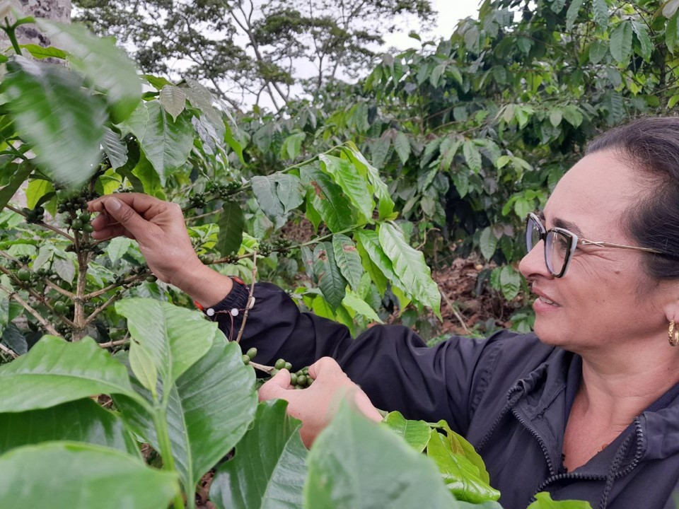
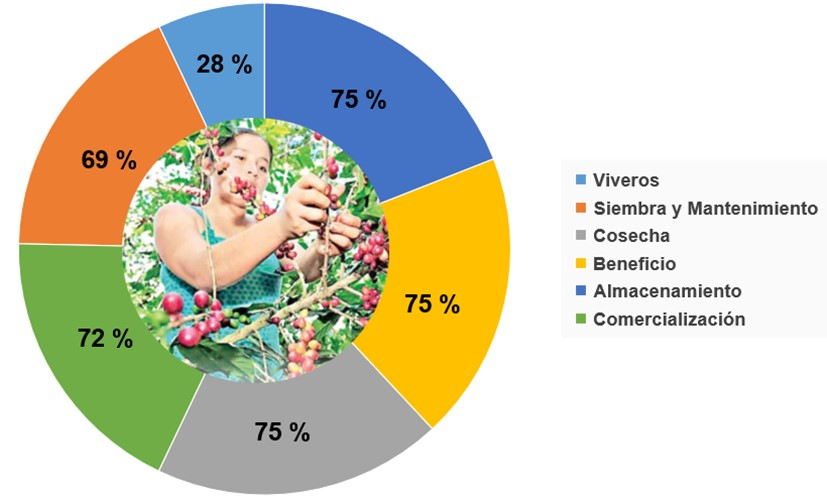
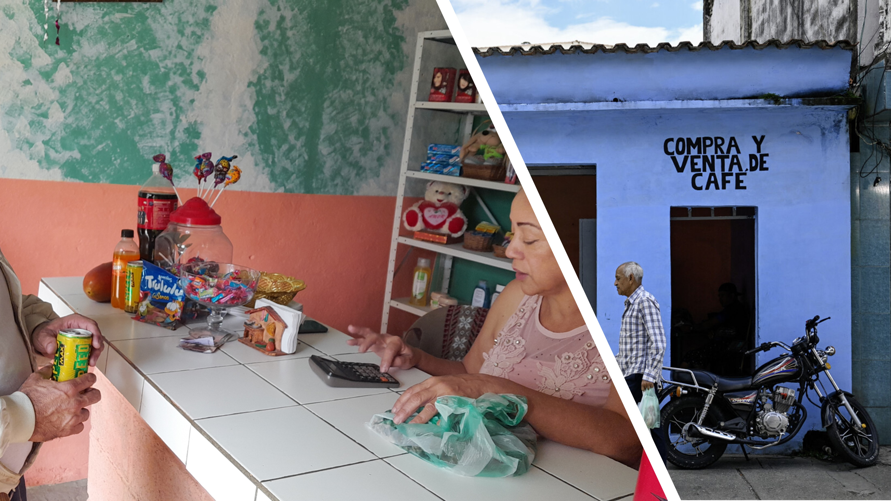

**Fortaleciendo la resiliencia en un contexto de cambio climático y desigualdad de género**

Los resultados del nuevo estudio realizado por FUSAGRI y el Instituto Interamericano de Cooperación para la Agricultura (IICA), en plantaciones del eje cafetalero suroeste de Lara, coinciden con las conclusiones del reciente informe de la Organización Mundial para la Alimentación (FAO): [“Situación de las Mujeres en los Sistemas Agroalimentarios”](https://doi.org/10.4060/cc5343es), donde se demuestra con abundante evidencia, que el aumento del empoderamiento de las mujeres y la igualdad de género, mejoran el bienestar de las mujeres y de sus hogares, creando oportunidades para el crecimiento económico, mayores ingresos, productividad y resiliencia. 

El estudio se basó en las informaciones, enfoques y expectativas de 36 mujeres productoras de café, pertenecientes a 9 comunidades de 5 sectores: Vigía Nueva, Centro. El Rincón, El Cauro y El Volcán;  de la parroquia Hilario Luna y Luna (Municipio Morán), entre quienes sobresalen un grupo de caficultoras que, mediante el fortalecimiento de sus capacidades y niveles de participación, logran obtener rendimientos significativos en sus unidades de producción, en un escenario de desigualdades de género. Sin embargo, estos avances se encuentran seriamente amenazados no solo por la distorsión en  los precios del café, sino también por el incremento del costo de los fertilizantes y los posibles impactos del cambio climático. 

De las treinta y seis caficultoras estudiadas, dieciséis (16) tienen rendimientos iguales o superiores al promedio local (15 quintales/ha). Sus experiencias muestran la incorporación de buenas prácticas de cultivo y la participación con enfoque de género a diferentes niveles e intensidades, asumiendo desafíos que les han permitido alcanzar esos niveles de producción. Más del 80% de ellas están sembrando árboles de sombra para sus cafetales, lo que indica la alta importancia que le dan a este tipo de manejo. Esta sensibilidad y afinidad particular que tienen de cultivar café bajo sombra, favorece una propuesta de incorporarlas a proyectos de sistemas agroforestales, que además de diversificar la producción, beneficien la preservación del suelo, agua y biodiversidad en la zona, al mismo tiempo que disminuya la vulnerabilidad al cambio climático.

>*“El principal problema es que nos olvidamos de sembrar con sombra. El clima ha cambiado mucho, las lluvias se retrasan y afectan a floración (Morelys Malvacias, Sector Centro)”*

Estos logros en productividad son muy relevantes debido a que el cultivo del café es esencial para la economía doméstica. Para seis de cada diez mujeres, el café es su única fuente de ingreso, el resto aprovecha la estacionalidad de la cosecha, para desarrollar otras actividades alternativas que complementan los ingresos, entre ellas tenemos: empleadas públicas (educadoras, madres procesadoras de alimentos) y otras funciones relacionada a la economía informal, como comerciantes, peluqueras e incluso transporte público (mototaxis).

Todas las caficultoras coinciden en que el principal obstáculo para la producción es la disminución progresiva del acceso a fertilizantes. El elevado precio de este insumo incrementa sensiblemente los costos, realidad que ha estimulado un aumento en el uso de abonos orgánicos, lográndose buenos resultados. En ese sentido, cobra importancia realizar estudios de suelos para determinar la demanda de nutrientes, optimizar la fertilización y explorar opciones de abonamiento mediante la utilización de biofertilizantes que puedan ser elaborados en biofábricas locales, utilizando residuos agrícolas de la zona, disminuyendo costos y promoviendo una agricultura sustentable dentro de un esquema de circularidad. 

 

De la misma manera, todas han ido sustituyendo las variedades tradicionales como Catuai por Colombia 27, y prefieren seguir sembrando esta última. Las productoras con rendimientos iguales o superiores a 15 qq/ha cultivan esta variedad y cuatro de ellas combinan Colombia 27 con Robusta, la cual usan como sombra o para delimitar la plantación como cerca viva. Es opinión generalizada que la variedad Colombia 27 ofrece alta resistencia a la roya del cafeto, aunque 9 productoras manifestaron su intención  de combinar Colombia 27 con la variedad Robusta, porque han sido informadas que *“el grano pesa más”*.

**Participación de las mujeres productoras en labores de cultivo del café.**

En las cafetaleras estudiadas los niveles de participación varían por labor. En general, participan menos en el manejo del vivero de café, y a medida que aumenta los rendimientos, menor es la participación en vivero. Un mayor rendimiento de café pudiera sugerir mejores ingresos y más oportunidad para adquirir las plantas. La participación aumenta a partir del trasplante, con el manejo de la plantación y tiende a mantenerse e incluso aumentar en la cosecha, beneficio, almacenamiento y comercialización (Figura 1)

 **Figura 1**. *Porcentaje de participación de las productoras en labores de cultivo del café en la parroquia Hilario Luna y Luna (Morán-Lara)*

De modo general, las productoras intervienen activamente en las labores y decisiones importantes en el cultivo, como el manejo de la plantación, renovación del cafetal, selección de la variedad, cosecha, etc. Asimismo, en actividades de postcosecha beneficio, almacenamiento y la comercialización, antes reservada exclusivamente a los hombres. Sin embargo, la participación de la mujer en el proceso de lavado está restringida por la disponibilidad de equipos y del combustible (gasoil), así como del suministro de agua. 

De igual modo, para el secado del café las mujeres se valen de familiares y amigos, ya sea para usar un patio prestado y solear su café, colocarlo en una secadora que se encienda, movilizar el café hasta el área de secado y para acarrear el saco. En estas labores de beneficio del café (lavado y secado), tanto el equipamiento como el esfuerzo físico, les genera dependencia. Igual ocurre con el almacenamiento, porque, aunque las productoras tienen el control sobre el café almacenado, dependen de espacios en el hogar para hacerlo e implica el consenso en la familia.

**Toma de decisiones de la mujer en la producción cafetalera.**

A pesar de que estas labores (lavado, secado y almacenamiento) son determinantes de la calidad y precio del producto final, la participación femenina y la toma de decisiones en esta fase está limitada, pero además las caficultoras sienten no compensado su esfuerzo debido a la ausencia del incentivo de precio por la calidad del café.
La fijación del precio en la zona, poco se ajusta a la normativa nacional. En su lugar, se toma como referencia el que acuerdan los grandes productores de la zona. Frecuentemente, la calidad no se reconoce y el comprador paga el mismo precio por el café lavado que el café corriente (natural), lo que desmotiva a las mujeres a mejorar la calidad.

> *“Para fijar el precio se toma como referencia el precio que más se repite, o se toma algún productor grande de la zona, y de acuerdo con lo que a él le pagan, se paga el resto” (Yaneth Sequera, Sector El Cauro)*

En cuanto a la comercialización, el alto porcentaje de participación de las mujeres despierta un interés particular. Tradicionalmente los hombres han asumido la venta del café, favorecidos por la disponibilidad de vehículos y teléfonos móviles. Sorprendentemente, algunas de las productoras estudiadas poseen motocicletas, con las que movilizan su café para la venta, además, cuentan con teléfonos inteligentes que les ha permitido conectarse con el mundo, superando así barreras de desigualdades y asumiendo roles de importancia para la participación y autonomía económica.

El café se vende por quintal (46 kg) y una parte se reserva y almacena para ser usado como moneda (trueque) en las compras personales y familiares (alimentos, medicamentos, vestidos y demás bienes y servicios). Esta se realiza con equivalencia del peso del café y el precio por kilo. 

**En las zonas cafetaleras de Lara, el café se utiliza como moneda**  

Por lo general, este precio es bajo e inestable, lo que ocasiona mucha incertidumbre al momento de las compras (desconfianza en el método trueque), por considerar que desvaloriza el café y les ocasiona pérdidas. Difícilmente tienen oportunidad de decidir a quién y en donde vender, por lo que casi todo el comercio en la parroquia se efectúa con café en modalidad de trueque. 

 >*“Yo necesito un mercadito, y voy con el saco, como llevar un monedero. Los nietos me lo llevan y me hacen las compras, es muy desagradable porque uno andaba con su carterita y ahora uno con un saco negro andando por allí” (María Susana Vargas, Sector Vigía Nueva)*

**Sembrando conocimiento: el papel de la educación y la tecnología en el empoderamiento de las mujeres productoras**

Finalmente, en las conclusiones del estudio se resalta que una cantidad significativa de las entrevistadas posee grados avanzados de escolaridad, lo cual implica un importante potencial para el aprendizaje, preferentemente hacia la especialización en técnicas de producción y agregación de valor del café, pero también hacia el desarrollo de otros conocimientos y habilidades, mediante cursos y talleres. Excepto una, todas estas caficultoras poseen teléfono celular y usan frecuentemente redes sociales y mensajes de texto; dos de cada tres de ellas tienen acceso a internet, lo que en total configura un ambiente muy favorable para la formación y capacitación presencial o virtual, lo cual posibilita mejorar la gestión productiva y comercial, potenciar la organización y la autogestión comunitaria.

Al abordar estos desafíos y aprovechar los logros alcanzados, se puede contribuir al empoderamiento económico de las mujeres caficultoras y al desarrollo sostenible del sector cafetalero en el estado Lara.

