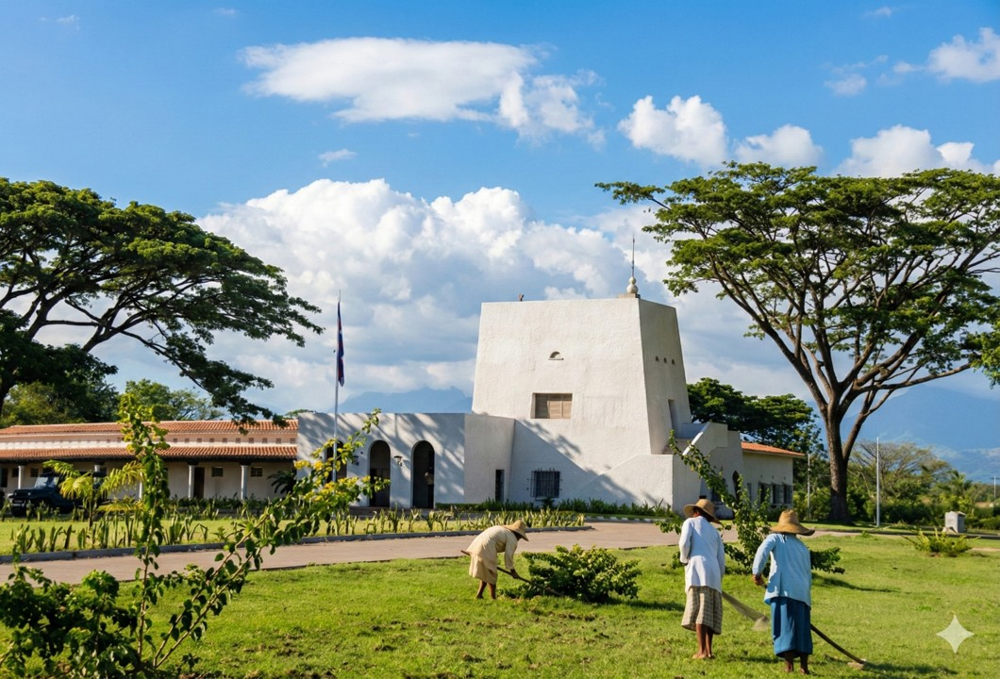
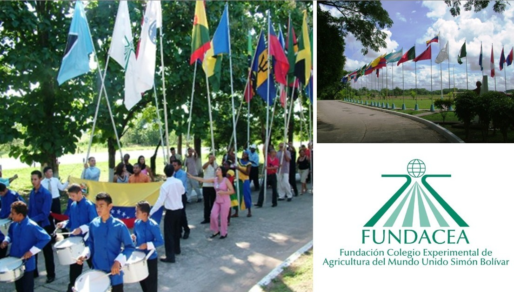

Al cumplirse doce años del fallecimiento del Dr. Luis Marcano Coello (1923-2014), se conmemora la vida y obra del que ha sido calificado como el ingeniero agrónomo con mayor proyección internacional en la historia de Venezuela. Su trayectoria profesional representa un pilar central en la modernización del agro venezolano, fundamentada en la formación académica de excelencia, el liderazgo por la autonomía institucional y una vocación inquebrantable por la educación y el desarrollo rural.

### Excelencia académica y formación de generación de relevo

El Dr. Marcano Coello formó parte de la V Promoción de Ingenieros Agrónomos de la Universidad Central de Venezuela en 1947. Su compromiso con el rigor científico lo llevó a la Universidad de Cornell (USA), donde en 1951 se convirtió en el primer venezolano en obtener un doctorado (PhD) en Ciencias Agrícolas, especializándose en Genética, Patología Vegetal y Citología.
Este estándar de excelencia no fue solo un logro personal, sino un modelo que replicó institucionalmente. Bajo su gestión, se impulsó un mecanismo de mejoramiento profesional que permitió a más de sesenta especialistas venezolanos alcanzar niveles de maestría y doctorado en las universidades más prestigiosas de Estados Unidos y Europa, así como intercambios, pasantías y cursos cortos para el personal de las varias instituciones a las que apoyó, fortaleciendo así el capital humano técnico del país.

### Liderazgo en la modernización agrícola venezolana

Su labor estuvo intrínsecamente ligada al **Servicio Shell para el Agricultor (SSPA)**, el cual dirigió entre 1955 y 1966, y posteriormente a la creación de la **Fundación para el Servicio del Agricultor (FUSAGRI)** en 1972. 

El Dr. Marcano Coello fue el artífice de la transición de una estructura dependiente de la industria petrolera a una fundación autónoma, logrando aglutinar el apoyo de instituciones públicas y privadas para garantizar la continuidad de sus actividades.

Entre sus aportes más significativos a la agricultura moderna destacan:

- **Investigación aplicada y extensión:** implementó una metodología de contacto directo con los agricultores, detectando problemas reales y ofreciendo soluciones técnicas inmediatas en áreas como el control de malezas, nuevas variedades y uso de fertilizantes.

- **Diversificación productiva:** promovió el desarrollo tecnológico en rubros como hortalizas, cítricos, ganadería de leche y viticultura tropical.

- **Visión estratégica:** Lideró un "triángulo operativo" integrado por **FUSAGRI**, **FUNDARBOL** (conservación de árboles) y **FUNDACEA** (educación agrícola), enfocado en el desarrollo agropecuario nacional.

### Prestigio y liderazgo internacional

La influencia del Dr. Marcano Coello trascendió las fronteras venezolanas, como consultor de varios organismos globales y como Director Regional del **Instituto Interamericano de Cooperación para la Agricultura (IICA)** para la zona andina, con sede en Lima. Fue presidente de la **Asociación Latinoamericana de Fitotecnia** y de la **Asociación Latinoamericana de Ciencias Agrícolas.** Asimismo, desempeñó un papel relevante como miembro de los directorios de centros de investigación de élite mundial, tales como el **Centro Internacional de Agricultura Tropical (CIAT)** en Colombia, el **Instituto Internacional de Agricultura Tropical (IITA)** en Nigeria y el **Comité Técnico Asesor del Grupo Consultivo para la Investigación Agrícola Internacional (CGIAR)** en Italia. Su prestigio internacional le permitió presidir la **Federación Internacional de Sistemas de Investigación Agrícola para el Desarrollo.**

### El legado (truncado) de educación rural

En la etapa final de su vida, su liderazgo se volcó hacia la educación de la juventud campesina a través de la **Fundación Colegio Experimental de Agricultura del Mundo Unido Simón Bolívar (FUNDACEA)** en el estado Barinas. Este proyecto educativo, que llegó a graduar a casi mil estudiantes de 44 países, reflejó su convicción de que el desarrollo rural requería de formación técnica de alto nivel para los sectores tradicionalmente desatendidos. Lamentablemente este proyecto fue desmantelado por el gobierno venezolano en 2011.

