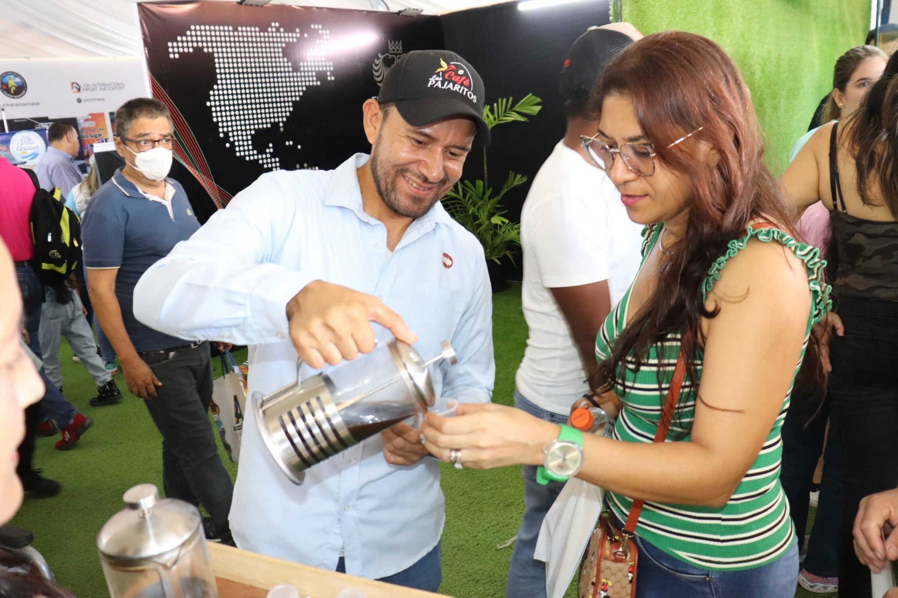
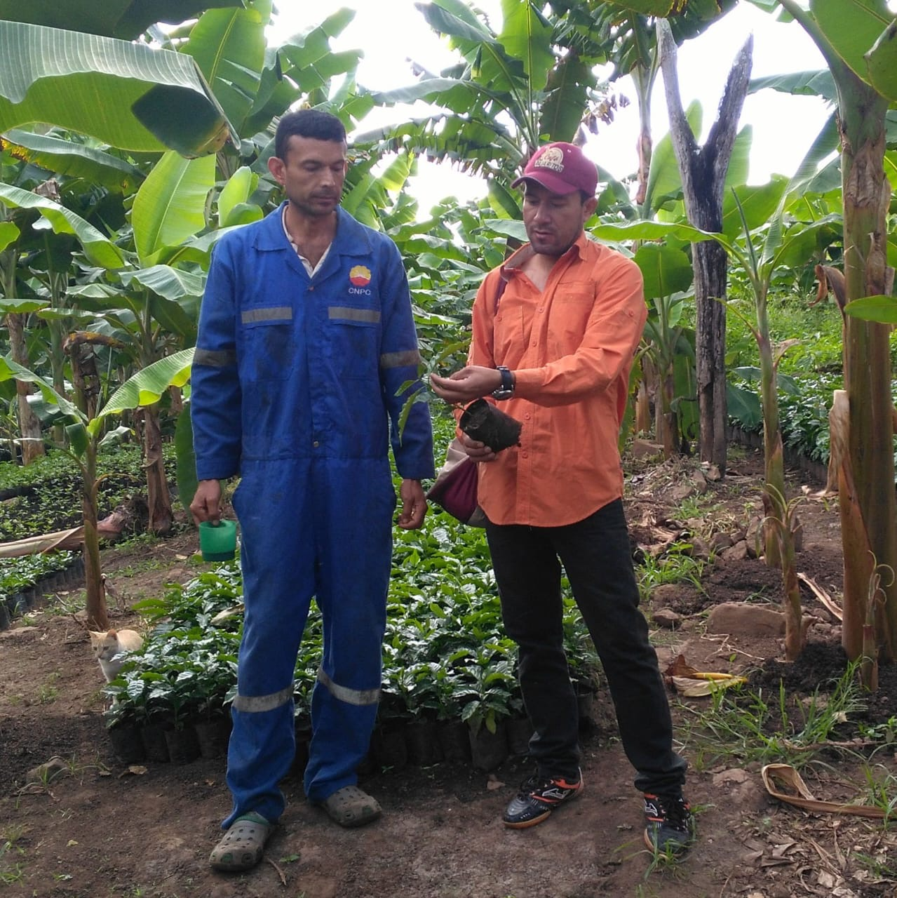
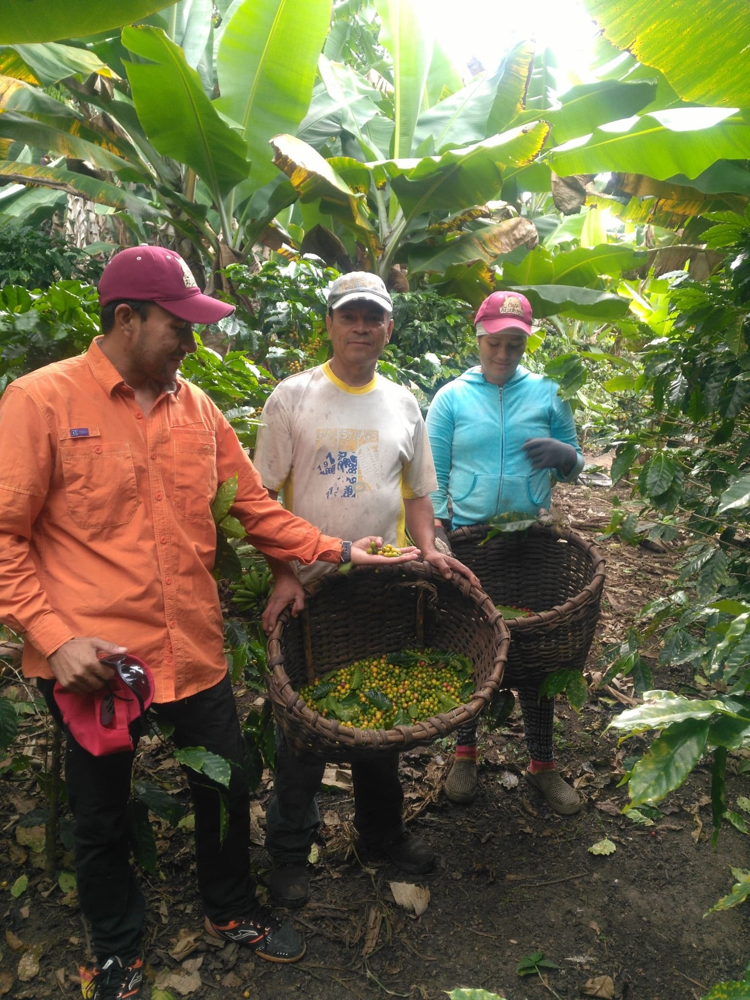

**San José, 3 de noviembre, 2025 (IICA).** Raúl Ortiz se presenta como licenciado en contaduría pública y como **caficultor** del estado Anzoátegui, en Venezuela. Es que, desde hace más de una década, él viene trabajando para combinar lo mejor de los dos mundos, el comercial y el agrícola, impulsando un salto de los productores de café de la región hacia productos de mayor calidad que representen mejores ventas y una creciente exposición al negocio del **agroturismo.**

>«Trabajar con café y turismo -dice este productor de Mundo Nuevo- es un privilegio que conecta la pasión de un agricultor con la alegría de mostrar los frutos de su cosecha».

Por su trabajo en favor de la promoción de las comunidades cafetaleras de su región y de la innovación en el terreno del agroturismo, Ortiz fue distinguido como Líder de la Ruralidad de las Américas por el Instituto Interamericano de Cooperación para la Agricultura (IICA). Raúl recibirá el **premio «Alma de la Ruralidad»**, parte de un proyecto del IICA para dar visibilidad a mujeres y hombres que dejan huella y hacen la diferencia en los campos del continente, figuras clave para la seguridad alimentaria y nutricional y la sostenibilidad de la región y el planeta.

>«Me siento afortunado por poder fomentar la **economía de inclusión**, aportando al crecimiento y el desarrollo del país», asegura el productor venezolano. 

Pero Ortiz es también un ejemplo de cómo todo el continente se está adaptando a los nuevos tiempos y las nuevas coordenadas de la economía agrícola. En su caso, acoplándose a la demanda creciente de **café de especialidad**.

Además del título de contador público, Raúl tiene una maestría en Finanzas, ambos diplomas obtenidos en la prestigiosa Universidad de Oriente. Su historia de vida arrancó en la localidad de Los Pajaritos, *uno de los caseríos más remotos del país*, dice, donde los productores se dedican al café y las hortalizas. El paisaje no podría ser más hermoso: *Los Pajaritos se encuentra en la zona montañosa de Turimiquire, donde la naturaleza nos enseñó a conservar el ambiente*.

Después de cursar la primaria en Mundo Nuevo y la secundaria todavía más lejos, saliendo de la casa a las cinco de la mañana para llegar a tiempo a las clases, Raúl marchó a la universidad, se graduó y trabajó cinco años en el ámbito privado, en empresas del sector de la salud. Junto con las aulas universitarias en la ciudad de Barcelona, esa experiencia empresarial, afirma, **me abrió las puertas al conocimiento** y a la idea de lanzar la marca de café Los Pajaritos, que se está desarrollando de la mano de la hacienda del mismo nombre.

Los Pajaritos, resume Ortiz, es un proyecto de **integración vertical agroindustrial** para favorecer la venta de café y, también, el desarrollo de los productores cafetaleros vecinos. A ellos los impulsa a dedicar parte de sus cultivos a granos de alta calidad, que luego se puedan vender a clientes que buscan café de especialidad, cada vez más consumido en las grandes ciudades del mundo.

Caficultor de tercera generación, Ortiz comenzó cultivando dos parcelas, que ahora se transformaron en cuatro, una extensión de tierra en una zona de montañas y ríos donde también planta **árboles para la sombra** que necesita el grano para crecer de manera saludable. En total, cuenta Raúl, en sus parcelas se producen unos cien quintales de café, un volumen que no es muy alto pero que se concentra en plantas de muy buena calidad, asegura.

>«El mejor café lo seleccionamos, lo transformamos y lo traemos a la ciudad», Mundo Nuevo, donde «buscamos clientes que puedan pagar el precio de este tipo de granos”. A cambio, explica, «le damos la garantía de que siempre van a tener buen café, a lo largo de todo el año».

Según Ortiz, este modelo de negocios sirve también como un ejemplo para otros productores, incluyendo aquellos con los que está asociado. La idea es que adopten la práctica de disponer de al menos un **diez por ciento** de su producción *para poder vender un buen producto a clientes que le van a dar valor»*, explica.

Ese trabajo de mejoramiento, sigue Raúl, está resultando en una **economía sustentable** para la zona. *Vimos un crecimiento exponencial donde, con ese diez por ciento dedicado al café de alta calidad, muchos productores lograron crecer más o menos un 30 por ciento respecto de los volúmenes de 2017*.

**Un café en panaderías de Miranda y lecherías de Anzoátegui**

La marca de café Los Pajaritos, señala Ortiz, está registrada a nivel nacional desde 2020 y cuenta con una concesión para trabajarla por diez años. Es un proceso de **industrialización**, señala contento. Aunque todavía no cuentan con toda la maquinaria necesaria para el circuito completo de transformación del grano y deben tercerizar algunos segmentos, *somos emprendedores que estamos avanzando, comprando algunos de esos equipos y promoviendo un proceso de formación, que es lo más importante*.

Incluso delegando algunas partes del proceso, o alquilando las maquinarias, *nosotros sabemos manejar (el procesamiento del café) de la mejor manera*, declara Raúl.  

Gran parte de la apuesta innovadora gira alrededor de la **comercialización** y del **agroturismo**. En ese proceso de integración, remarca el productor venezolano, desde Los Pajaritos se ocupan de sembrar, cosechar, procesar y distribuir el café. *«Y también le podemos servir una rica taza»*, promete. 

>La calidad de este café que crece cerca de la cordillera de Turimiquire se puede comprobar en varias panaderías acá arriba, en hoteles del estado Miranda. Y en **Lecherías de Puerto La Cruz y Barcelona**, en Anzoátegui, donde también se sirve en algunos importantes hoteles, dice Ortiz. O se puede degustar en la hacienda, reservando una visita a través de las redes sociales **(@cafelospajaritosve, en Instagram)**

*«Cuando alguien llega a mi casa, pasa a ser parte de la familia, y así lo vamos a tratar»*, adelanta Raúl, quien aprendió las reglas de la hospitalidad de su padre, que además de productor agropecuario fue durante mucho tiempo el único enfermero de la zona. *«Una de las cosas principales que me enseñó es la humildad: incluso en tiempos de abundancia -rememoró-, cuando tener una finca era un muy buen negocio, siempre es importante servir a la gente»*.

Son valores, dice Ortiz, que se aplican también al momento de recibir visitantes en la hacienda. *«Cada vez que traemos gente a visitar nuestra hacienda les explicamos cómo es la producción, cómo se siembra, se eligen los granos, los secretos de la molienda y les hablamos sobre las mejores formas de llevar a cabo el secado»*.

>Después del recorrido, los visitantes tienen la oportunidad de adquirir *el café que yo cosecho, sin tener que pagar los costos de intermediarios o del traslado hasta los mercados municipales y otros puntos de comercialización*. Raúl define a ese espacio como **kilómetro cero**, una iniciativa a la que se van sumando otros caficultores.
*Es un tipo de conexión directa que nos ayuda a minimizar costos y a tener un alcance mayor para nuestro café y otros productos agrícolas*, remarca.

**Sueños colectivos, más que personales**

Sea para fomentar el proceso tradicional de producir café de alta calidad o de movilizar el agroturismo, *«una de las cosas más importantes es profesionalizarse»*, insiste Ortiz durante la entrevista. *«Nosotros somos cultivadores de café y eso es un talento, pero cuando sales a la universidad, a conseguir un diploma, obtienes un tipo de conocimiento diferente al saber empírico que traes por haber nacido en una hacienda y por haber cultivado la tierra»*, confiesa.

>Hay que salir -subraya Ortiz-, estamos obligados como seres humanos a obtener conocimiento, porque eso nos abre muchísimas puertas. Eso sí, advierte, no hay que olvidarse de la propia identidad: *«Si usted nació en un pueblo, tiene que estar orgulloso de haber nacido en un pueblo, y cuando va a la universidad dice que es de Los Pajaritos, que es el hijo de un caficultor o de un ganadero, y refuerza así los valores de su familia. Esa identidad debe ser parte de nuestra cultura, y mientras tengamos identidad, la gente va a querer volver al campo*, afirma este productor.

Cuando se le pide que describa cómo ve el futuro, Raúl no duda: **«Crear una gran industria a partir de la hacienda Los Pajaritos. Solo le pido a Dios que me dé salud y vida para lograr ese sueño, que es más colectivo que personal»**.

**Fuente:** [IICA - PRENSA](https://iica.int/es/news/raul-ortiz-caficultor-venezolano-que-llevo-a-su-region-un-innovador-sistema-para-promocionar-el-agroturismo-es-reconocido-por-el-iica-como-lider-de-la-ruralidad-de-las-americas/)
