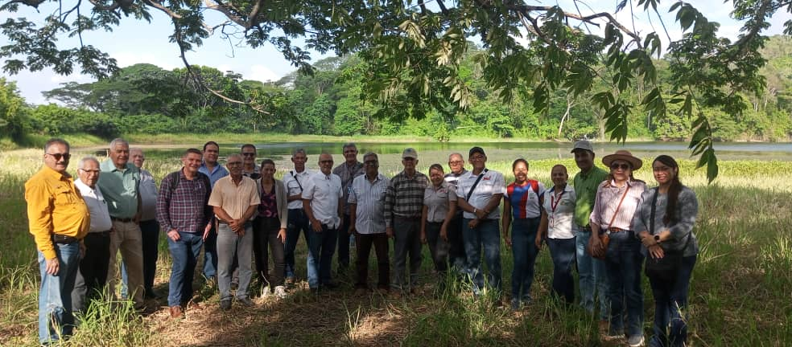
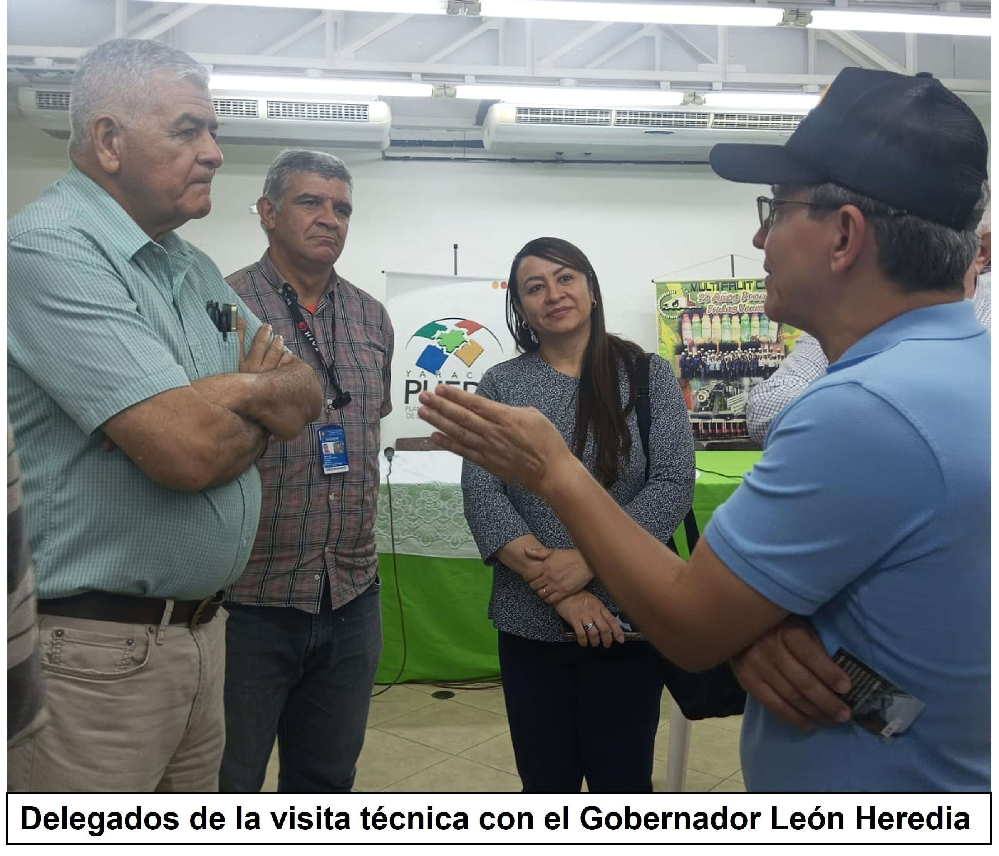
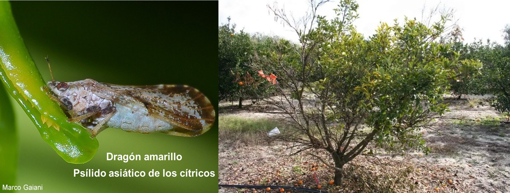

En Yaracuy se comienzan a dar los primeros pasos para el rescate de la citricultura, esto a través de una alianza que lideran gremios productivos junto a especialistas de sanidad vegetal nacional e internacional y autoridades públicas.
El norte de esta unión es crear un plan piloto para comenzar a trabajar con patrones tolerables en pequeñas parcelas de la región, esos que no se vean afectados por el llamado dragón amarillo, el cual fue el que destruyó miles de hectáreas en el país. Evalúan si pueden ser plantas traídas del exterior o producidas en Venezuela, todo esto tomando como referencia las experiencias que han realizado en otras naciones. 

Durante la mañana y gran parte de la tarde de ayer representantes de CAB International (Centre for Agricultural Bioscience International), la Fundación Servicio para el Agricultor (FUSAGRI), el Instituto Interamericano de Cooperación para la Agricultura (IICA), FEDECAMARAS, Yaracuy PUEDE, FEDEAGRO, entre otras instituciones, realizaron una visita técnico-científica por tierras y espacios donde trabajan con la siembra y producción de cítricos. 

La Dra. **Yelitza Colmenarez**, especialista en protección de plantas y Directora de **CAB International (CABI)**, explicó que están en una fase de retroalimentación con los que están detrás de la producción de cítricos para poder evaluar la plaga invasora que está afectando no solo en Venezuela, sino en otros países. Aseguró que en México y Brasil han sufrido impactos significativos. 

“La idea es que podamos tener esa recopilación de experiencias e información; hemos visto áreas completamente devastadas debido a la influencia de ese patógeno”, señaló la Dra. Colmenarez, quien aseguró que existe un paquete de manejo que pudiera ser aplicado y ajustado a las condiciones de Venezuela, es por ello la evaluación y establecimiento de alianzas. 

Por su parte, Luis López Méndez, Director Técnico de **FUSAGRI**, aseguró que no vienen a enseñarle a los productores como sembrar, “ellos lo que necesitan es ver cómo podemos apoyarlos a luchar contra ese enemigo que no es pequeño, ha causado graves destrozos en diferentes países”. 

Aseguró que es un trabajo lento, pero seguro. “Sería una locura pensar que de la noche a la mañana vamos a sembrar 30 mil hectáreas de cítricos para hacer una prueba. Vamos a comenzar con pequeños parcelas, no es sencillo, los resultados se verán a mediano y largo plazo”, dijo el especialista, quien agregó que posiblemente ese plan inicie en Nirgua. 

**Protocolo adecuado y planificado**

**Héctor Bastida**, Presidente de **FEDECAMARAS Yaracuy**, explicó que esta es una agenda que están impulsando desde el año pasado y que estos próximos días aspiran a obtener conclusiones de políticas públicas para que el esfuerzo transcienda. 

Sostuvo que construyen una hoja de ruta con el ejercicio y aprendizaje de aquellos que de alguna manera han superado o comienzan superar esa situación de sanidad vegetal. Dejó claro que la idea es arrancar con un protocolo adecuado y lo mejor planificado. 

Todo este grupo de científicos, especialistas, productores e industriales tuvieron un encuentro al final de la tarde  en las instalaciones de Multi Fruit y durante estos días continuarán con los recorridos por diferentes espacios, entre ellos la Fundación DANAC y  la Fundación CIEPE.

También pudieron reunirse con el Gobernador **Julio León Heredia** a quien le plantearon el proyecto para en conjunto impulsar esta propuesta de manera que Yaracuy se convierta nuevamente en ese estado de referencia productiva en cítricos.

**La enfermedad fue confirmada en el 2017**

La enfermedad de los cítricos “Huanglongbing” (HLB), también conocida como enverdecimiento (greening), causada por la bacteria *Candidatus* Liberibacter asiaticus (CLas), y transmitida por el psílido asiático de los cítricos o dragón amarillo (*Diaphorina citri*), es el problema fitosanitario más grave en el país. 

Expertos aseguran que fue detectada en 2017, aunque los síntomas tempranos característicos asociados a la enfermedad, tales como brotes amarillos fueron notificados por productores en varias regiones desde el 2016. 

En Yaracuy las zonas de mayor producción de cítricos eran Nirgua, Monge y Bolívar. La producción de cítricos en la región representaba el 51.14%  de las 35.000 hectáreas nacionales. El 95 % de naranjas y el resto en diferentes frutas.

**Fuente:** Diario Yaracuy al Día, 28 de noviembre 2023. ACTUALIDAD, página 3
