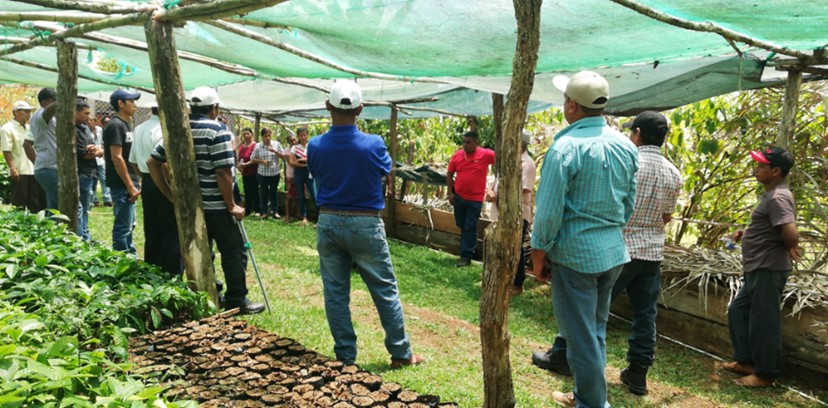
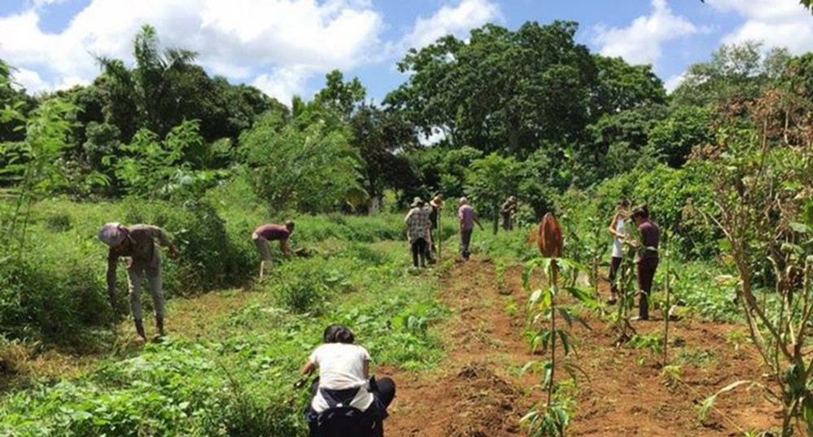
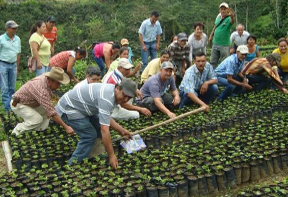
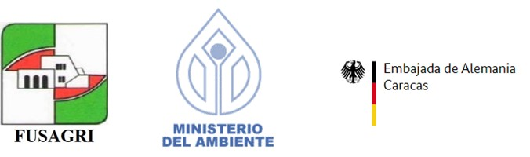

**Sierra de San Luis: un programa integral de asistencia técnica y autogestión comunitaria, en armonía con el ambiente.**

Este Programa de Manejo y Conservación de Cuencas Hidrográficas, se realizó entre los años 1998-1997, en la Sierra de San Luis, localizada en la parte occidental de la Cordillera Norte Costera de Venezuela en el Estado Falcón, la región más árida del país.
La Sierra de San Luis es fuente principal de agua de ese Estado que sirve de asiento a 300 mil personas. De allí también se suministra el líquido a las dos refinerías petroleras más importantes del país, ubicadas en la Península de Paraguaná.
En el área de influencia del Programa estaban establecidos alrededor de 35.000 habitantes, de muy escasos recursos, que practicaban una agricultura itinerante de subsistencia, causando un enorme deterioro del suelo y de las reservas de agua. En este programa se armonizó el aspecto ecológico, con una agricultura eficiente basada en la reforestación con café, cultivo de excelente productividad, aun con mínimos insumos

ETAPA INICIAL

Partiendo de un diagnóstico inicial realizado por FUSAGRI, se obtuvo la siguiente caracterización: 
1.	Los campesinos requerían la producción de caraota y maíz para el sustento diario, por lo que la tala y quema de nuevos sectores era una práctica común. 
2.	La política desarrollada anteriormente, basada en el subsidio conservacionista, "estimuló" el establecimiento de cítricas y con ello, incentivó la tala del bosque natural para sembrar naranja. 
3.	Al comportarse la naranja como un "cultivo limpio" al menos durante la primera etapa de su desarrollo, no se favoreció la conservación del suelo y el agua. 
4.	Existía inhibición del esfuerzo y creatividad individual a nivel local. 

Con estas premisas, se propuso al Ministerio del Ambiente y de los Recursos Naturales Renovables (MARNR) un cambio radical, cuya filosofía fue sustituir el subsidio conservacionista por un programa de capacitación para un desarrollo socioeconómico sustentable, cuyos objetivos fueron los siguientes: 

1.	Mejorar los niveles de abastecimiento de agua en la cuenca.

2.	Mejorar el nivel de vida de la población asentada, en base al aprovechamiento racional de los recursos naturales disponibles y a la promoción de organizaciones para la autoayuda. 

ASPECTOS OPERATIVOS

La metodología del trabajo de FUSAGRI combina la investigación aplicada con la capacitación y asesoría técnica permanente, y en este Programa, el componente de capacitación fue el factor dominante, cubriendo los aspectos de agricultura conservacionista y de promoción de organizaciones para la autogestión. Esta capacitación, se llevó a cabo mediante visitas (al hogar y a la parcela), charlas, cursos, talleres, reuniones, prensa hablada y escrita y publicaciones de diferente índole. 

ALGUNOS PRODUCTOS, EFECTOS E IMPACTOS:

Luego de 11 años de este emprendimiento, se lograron los siguientes resultados: 

-	Aceptación de un programa de capacitación versus el tradicional subsidio conservacionista, por parte de los campesinos. 
-	Adopción de prácticas conservacionistas en cultivos limpios de maíz y caraota. 
-	Producción cerca de 1.200.000 plantas de café (principalmente catuaí amarillo).
-	Establecimiento en condiciones conservacionistas de 450 ha. de aproximadamente 417 productores. 

Previamente y durante la siembra, los agricultores y sus familiares, fueron capacitados en el manejo agronómico desde siembra hasta postcosecha, así como aspectos económicos y administrativos de la producción.

-	En los sectores atendidos quedó eliminada la quema cuando en 1987 la misma era practicada por más del 60% de los campesinos
-	Se logró desde 1993 el establecimiento permanente de unos 300 m2 de huertos familiares con participación de 50 familias y 2 escuelas. 
-	Se asesoraron a unas 90 familias en actividades relacionadas con artesanía, huertos familiares, corte y costura y saneamiento ambiental. 
-	Se promovió el fortalecimiento de la Asociación de Productores y Artesanos de Uria (AGROARTE), con una alta participación de mujeres jóvenes. A través de dicha asociación, y con financiamiento de la Embajada y el Ministerio de Cooperación Económica de Alemania, en febrero de 1996 fue puesto en servicio el Taller Artesanal Uria (TAU) con talleres de costura, cerámica, carpintería, cocina, pintura y manualidades, y dispone de áreas para usos múltiples, cafetín, etc. 
-	Se logró la formación de 20 promotores rurales (campesinos multiplicadores de la caficultura conservacionista). De éstos, seis (6) son activos voluntarios y grandes cooperadores. 
-	El rendimiento de los cafetales atendidos en el período, aumento de 1,5 a 17 q/ha en el sector de Zaragoza. 
-	Los caficultores del sector lograron una organización con fines de comercializar su producto, el cual procesan, empacan y venden en forma colectiva, ampliando sus márgenes de ganancia.

La asociación Pequeños Caficultores de Zaragoza (PECAZA) fue constituída a fines de 1992 con 69 socios, y en la actualidad son más de 300. Promovida en el marco del proyecto, orienta sus actividades hacia el mejoramiento de la producción y productividad cafetera, con prácticas de conservación. 

- En 1995, PECAZA con la cooperación de FUSAGRI, logró la aprobación de un proyecto para crear un Central Piloto de Beneficio de Café, con la Embajada de la República Federal de Alemania. Este Central, gestionado y administrado por PECAZA, tiene capacidad para beneficiar 7.500 kg de café en cereza diariamente, mejorando la calidad de gran parte de su café a LAVADO FINO y EXTRAFINO con calidad GOURMET de exportación y un precio superior en un 70%, al pagado en la zona. 

- Nacional e internacionalmente, la experiencia del Proyecto Sierra de San Luis, ha sido reconocida como exitosa desde los ángulos ambiental y socioeconómico. El Proyecto se ha convertido en sede e instrumento formativo de visitas técnicas, congresos, cursos y talleres nacionales e internacionales. Esto ha hecho que sirva de marco de referencia y modelo obligado para otras cuencas altas del país. Más aún, la Fundación Alemana para el Desarrollo Internacional (DSEIZEL), a través del Convenio con FUSAGRI, dictó en 1994 un Curso Internacional sobre Agricultura Ecológicamente Apropiada con participantes e instructores de unos 20 paises de Europa y América. Este proyecto fue sede demostrativa de este curso durante tres (3) días. 

- Otras instituciones como la Compañía Nacional de Reforestación (CONARE), el Ministerio de Agricultura y Cría a través del Programa Nacional de Extensión Agrícola y la Gobernación del estado Falcón, establecieron nuevos programas en la zona. 

DONANTES, CONTRAPARTES, COOPERADORES Y BENEFICIARIOS

A través de contratos con el Ministerio del Ambiente se obtuvieron los fondos básicos para el Proyecto (aproximadamente US$ 400.000 a lo largo de 8 años). 
FUSAGRI, ha liderizó la búsqueda de fondos adicionales, que sumados a los ya mencionados totalizaron US $800,000, de los cuales, el 65% fue aportado por 4 instituciones venezolanas (incluida FUSAGRI) y el resto por 4 instituciones extranjeras.
FUSAGRI también ha promovido la concentración de esfuerzos en la región por parte de otras 20 instituciones públicas y privadas para apoyar con sus recursos ordinarios y experticias específicas. 

Por otra parte, la inversión realizada por los propios agricultores (como capital fijo) en el establecimiento de nuevas plantaciones hasta 1996, fue del orden de un millón de dólares, con retornos anuales brutos (para ese mismo año) estimados en US $250.000, de los cuales una proporción muy baja se orientó a remunerar recursos externos. 

